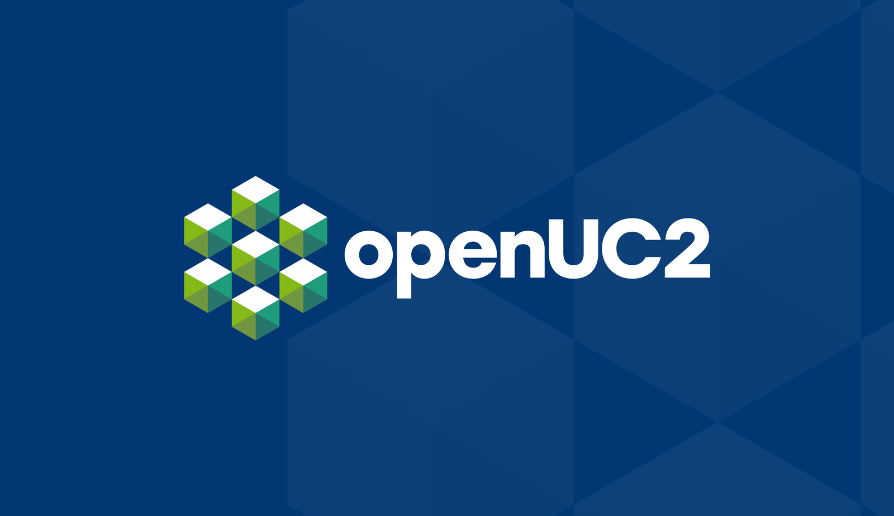
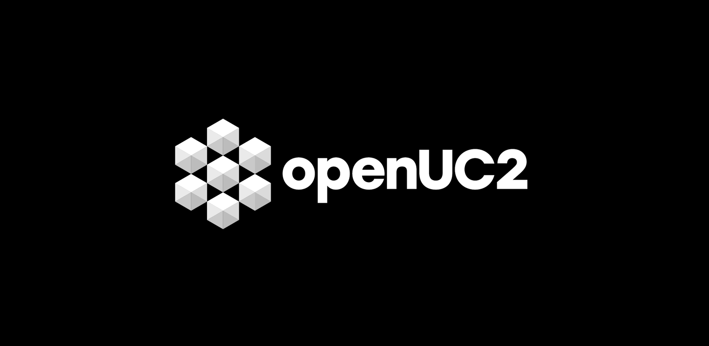
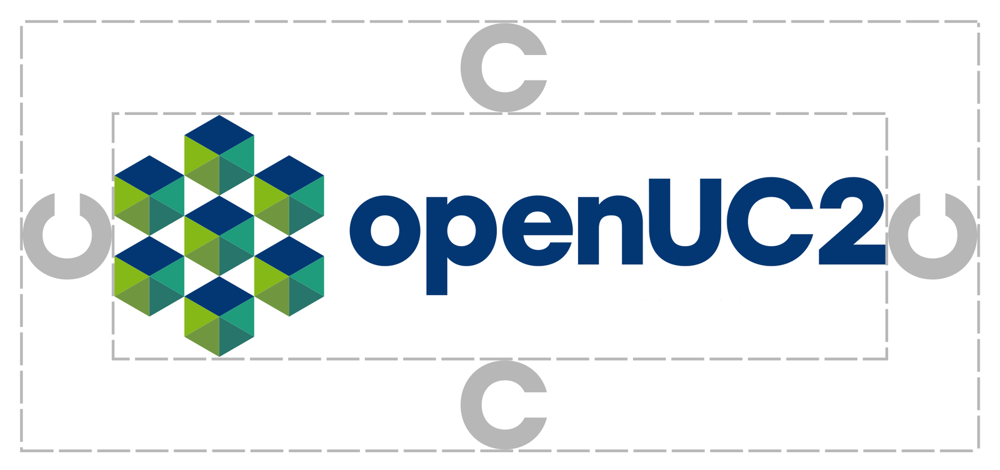
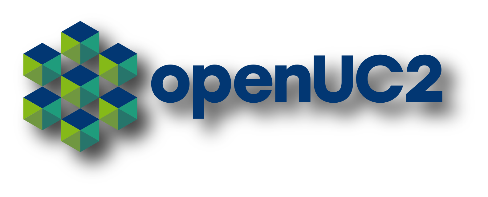
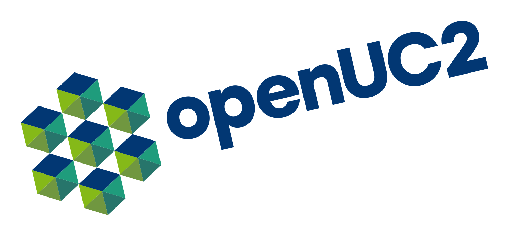
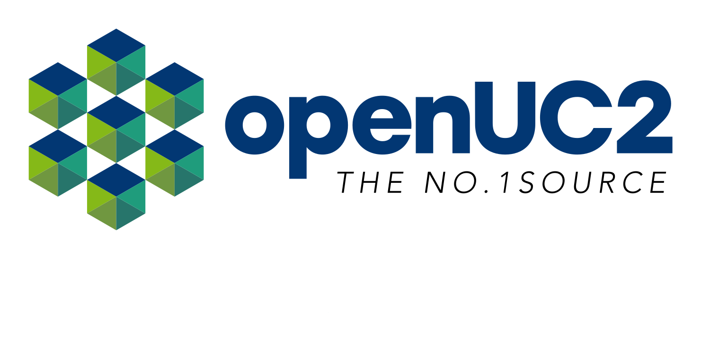
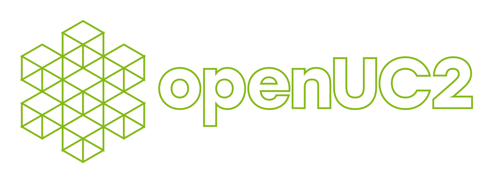
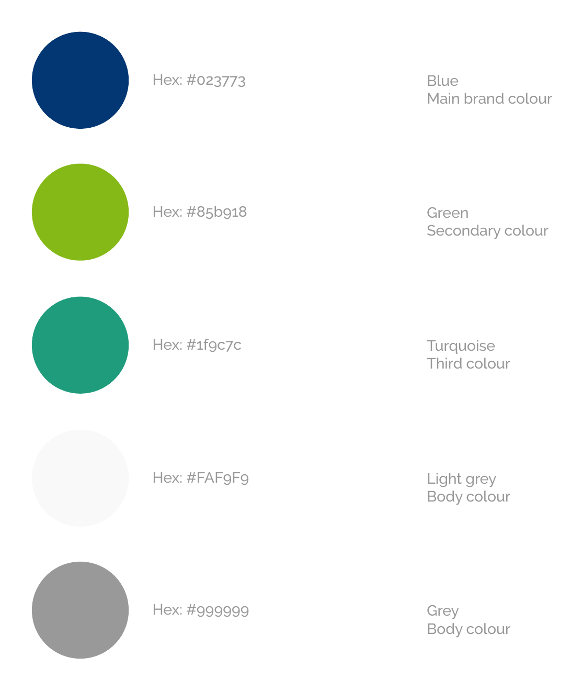
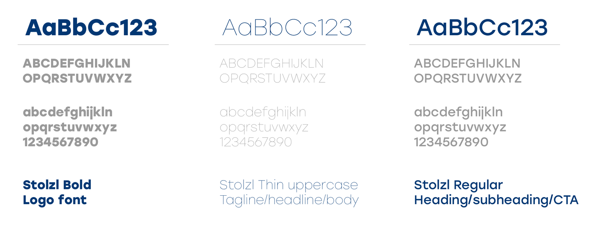

# openUC2 Brand Guidelines

This page explains how to use the openUC2 logo, colours and typography. Whether you are making a slide deck, a datasheet, a website page, a poster or a conference talk, following these rules keeps everything we publish looking like openUC2.

**In short:** use the logo as supplied, leave room around it, stick to the five brand colours, and set text in Stolzl (licensed) or Objectivity (free).

---

## 1. The logo

[PNG FILE](images/logo-primary.png)

[SVG FILE](images/opemUC2_Logo.svg)

The logo has two parts: the **cube mark** (a hexagonal cluster of seven cubes) and the **wordmark** "openUC2", set in Stolzl Bold. The two always appear together, in the arrangement shown above.

### Approved versions

Use one of the four versions below, depending on the background.

| Version | Use it when | Preview |
|---|---|---|
| **Full colour** | The background is white or very light. This is the default. |  |
| **White on brand blue** | The background is our brand blue `#023773`, for example title slides, covers and banners. |  |
| **White / grey on black** | The background is black or very dark. |  |
| **Greyscale (dark)** | Only one ink or a greyscale output is available, for example a black-and-white print, a stamp or a fax-style form. |  |

**What to do**

- Start with the **full-colour logo** whenever the background allows it.
- On dark backgrounds, switch to the white or reversed version rather than placing the full-colour logo on a dark surface.
- Use the greyscale version only when colour is not possible.
- Always work from the original logo files. Never redraw or re-type the logo.

### Clear space

Keep a protected zone around the logo that is **at least the height of the letter "C"** from the wordmark, measured on all four sides, as in the diagram. No text, images, edges or other logos may enter that zone.

More space is always better. The "C" is a minimum, not a target.

### Don't do this

**Don't add effects.** No drop shadows, glows, bevels or gradients.

**Don't rotate or tilt the logo.** It is always placed horizontally.

**Don't attach a tagline or extra text.** Anything you want to say goes outside the clear-space zone, never inside or under the logo.

**Don't turn the logo into an outline or recolour it.** Only use the approved versions listed above.

Common-sense additions (ours, not from the original guide): don't stretch, squash or crop the logo, don't change the proportions between the mark and the wordmark, and don't place it on busy backgrounds that reduce legibility.

---

## 2. Colours

Our palette has three brand colours and two neutrals.

| Colour | Role | HEX | Swatch |
|---|---|---|---|
| **Blue** | Main brand colour | `#023773` |  |
| **Green** | Secondary colour | `#85b918` |  |
| **Turquoise** | Third colour | `#1f9c7c` |  |
| **Light grey** | Body colour | `#FAF9F9` |  |
| **Grey** | Body colour | `#999999` |  |

**What to do**

- Lead with **blue**. It should be the dominant colour in anything we produce.
- Use **green** as the accent, for highlights, buttons and key figures.
- Use **turquoise** as the third colour, sparingly, for example to support charts or secondary accents.

*The guide only names the roles (main, secondary, third, body). The usage hints above are our interpretation of those roles.*
- Use **light grey** and **grey** as the neutral "body" colours, for page backgrounds, panels and supporting text.
- Copy the HEX values exactly rather than picking colours by eye.

> **Accessibility tip (our suggestion, not part of the original guide):** green `#85b918` and grey `#999999` have low contrast on white, so they are not suitable for small body text. Use blue (or a darker neutral) for text that has to be read easily, and keep green and grey for accents, icons, large elements and secondary information.

---

## 3. Typography

Our typeface is **Stolzl**, used in three weights:

| Weight | Where to use it |
|---|---|
| **Stolzl Bold** | Logo font. Reserved for the logo wordmark. |
| **Stolzl Regular** | Headings, subheadings and calls to action (CTA). |
| **Stolzl Thin (uppercase)** | Taglines, headlines and body text. |

**What to do**

- Set headings, subheadings and buttons in **Stolzl Regular**.
- Use **Stolzl Thin** for taglines, headlines and body copy, in uppercase as shown in the specimen.
- Don't use Stolzl Bold for general text. It belongs to the logo.
- *Suggestion (not in the original guide):* if Stolzl is not available, for example in a shared document or an email, fall back to a clean sans-serif and keep the same hierarchy of bold, regular and light.

---

## 4. Quick checklist

Before you publish anything, check:

- [ ] The logo is one of the four approved versions, unmodified.
- [ ] There is at least one "C" of clear space on every side.
- [ ] No shadow, rotation, outline, recolouring or added tagline.
- [ ] Colours come from the palette, with blue as the lead.
- [ ] Headings are in Stolzl Regular, body text and taglines in Stolzl Thin.
- [ ] Text is readable against its background.

---

## 5. Files and questions

Download the logo files and fonts from: *[add link to your asset folder here]*.

Not sure whether a use is on-brand? Ask before you publish: *[add contact here]*.
