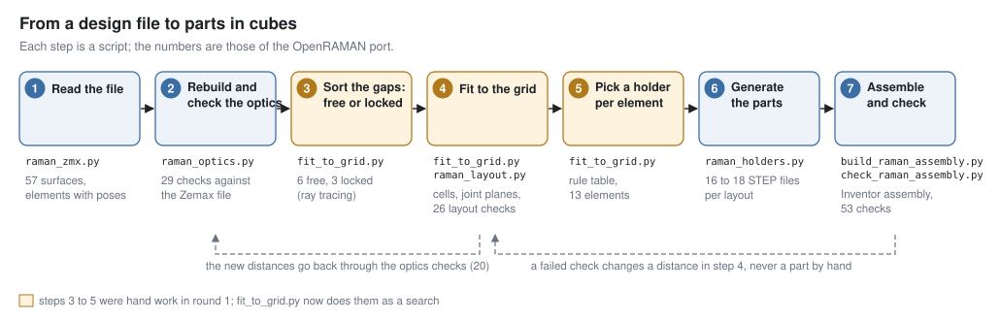
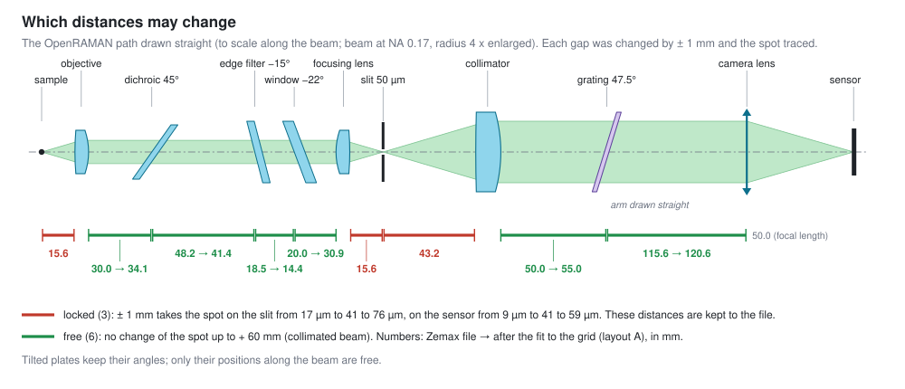
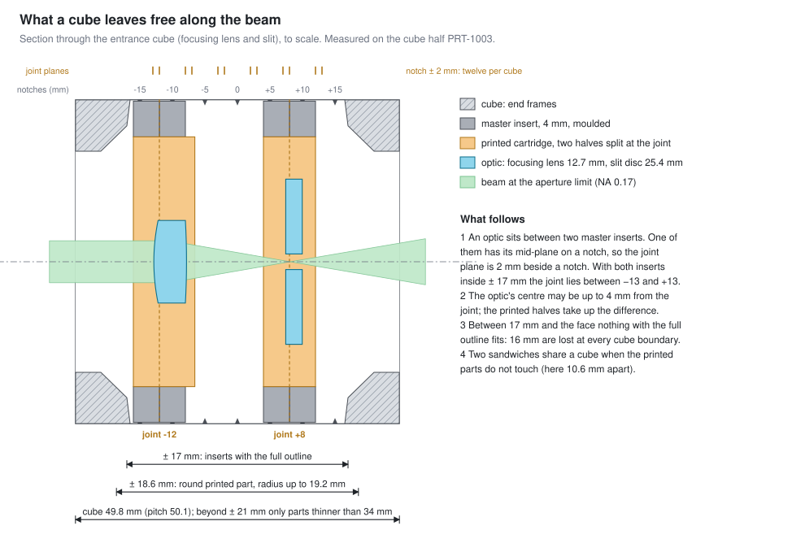
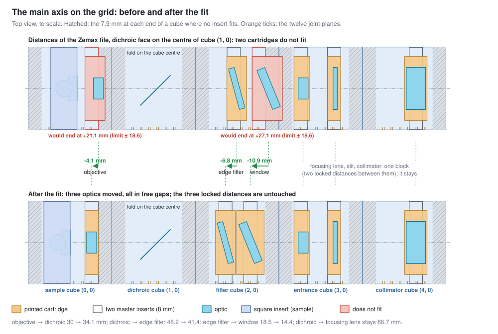
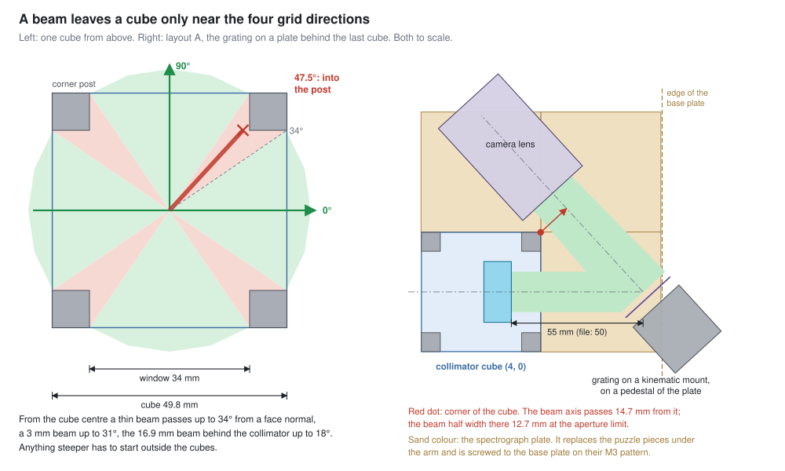
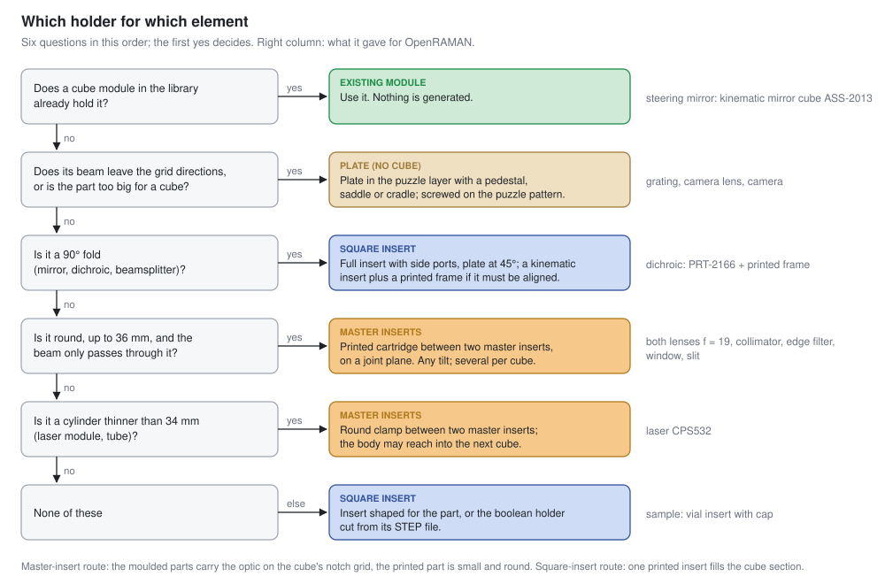
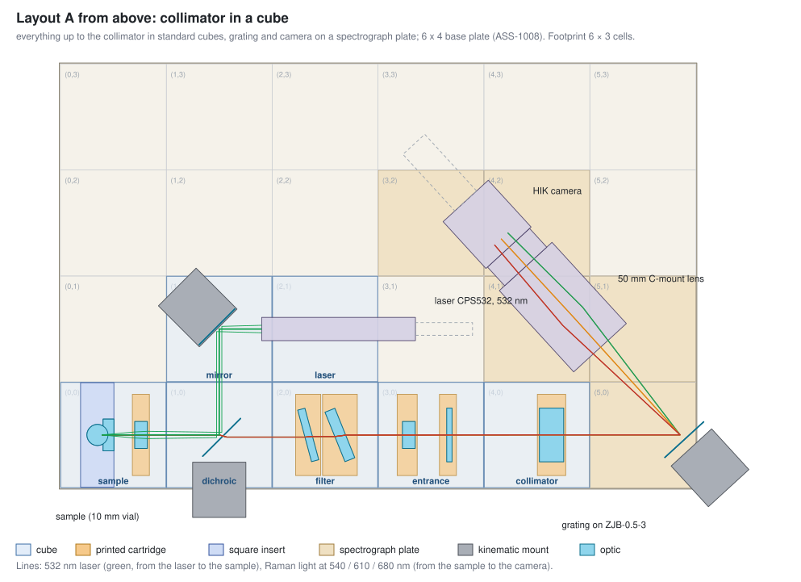

# From an optical design to openUC2 cubes: a short tutorial

This is an example how you can go from an arbitrary optical sketch/design/layout into something cube-based. We have decided to use the open-source OpenRAMAN spectrometer since this is not strictly 50mm/rectangular design to demonstrate that the cubes can also deal with this. 

How to take an optical design that exists as a Zemax or Optiland file and build it in the openUC2 cube system. The worked example is the OpenRAMAN spectrometer (<https://docs.open-raman.org>,
Luc Boussemaere, CC BY‑SA 4.0) on the quantum‑kit base plate. Every number below is produced by the scripts in this repository (https://github.com/openUC2/openuc2-openraman).

In general, you have to follow the following steps (instead of Zemax, you can also use an optiland file of course since we convert it into optiland):

## What you need

- The design as a file with real distances. Here: `reference/P00006 - OPTICAL PATH.zmx`. (or optiland)
- The outer shape of every bought part: lenses, filters, mounts, laser, camera (STEP files or data
  sheets).
- The facts about the cube system (step 3). They are constants in `raman_layout.py`.
- Python with Optiland and CadQuery (commands at the end).

## 1. Read the design and rebuild it

*This part is very specific and was claude generated. Other ZMX files need different treatment, but follow the same principle. We will work on a way to automate this step in the upcoming Optikit*

`raman_zmx.py` reads the Zemax text file, follows its coordinate breaks and returns every element
with its position and direction: 57 surfaces become objective, dichroic, edge filter, window,
focusing lens, slit, collimator, grating and camera lens.

`raman_optics.py` builds the same system in Optiland and compares it with the file: 29 checks
(distances, focal lengths, the grating equation, 16.67 nm/mm dispersion, the slit image). Later
steps change distances; this model is what tells you whether a change is harmless.

Two things were not in the file and came from the OpenRAMAN CAD: the laser path (the laser runs
50 mm beside the main axis) and the camera lens (a black box in the file, modelled as an ideal
50 mm lens).

## 2. Sort the distances: locked or free

Change one air gap by ± 1 mm, trace again, look at the spot at the next focus.

- **Locked (3):** sample → objective, focusing lens → slit, slit → collimator. One millimetre
  takes the spot on the slit from 17 µm to 41–76 µm. These distances stay as in the file.
- **Free (6):** everything in a collimated beam: objective → dichroic → edge filter → window →
  focusing lens, collimator → grating, grating → camera lens. The spot does not change, even for
  + 60 mm.

Optics joined by a locked distance move together as one block: sample with objective; focusing
lens with slit and collimator. Tilted plates keep their angles; only their positions are free.

This test was done for the point the laser illuminates, on the axis. A design that images a wide
field needs the same test at the edge of the field: a longer collimated gap moves the beam
sideways on the next lens.

## 3. Know what a cube can hold

| fact | value |
| --- | --- |
| cell pitch of the quantum‑kit base plates | 50.1 mm (not 50.0) |
| cube | 49.8 mm |
| notches for inserts along the beam | −15 … +15 mm in 5 mm steps |
| inserts with the full outline | within ± 17 mm of the cube centre (the end frames start at 17.2 mm) |
| round printed part, radius up to 19.2 mm | within ± 18.6 mm |
| beyond ± 21 mm, up to the face | only parts thinner than 34 mm (a laser nose, a lens tube) |
| master insert (moulded, PRT‑2100 and PRT‑2123) | 4 mm thick |
| joint planes of a sandwich of two master inserts | ± 2, ± 3, ± 7, ± 8, ± 12, ± 13 mm |
| optic centre to joint plane | up to 4 mm |
| window of a cube face between the corner posts | 34 mm |

The consequence that decides most layouts: at every cube boundary 16 mm of the beam path are
closed for holders (from + 17 mm in one cube to − 17 mm in the next).

## 4. Folds on cube centres, then move optics inside free gaps

**Folds first.** The point where the beam axis meets a 90° mirror or dichroic goes on a cube
centre. Both beams then leave through the centres of cube faces. For OpenRAMAN the dichroic's
coated face sits on the centre of cube (1, 0). The steering mirror is then one cube up and the
laser one cube further; the file's 50 mm between laser axis and main axis becomes 50.1 mm, which
is a free distance.

**Then walk along the axis.** Each optic falls into a cube at some distance from the cube
centre. With the distances of the file, two holders do not fit: the objective's would end at
+ 21.1 mm and the window's at + 27.1 mm, both past the 18.6 mm limit.

**Move only what is free, and as little as possible.** An optic with a free gap on both sides
goes to the nearest joint plane that fits. A block moves as a whole. `fit_to_grid.py` tries the
candidates and lets the checks of `raman_layout.py` decide:

| distance (mm) | Zemax file | search | built in round 1 (by hand) |
| --- | --- | --- | --- |
| objective → dichroic | 30.0 | 34.1 | 34.0 |
| dichroic → edge filter | 48.2 | 41.4 | 40.4 |
| edge filter → window | 18.5 | 14.4 | 14.4 |
| dichroic → focusing lens | 86.7 | 86.7 | 86.7 |
| the three locked distances | 15.58, 15.58, 43.22 | unchanged | unchanged |

The search and the hand layout differ by 0.1 mm at the objective and by 1 mm in the filter cube
(filter and window at − 7 / + 8 mm instead of − 8 / + 7 mm). Both pass the layout checks, and
the holders of both generate. The Inventor assembly and the checks of step 7 exist only for the
hand layout. The full comparison is in `layouts/fit_report.md`.

**Check the optics again** with the new distances: 20 of 20 for both (`fit_to_grid.py` runs the
checks on its result, `raman_optics.py --validate --cube` on the hand layout).

## 5. What cannot go into a cube goes on a plate

A beam that starts on a cube centre gets out only near the four grid directions: up to 34° from a
face normal for a thin beam, 18° for the 16.9 mm beam behind the collimator. The grating sends
the light back at 47.5° to the main axis, so the grating, the camera lens and the camera cannot
be in cubes.

They stand on a solid plate in the puzzle layer (5 mm thick). The plate replaces the puzzle pieces
under the arm and uses their M3 holes in the base plate. It carries a pedestal for the grating's
kinematic mount, a saddle for the lens barrel and a cradle for the camera (three M3 screws from
below).

The two free distances of the arm are set by clearances, not by the grid: the diffracted beam has
to pass the corner of the last cube (collimator → grating 55 mm instead of 50 mm), and the lens
barrel has to clear that cube.

Decide early how much goes on the plate. Layout A keeps the collimator in a cube. Layout B puts
it on the plate too: slit to camera then sit on fewer separate parts, and the grating can move
20 mm closer.

## 6. Pick a holder for every element

The two routes inside a cube:

- **Master inserts.** Two moulded inserts carry a small round printed part on the cube's notch
  grid. Use it for round optics up to 36 mm that the beam only passes through, at any tilt, and
  for thin cylinders. Several fit in one cube.
- **Square insert.** One printed insert with the full outline. Use it when the beam also leaves
  sideways (a 90° fold), when the part is not round (vial, cuvette, beamsplitter cube), or when
  an existing kinematic insert has to carry the optic.

For OpenRAMAN: six cartridges, one round clamp (laser), one square insert (sample), one existing
kinematic mirror cube, one printed frame in the existing kinematic splitter insert (dichroic), one
printed adapter in a kinematic mount (grating), one plate.

## 7. Generate, assemble, check

One file drives the rest: `layouts/<variant>/raman_layout.json` holds every frame, cube,
cartridge and placement.

- `raman_holders.py` writes a STEP file for every printed part.
- `raman_beam_solids.py` writes the beams as solids.
- `build_raman_assembly.py` builds the Inventor assembly from the placements.
- `check_raman_assembly.py` tests the built assembly: every optic lies in the pocket cut for it,
  no holder overlaps another part by more than 0.12 mm, the beams pass at the design aperture and
  at the aperture limit.

When a check fails, change a distance in step 4 and generate again. Do not repair a generated
part by hand. In round 1 the overlap test found three errors that the layout in the plane had
passed: the objective's sandwich with its joint at + 17 mm inside the end frame, the window
cartridge reaching into the end frame, and the sample insert with its outline turned by 90°.

## 8. What has to stay adjustable

| what | why | how |
| --- | --- | --- |
| focus at the sample and at the slit | 0.1 mm doubles the spot; a printed cartridge holds a lens with 0.15 mm of play | shims or a fine thread at objective and slit (open) |
| laser onto the collection axis | two beams through one objective | two kinematic mounts: steering mirror and dichroic |
| grating angle | 24 nm per degree | kinematic mount |
| camera focus | the slit image has to be sharp on the sensor | focus ring of the camera lens |
| slit rotation | the slit image has to follow the pixel columns | turn the slit disc in its cartridge before clamping (open) |

## 9. The result

| layout | cubes | cells of the plate | collimator → grating | beyond the base plate |
| --- | --- | --- | --- | --- |
| A, collimator in a cube | 7 | 5 | 55 mm | grating mount 24.7 mm |
| B, collimator on the plate | 6 | 7 | 35 mm | grating mount 8.4 mm |
| C, as B on the 5 × 4 plate | 6 | 7 | 35 mm | the sample cube stands on an outrigger |

All three use 6 × 3 cells (300.6 × 150.3 mm), the size of the OpenRAMAN base plate.
Layout B: [img/layout_B.svg](img/layout_B.svg).

## Things that cost time

- **Distances in the file are not always paraxial.** OpenRAMAN's working distances are 0.175 mm
  and 0.249 mm inside the paraxial foci: best focus at full aperture. Keep the file's numbers.
- **The pitch is 50.1 mm.** Over six cubes that is 0.5 mm, more than the focus tolerance.
- **Vendor CAD has its own frames.** Measure where the optical surface is in each file before
  placing it (table in `RAMAN_PROJECT_PLAN.md`, section 7).
- **Insert springs overlap the cube by design** (about 0.3 mm near the legs). An overlap check
  has to leave that zone out.
- **Mount knobs need a hand.** The dichroic's kinematic mount hangs over the plate edge on
  purpose.

How this procedure runs without a person in the loop, and what the optikit editor needs for it:
`optikit-core/DOCS/roadmap/PLAN-EMBED-OPTICAL-DESIGN.md`.

*The optical design is OpenRAMAN's (CC BY‑SA 4.0). This tutorial and the derived layouts carry
the same licence and attribution.*
