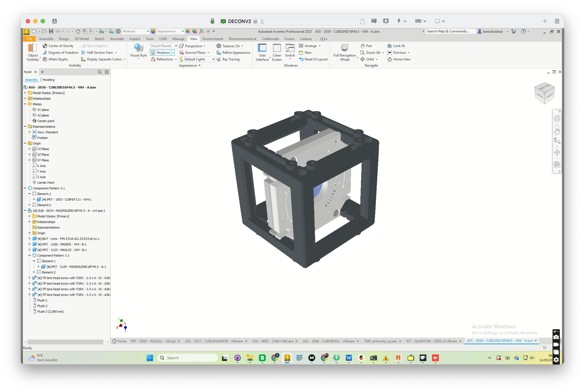
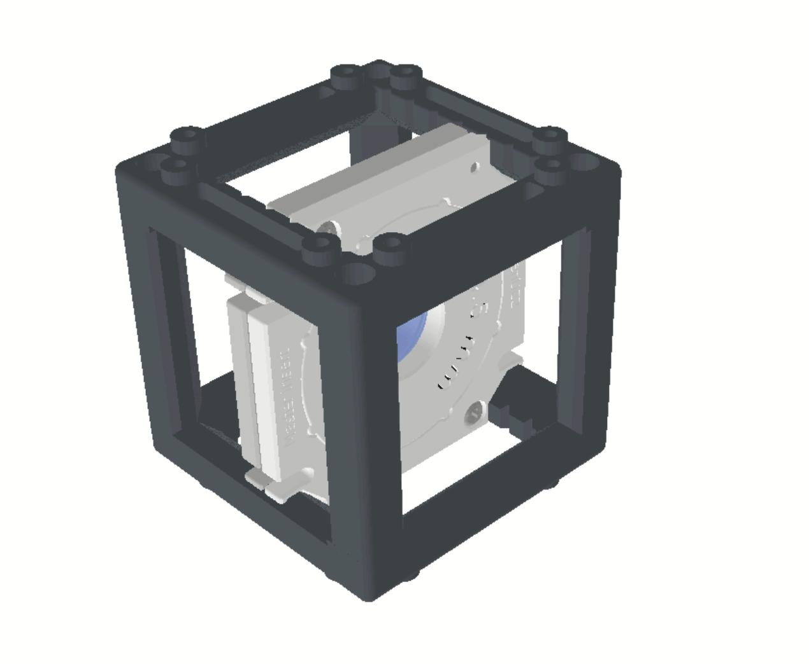
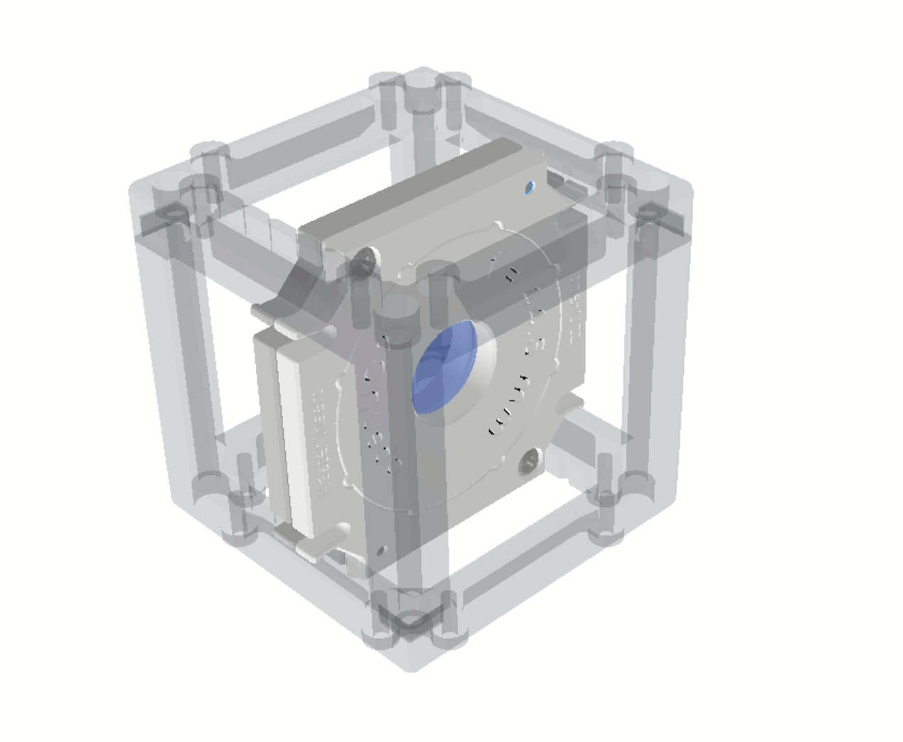
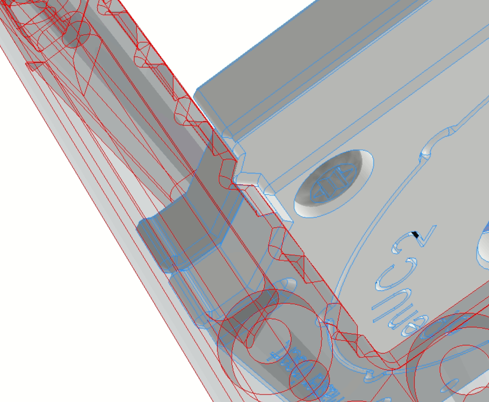
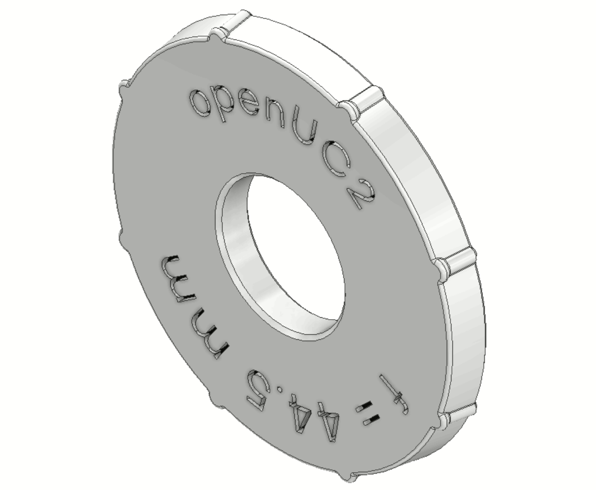
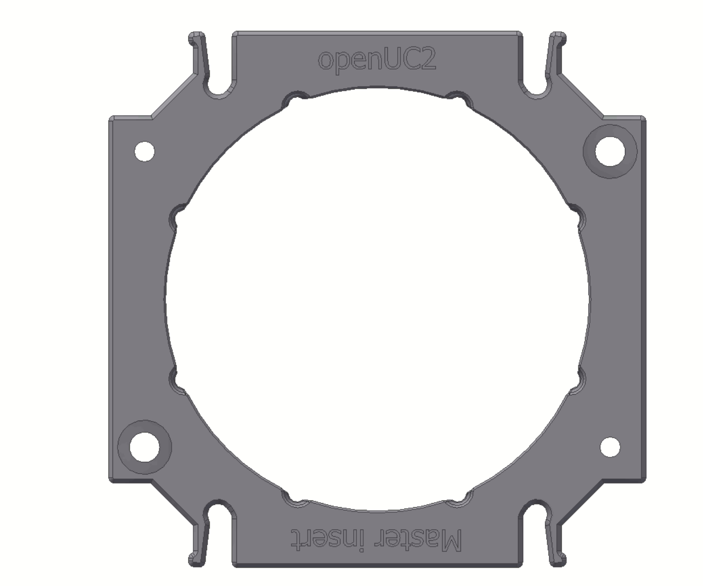
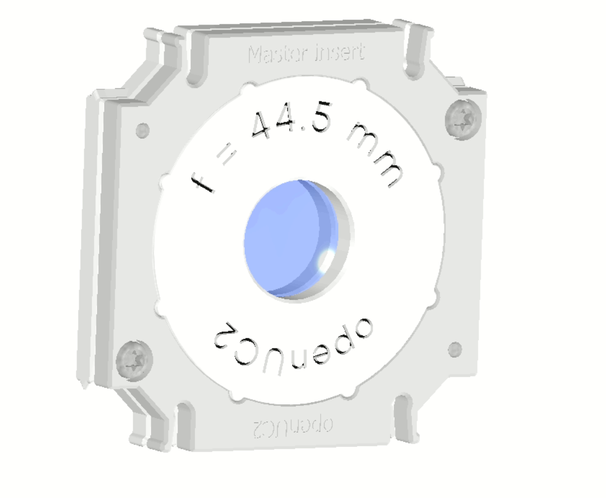
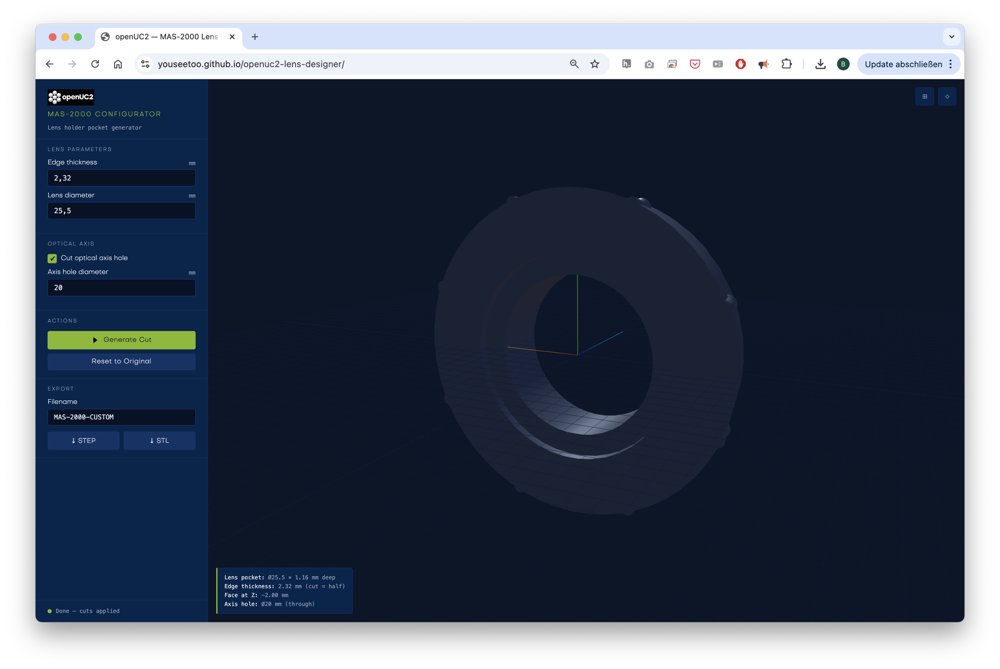

# v4 Modules

This is a new version of the cube that has some minor yet very important changes to improve usability and assembly. The main changes are:
- grooves along the optical axis to work together with the master insert in order to lock an insert (e.g. lens) perfectly perpendicular to the optical axis and not movable
- no edges to cut your fingers anymore! 
- moved hole position for the through holes to align it with the new puzzle piecs
- capable of loading 5mm ball magnets to snap them to the grid magnetically 
- same knob foodprint to keep compatibility with v3 baseplates

## Insert Design

## Design your own Insert in Tinkercad

Below you can find a step-by-step guide to create your own insert in Tinkercad, a free online 3D design tool. For this you need a free Tinkercad account.

Feel free to copy the template design we created for you: [Tinkercad UC2 Insert Template](https://www.tinkercad.com/things/j9oYjW6ftqo-openuc2-insert-template)

### Steps to get your tinkercad design ready for 3D printing:

Go to Tinkercad.com and login or register for a free account.

As a student of teacher you have access to this for free:

You can also use your google account to login:

Once you're logged in, you can start with a new design or copy our template by clicking on the link above.

Here, we have imported the STL file from below which you can now freely modify or derive it from our template.

You can download the file as an STL and print it. 

The link to this file can be found here:
[www.tinkercad.com/things/j9oYjW6ftqo-openuc2-insert-template](https://www.tinkercad.com/things/j9oYjW6ftqo-openuc2-insert-template)

## Design your own insert in Fusion 360 

We provide an example Fusion360 file for a lens insert that you can modify to create your own insert design. Since we exported it from Autodesk Inventor, the ability to alter the design is lost unfortunately. It is very similar to a STP file in that sense. 
You can find the file here: [https://a360.co/3ZvHHal](https://a360.co/3ZvHHal)

The editable Fusion360 design files for the UC2 v4 cube and baseplate can be found here: [a360.co/4rjtYiu](https://a360.co/4rjtYiu)

## Design for the Master Insert

The v4 cube introduces a specialized mechanical interlocking system. We have integrated precision **grooves and notches** along the internal edges of the cube. These work in tandem with the new **Master Insert**, which features specific "teeth" designed to lock the component perfectly perpendicular to the optical axis.

*Current Design of the Master Insert in Autodesk Inventor. It's relatively hard to interact with this design due to the lack of direct editability. Hence we decided to share the STEP file for reference for now. Feel free to use it if you still want to explore the design using Inventor :)*

### Why use the Master Insert?

In optical setups, even a tiny tilt in a lens can cause significant aberrations. The Master Insert ensures that:

* **Perfect Centration:** Your optics sit exactly in the middle of the cube.
* **Perpendicular Alignment:** The insert cannot "wiggle," keeping the lens parallel to the optical axis.
* **Discrete Positioning:** You can snap the insert into specific, repeatable positions within the cube.

*An Example arrangement for a lens hold with a nodge-based insert in the exact position, centered*

### Two Versions for Maximum Flexibility

To account for 3D printing tolerances and different use cases, the Master Insert comes in two distinct flavors:

1. **With Teeth:** These are designed to "bite" into the cube’s internal grooves, locking the insert firmly in place.
2. **Without Teeth:** These feature smooth edges, allowing you to slide the insert freely along the internal tracks for fine-tuning the distance between components.

While we provide these as high-precision injection-molded parts to ensure the center is always spot-on, they are also fully 3D-printable.

### Advanced Features: The 45° Locking System

The internal geometry of the Master Insert isn't just a simple hole; it’s a conical shape featuring **8 internal teeth**. This allows for discrete orientation in **45° increments**.

This is a game-changer for components like mirrors or beamsplitters. You can use the same Master Insert "blank" and simply click it into the cube at the specific angle required (e.g., 45° or 90°) without needing to design a custom angled bracket.

### Assembly Guide: Lens Insert

In the example below, you can see how the system works for a standard lens:

* **The Sandwich Design:** A lens set consists of an internal Master Insert with a central aperture. The lens is securely clamped between two identical halves.
* **Fastening:** The Master Insert features integrated screw holes. Simply align the two halves and screw them together to lock the lens in place.
* **Adjustment:** The lens position can be adjusted within the inner cavity or held in place using custom pressure elements.

### How to Integrate Your Own Designs

We are currently developing a **CadQuery tool** that will allow you to take any custom geometry and perform a "Boolean subtract" using the Master Insert’s STEP file. This means you can turn almost any object into a UC2-compatible insert with perfect fitment.

**Need help with your design?**
If you need support integrating a specific sensor or optical component into the v4 system, reach out to us at `support@openuc2.com`. We are eager to help you get your project off the ground!

### Online Lens Insert Maker 

We are also working on an online tool that will allow you to create custom lens inserts by simply inputting your lens parameters (focal length, diameter, thickness). The tool will then generate a ready-to-print STL file for you to use with the v4 cube. Stay tuned for updates on this! You can find the current version of the tool here: [https://youseetoo.github.io/openuc2-lens-designer](https://youseetoo.github.io/openuc2-lens-designer)

*You can set the lens diameter and thickness and generate the inserts that go into the master insert. You need two halfs and sandwich the lens in between. The tool will generate the STL files for you to print. We are working on a more advanced version that will allow you to set more parameters and also generate the master insert itself.*

### Design Files

* **STEP** [Lens Cube Module (incl. Cube)](./stp/ASS-2030-CUBLEND16F44.5-V04-A.stp) 
* **STEP** [Master Insert Base (Teeth)](./stp/PRT-2100-MASINS-V04-B.stp) 
* **STEP** [Master Insert Base (Smooth)](./stp/PRT-2123-MASLCK-V04-B.stp) 
* **STEP** [Master Insert Lens](./stp/PRT-2129-MASINSLEND16F44.5-V04-A.stp)
## Design Files

### Cad Query

We provide a very open-source friendly CadQuery file that you can use to create your own inserts. You can find it here: [github.com/openUC2/openuc2-cadquery](https://github.com/openUC2/openuc2-cadquery)

It allows you to create inserts parametrically and export them as STL or STEP files. You have full control over the design and fully relies on open-source software.

### STP

- [Insert Assembly as STP](./stp/SUB-0026-LEND40F-50-V04-virtass.stp)

### INVENTOR

- [Inventor Part (Lens)](./inventor/BUY-Lens-f-50D43sA10sI5bi-cv.ipt)
- [Inventor Part (Nut)](./inventor/PRT-2005-NUTD43.ipt)
- [Inventor Part (Insert)](./inventor/PRT-2027-INSLEND43F-50-V04.ipt)
- [Inventor Part (Parameters)](./inventor/MAS-0001-MainParameters-V03-04.ipt)
- [Inventor Part (Insert)](./inventor/MAS-2013-SquareInserts-V04.ipt)
- [Inventor Assembly (Assembly)](./inventor/SUB-0026-LEND40F-50-V04-virtass.iam)

### STL

- [Insert as STL (Lens)](./stl/SUB-0026-LEND40F-50-V04-virtass_BUY-Lens-f-50D43sA10sI5bi-cv_3.stl)
- [Insert as STL (Insert)](./stl/SUB-0026-LEND40F-50-V04-virtass_PRT-2027-INSLEND43F-50-V04_1.stl)
- [Insert as STL (Nut)](./stl/SUB-0026-LEND40F-50-V04-virtass_PRT-2005-NUTD43_2.stl)