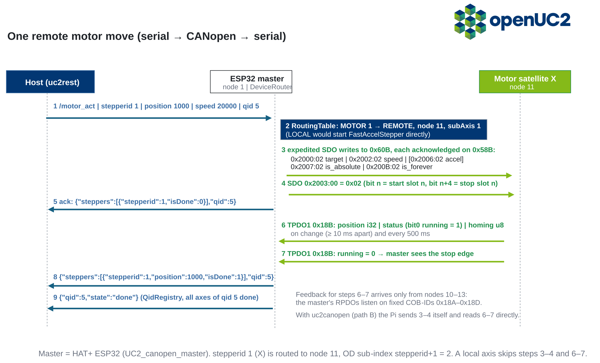

# Architecture

*Explanation. For lists of keys and objects see the [reference](../reference/serial-protocol.md).*

## One firmware with three different roles 

All boards run the same firmware (`uc2-ESP`), built per board. The build selects:

- the **role**: standalone, CAN master (node 1) or CAN satellite;
- the **devices** compiled in (motor, laser, LED, galvo, …);
- the **routing defaults**: which device ids are local and which live on which CAN node.

Every build accepts serial JSON on its USB port, including satellites. That makes a satellite testable on its own before it goes on the bus.

## Move a motor by the json doc 

1. The host sends one JSON line, e.g. `/motor_act` for `stepperid` 1.
2. On a master, `DeviceRouter` looks the device id up in the `RoutingTable`.
3. **Local:** the ESP32 drives the stepper itself.
4. **Remote:** the master writes the parameters into the satellite's object dictionary with expedited SDOs and rings a doorbell object (`0x2003` command word). One move costs 5–6 SDO round-trips.
5. The satellite moves and publishes position and running status in TPDO1 (`0x180 + node`).
6. On the running → stopped edge the master pushes the same `{"steppers":[…"isDone":1}]}` message a local axis would send, then `{"qid":…,"state":"done"}`.

The host does not see whether an axis is local or on CAN. The JSON and the replies are the same.

**Why SDO for commands and PDO for status:** SDOs are confirmed, so the master knows each parameter arrived. They need no PDO mapping agreement between nodes and work for any object. Status changes often and is useful to every listener, which suits event-driven TPDOs.

## Limits of the master's feedback {#feedback}

- The master's receive PDOs are fixed in `OD.c` to COB-IDs `0x18A–0x18D`, i.e. TPDO1 of nodes **10–13**. A motor on any other node can be moved, but the master never sees it stop: no `isDone`, no `done`, no homing result.
- Feedback slots are keyed by `subAxis`. `/route_set` always sets `subAxis = 0`, so a re-routed motor reports through slot 0 (node 10).
- Only motor ids 0–3 have routes. The standalone v4 drives A/X/Y/Z itself and does **not** forward extra motors (`stepperid ≥ 4`) to CAN. Its CAN port serves the illumination board (LED + laser id 4, node 30) and the galvo (node 40).
- `/laser_get`, `/home_get` and `/ledarr_get` are not implemented for remote devices.

## Two paths onto the HAT+ bus {#two-paths}

The HAT+ carries two independent CAN controllers on the same bus: the ESP32 (master, node 1) and an MCP2515 that gives the Raspberry Pi its own `can0`.

| | Path A: serial via the ESP32 master | Path B: direct CANopen from the Pi |
|---|---|---|
| Host library | `uc2rest`, ImSwitch `ESP32Manager` | `uc2canopen`, ImSwitch `UC2CANOpenManager` |
| Addressing | device ids (`stepperid`, `LASERid`) | node ID + OD sub-index |
| Completion | firmware pushes `isDone` / `qid` done | poll TPDO1 / `wait_for_idle` |
| Features | everything in the [command list](../reference/serial-commands.md) incl. stage scan, strobed sweep, OTA | expedited SDOs only: motion, homing, laser, LED fill, galvo, GPIO |
| Extra latency | serial + routing | none |

Rules for sharing the bus:

- Each satellite has **one** SDO server. Two clients writing to the same node at once corrupt each other's transfers. The master, the PS4/PTZ/dial bridges and the Pi are all SDO clients, and nothing arbitrates between them.
- Pick one path per node. If the Pi drives the bus, send no motion commands to the ESP32 master (no stage scan, no strobed sweep, no gamepad jogging).
- Never broadcast NMT *Reset Node*: the ESP32 nodes stop their CANopen stack instead of rebooting.

## Node identity

A node's ID comes from the build (`CAN_ID_CURRENT`, e.g. 11 for the default motor image) unless NVS holds `canNodeId`. NVS wins. It survives CAN firmware updates and `pio run -t upload`, but the web flasher writes a full image from 0x0 and resets it. IDs are changed over the bus with SDO `0x250A` (`/can_act {"setRemoteNodeId":…}`) or locally with `/can_act {"nodeId":…}`. There is no LSS master.

## Firmware updates over CAN

Satellites accept a new image through the manufacturer object `0x2F00` (SDO block download), verify a CRC-32, switch the boot partition and reboot. The image comes either from the HAT+ master (`/ota_start`, streamed over serial) or straight from the Pi/PC with python-canopen. See [Update firmware over CAN](../how-to/update-firmware-over-can.md).
