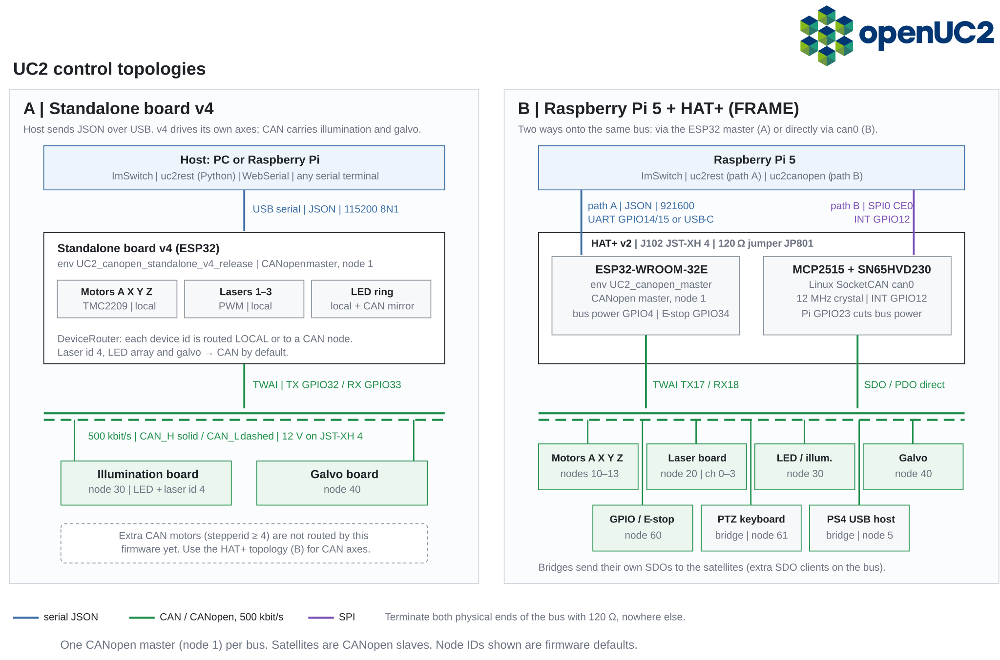

# Serial & CANopen interface

UC2 electronics have two interfaces:

- **Serial (USB/UART):** one-line JSON commands such as `{"task":"/motor_act",…}` to a single ESP32. Every firmware build speaks it.
- **CANopen (500 kbit/s):** between a master ESP32 (node 1) and satellite boards (motor, laser, LED, galvo, GPIO). On the HAT+ the Raspberry Pi can join the bus directly through its own CAN controller.

| You have | Talk to it with | Start here |
|---|---|---|
| Standalone board v3/v4 or a single satellite | serial JSON, Python `uc2rest` | [First serial command](./tutorials/first-serial-command.md) |
| Raspberry Pi 5 + HAT+ (FRAME) | serial JSON to the HAT's ESP32, **or** CANopen on `can0` with `uc2canopen` | [CANopen from the Raspberry Pi](./tutorials/canopen-from-raspberry-pi.md) |
| ImSwitch | `ESP32Manager` (serial) or `UC2CANOpenManager` (CAN) | [Connect ImSwitch](../imswitch/Advanced/02_Usage/UC2-REST.md) |
| A new CAN board | — | [Add a CAN satellite](./how-to/add-can-satellite.md) |

## Contents

| Type | Pages |
|---|---|
| Tutorials | [First serial command](./tutorials/first-serial-command.md) · [Python first steps](./tutorials/python-first-steps.md) · [CANopen from the Raspberry Pi](./tutorials/canopen-from-raspberry-pi.md) |
| How-to | [Add a CAN satellite](./how-to/add-can-satellite.md) · [Update firmware over CAN](./how-to/update-firmware-over-can.md) |
| Reference | [Serial protocol](./reference/serial-protocol.md) · [Serial commands](./reference/serial-commands.md) · [CANopen object dictionary](./reference/canopen-object-dictionary.md) · [Boards, roles & node IDs](./reference/boards-and-node-ids.md) · [uc2rest](./reference/python-uc2rest.md) · [uc2canopen](./reference/python-uc2canopen.md) |
| Explanation | [Architecture](./explanation/architecture.md) |

## Sources

| Component | Repository | State documented |
|---|---|---|
| Firmware | [youseetoo/uc2-esp32](https://github.com/youseetoo/uc2-esp32) | branch `feature/strobed-sweep`, `3c86acd` (2026-09-30) |
| Serial client | [openUC2/UC2-REST](https://github.com/openUC2/UC2-REST) | `mergemaster`, `766dd4a` |
| CANopen client | [openUC2/UC2-REST-CANOPEN](https://github.com/openUC2/UC2-REST-CANOPEN) | 0.2.3 |

Items marked **new** (strobed sweep, laser strobe, hard homing, multi-axis TMC) are not yet on firmware `main`.
