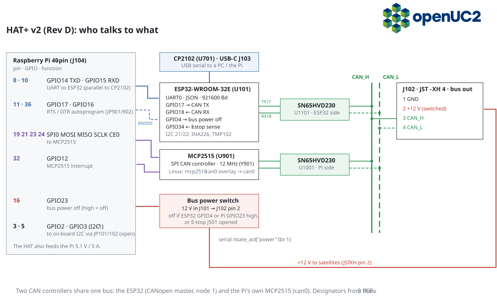

# Boards, roles & node IDs

*Reference. Firmware: `uc2-ESP`, `platformio.ini` and `main/config/<env>/PinConfig.h`.*

## Roles

| Role | `canRole` | What it does |
|---|---|---|
| Standalone | 0 | serial JSON only, all devices local |
| CAN master | 1 | node 1; serial JSON in, routes each device locally or via SDO to a satellite |
| CAN slave (satellite) | 2 | executes OD writes, reports via TPDO; still accepts serial JSON on its own USB |
| Bridge | 2 | slave that also sends SDOs to other nodes (PS4 controller, PTZ keyboard, M5 dial) |

Role and node ID come from the build. Values stored in NVS (`/config_set`, `/can_act`) override the build. They survive CAN firmware updates and `pio run -t upload`; a full web-flash resets them.

## Firmware environments

Release images (web flasher, [youseetoo/uc2-esp32-binaries](https://github.com/youseetoo/uc2-esp32-binaries)) are full images flashed at 0x0, named by board ID, e.g. `uc2-can-master.bin`, `uc2-can-slave-motor.bin`. The FRAME firmware server inside ImSwitch OS uses `esp32_<env>.bin` (app only) and `esp32_<env>_merged.bin`.

| Env | Board | Role | Default node | Serial baud | CAN TX / RX |
|---|---|---|---|---|---|
| `UC2_3`, `UC2_4` | standalone v3 / v4 (ESP32 DevKit) | standalone | — | 115200 | — |
| `UC2_canopen_standalone_v4_release` | standalone v4 | master (hybrid) | 1 | 115200 | GPIO32 / GPIO33 |
| `UC2_canopen_master` | HAT+ v2 ESP32 | master | 1 | **921600** | GPIO17 / GPIO18 |
| `UC2_canopen_slave_motor` | stepper backpack (XIAO ESP32-S3) | slave | 11 (CI: `_motA/X/Y/Z` = 10/11/12/13) | USB-CDC | D2 GPIO3 / D1 GPIO2 |
| `UC2_canopen_slave_accelmotor` | XIAO, AccelStepper | slave | 11 | USB-CDC | D2 / D1 |
| `UC2_canopen_slave_laser` | laser interface (XIAO) | slave | 20 | USB-CDC | D3 GPIO4 / D10 GPIO9 |
| `UC2_canopen_slave_led` | illumination / LED ring (XIAO) | slave | 30 | USB-CDC | D4 GPIO5 / D5 GPIO6 |
| `UC2_canopen_slave_galvo` | galvo interface (XIAO) | slave | 40 | USB-CDC | D4 GPIO5 / D7 GPIO44 |
| `UC2_canopen_slave_gpio` | E-stop / collision / I2C bridge (XIAO) | slave | 60 | USB-CDC | D2 / D1 |
| `UC2_canopen_bridge_ptz` | Pelco PTZ keyboard (XIAO) | bridge | 61 | USB-CDC | D2 / D1 |
| `UC2_canopen_bridge_ps4_usbhost` | DS4 over USB-OTG (XIAO) | bridge | 5 | USB-CDC | GPIO13 / GPIO14 |
| `m5stack_dial` | M5 Dial | bridge | 62 | USB-CDC | GPIO2 / GPIO1 |

Most CAN envs also exist as `_release` and `_debug`; `_debug` builds print more log lines on the serial port. Do not build `*_default` envs: they pick up a stale `PinConfig.h`.

## Default node IDs

| Node | Device |
|---|---|
| 1 | master (HAT+ or standalone v4) |
| 5 | PS4 bridge |
| 10, 11, 12, 13 | motor A, X, Y, Z |
| 20 | laser board (channels 0–3 = OD sub 1–4) |
| 30 | LED / illumination board (also laser id 4 on sub 1) |
| 40 | galvo |
| 60 | GPIO satellite |
| 61, 62 | PTZ bridge, M5 dial |

- Motor satellites built without an axis suffix are all node 11. Set unique IDs before connecting several ([how](../how-to/add-can-satellite.md)).
- The master receives motor feedback **only from nodes 10–13**.
- `uc2canopen` (`NODE.*`) and ImSwitch's `UC2CANOpenManager` use different defaults: motor A 14, LED 20, laser 21, galvo 30. Pass node IDs explicitly.

## Default routing on the masters

Logical ids → where `/motor_act`, `/laser_act`, … go. Inspect with `{"task":"/route_get"}`.

| Device id | `UC2_canopen_master` (HAT+) | `UC2_canopen_standalone_v4_*` |
|---|---|---|
| motor / home / TMC 0–3 (A X Y Z) | node 10–13, sub id+1 | local |
| motor ≥ 4 | — | — |
| laser 0–3 | node 20, sub 1–4 | local (pins for 1–3) |
| laser 4 | node 30, sub 1 | node 30, sub 1 |
| LED array | node 30 | node 30 + local mirror |
| galvo | node 40 | node 40 |
| digital I/O, gpio, i2c with `"node"` | node 60 | node 60 |

## Bus wiring

| Item | Value |
|---|---|
| Bitrate | 500 kbit/s |
| Connector | JST-XH 4: **1 GND · 2 +12 V · 3 CAN_H · 4 CAN_L** (HAT+ J102, galvo J1001; daisy-chain) |
| Termination | 120 Ω at both physical ends only. Solder jumpers (open by default): HAT+ v2 JP801, HAT+ v1 JP1001, stepper backpack JP502, laser interface JP301, galvo JP2001 |
| Transceivers | SN65HVD230 (3.3 V), not isolated |
| Bus power | HAT+: switched 12 V on pin 2; off via ESP32 GPIO4, Pi GPIO23, E-stop, or `{"task":"/state_act","power":0}` |

## HAT+ v2 Raspberry Pi side

| Pi pin | GPIO | Use |
|---|---|---|
| 8 / 10 | 14 / 15 | UART to ESP32 (parallel to USB-C CP2102) |
| 11 / 36 | 17 / 16 | RTS / DTR auto-program (JP901 / JP902) |
| 19, 21, 23, 24 | SPI0 + CE0 | MCP2515 |
| 32 | 12 | MCP2515 interrupt |
| 16 | 23 | bus power off (high = off) |
| 3 / 5 | 2 / 3 | I2C-1, via JP101/JP102 (open by default) |

MCP2515 crystal: **12 MHz**. Device-tree overlay: `dtoverlay=mcp2515-can0,oscillator=12000000,interrupt=12`.
