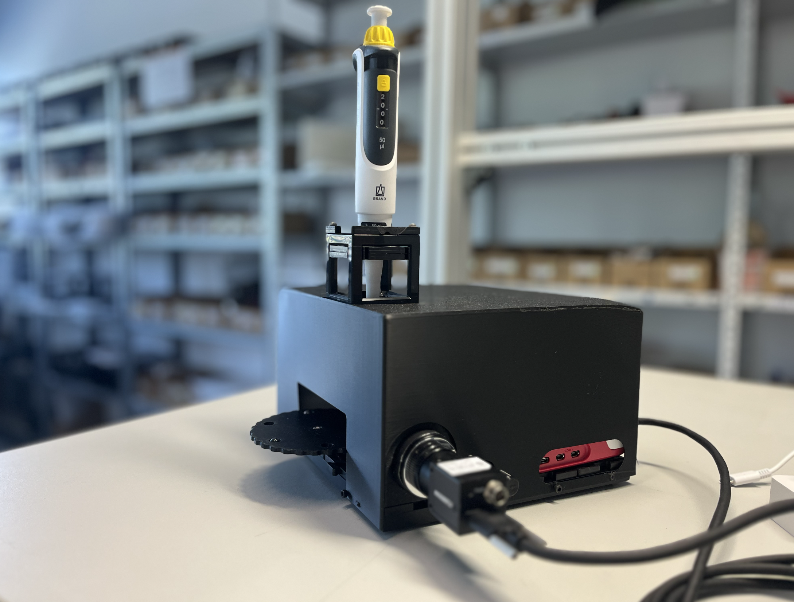
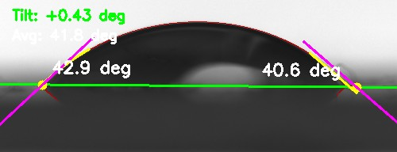
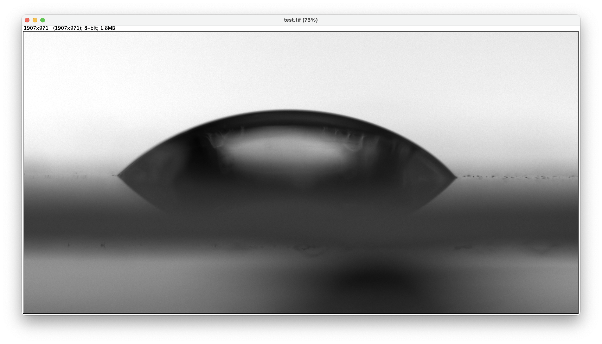
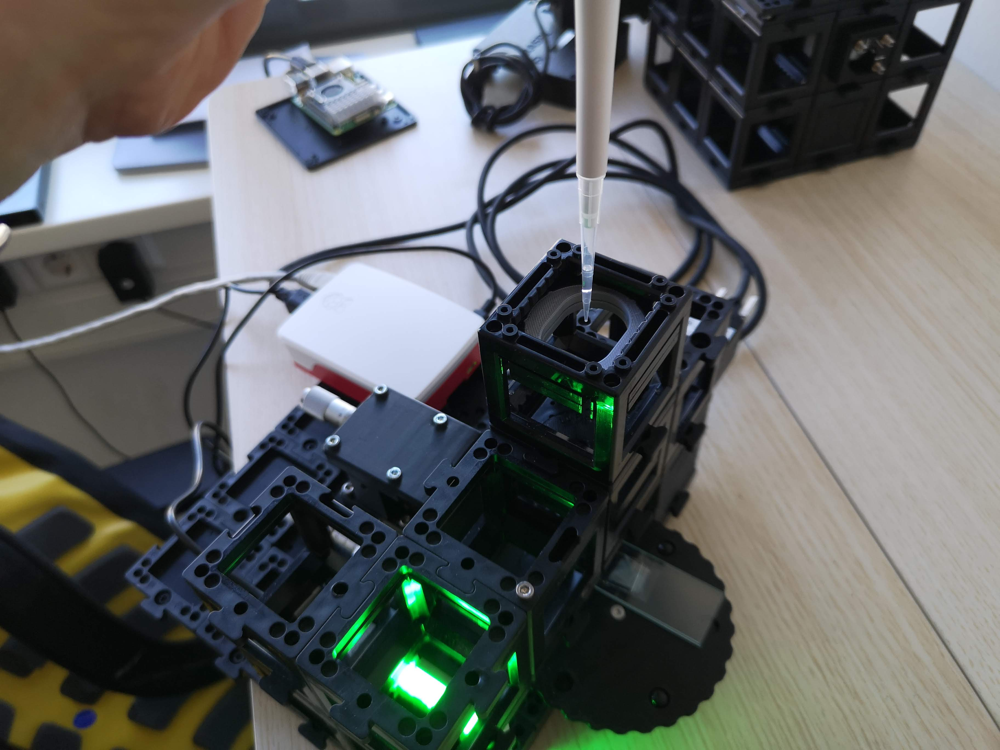
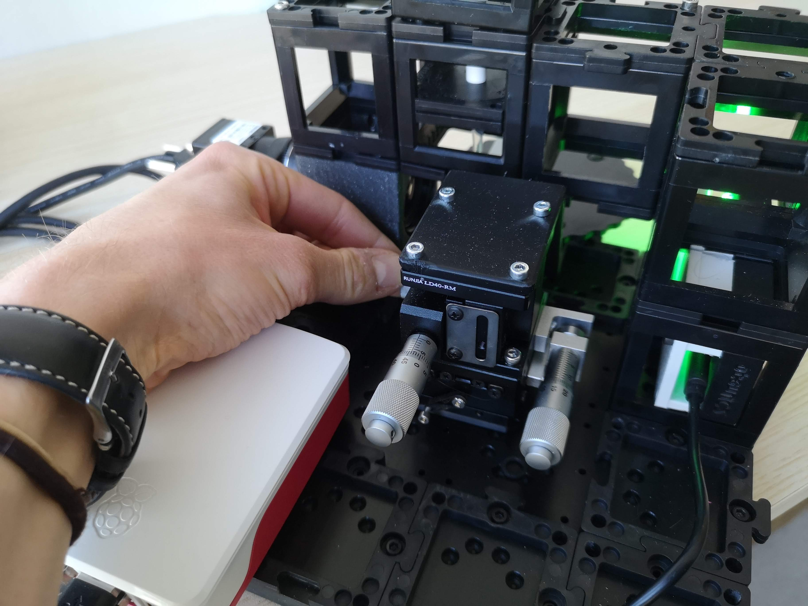

# openUC2 Goniometer – Tutorial

Measure sessile-drop contact angles with your **openUC2 modular microscope** running **ImSwitch** on a Raspberry Pi.



Beware: There are cubes inside :)


## 1. Hardware Overview

```
              ┌─────────────────────────────┐
              │      openUC2 Cube "Stack"   │
              │                             │
              │  ┌──────────┐               │
              │  │ Pipette  │  (syringe or  │
              │  │ Holder   │   dispenser)  │
              │  └────┬─────┘               │
              │       │ droplet             │
              │  ══════════════  substrate  │
              │                             │
              │  ┌───────────┐              │
              │  │HIK IMX178 │ USB3 camera  │
              │  │ CCTV Lens │  ~90° to drop│
              │  │    25 mm  │              │ 
              │  └───────────┘              │
              │                             │
              │  ┌──────────────────────┐   │
              │  │ LED Array + Diffuser │   │
              │  │  (back-light)        │   │
              │  └──────────────────────┘   │
              └─────────────────────────────┘
                        │ USB3
              ┌─────────▼──────────┐
              │   Raspberry Pi 5   │
              │   running ImSwitch │
              └────────────────────┘
                        │ Wi-Fi / Ethernet
              ┌─────────▼──────────┐
              │  Browser (laptop)  │
              │  ImSwitch UI       │
              └────────────────────┘
```

| Component | Details |
|-----------|---------|
| **Platform** | openUC2 modular cube system |
| **Controller** | Raspberry Pi 5 (runs ImSwitch) |
| **Camera** | HIK Vision IMX178 (USB 3.0, 6.4 MP, colour/mono) |
| **Illumination** | LED array + diffuser — back-lit, homogeneous |
| **Dispensing** | Syringe pipette held in a cube mount; drops ~1–10 µL |
| **Substrate** | Flat sample placed on the cube base plate |

The camera observes the droplet from the side (macro view) so the contact line between the drop and substrate is visible as the widest horizontal extent of the drop silhouette.


## 2. Software Stack

```
Raspberry Pi
└── ImSwitch  (Python, FastAPI REST)
    └── GoniometerController  (plugin)
        ├── REST API  /GoniometerController/…
        └── OpenCV image processing pipeline

Browser
└── ImSwitch Frontend  (React)
    └── GoniometerController.js  (this UI)
```

ImSwitch exposes the goniometer as a REST API.
The React frontend is served alongside ImSwitch and communicates over the
local network.


## 3. In Action 

The software workflow is explained in the following video. You have to connect to the Raspberry Pi's wifi or network (PW: `youseetoo`) and then navigate to the website http://192.168.4.1 and enable the Goniometer app in the side bar:

<iframe width="560" height="315" src="https://www.youtube.com/embed/i9ORYjFVBrc?si=PmFjd52UPWCQaZsi" title="YouTube video player" frameborder="0" allow="accelerometer; autoplay; clipboard-write; encrypted-media; gyroscope; picture-in-picture; web-share" referrerpolicy="strict-origin-when-cross-origin" allowfullscreen></iframe>


## 4. UI Walkthrough

The code for the backend is here:
https://github.com/openUC2/ImSwitch/blob/master/imswitch/imcontrol/controller/controllers/GoniometerController.py

The code for the frontend is here:
https://github.com/openUC2/ImSwitch/blob/master/frontend/src/components/GoniometerController.js

### 4.1 Live Camera Stream

The top-left card shows a **live MJPEG stream** from the HIK camera.

- The stream is updated continuously — use it to position the pipette and
  focus the droplet before snapping.
- Zoom and pan are available on the **snapped image** (bottom card), not on
  the live view.

### 4.2 Setting a Crop ROI

For best results the algorithm only sees the droplet and its reflection — crop
out any background clutter.

1. Click the **Crop icon** (✂) in the live stream card header.
   The cursor changes to a crosshair and an info banner appears.
2. **Click and drag** a rectangle around the droplet (include a little
   background above and below).
3. Release the mouse — the crop is sent to the backend and a gold dashed
   rectangle persists on the live view.
4. To remove the crop, click the **×** on the orange "Crop active" chip, or
   click **Reset Crop**.

> **Why crop?** The algorithm searches for the widest contour in the image.
> Bubbles, pipette edges, or substrate edges that extend further than the drop
> width will confuse the baseline detection.

### 4.3 Camera Settings

Below the live stream you find two fields:

| Field | Typical value | Effect |
|-------|--------------|--------|
| **Exposure (ms)** | 2 – 10 ms | Shorter = less motion blur; too short = dark image |
| **Gain** | 0 – 10 | Amplifies signal; higher gain adds noise |

Press **Enter** or click outside the field to apply.
A well-exposed image shows a bright, uniform background and a clearly dark
drop silhouette.

### 4.4 Snap an Image

Click the green **Snap** button.

- The backend captures a full-resolution frame from the HIK camera.
- If a crop ROI is active, only the cropped region is returned.
- The snapped image appears in the lower card.
- The raw image is also saved as a TIFF on the Raspberry Pi
  (`/tmp/goniometer_*.tiff` by default).

### 4.5 Automatic Measurement 



After snapping, switch to the **Auto** tab (right panel) and click
**Measure (Auto)**.

The algorithm runs in ~100 ms and overlays:

- **Green line** — detected substrate baseline.
- **Cyan circles** — left and right contact points.
- **Cyan curves** — polynomial fit along each drop edge.
- **Magenta lines** — tangent vectors at the contact points.
- **Angle labels** — left angle θ_L and right angle θ_R in degrees.
- **Top-left overlay** — mean angle and wetting regime
  (*hydrophilic* θ < 90° or *hydrophobic* θ > 90°).

The results (θ_L, θ_R, baseline tilt, regime) appear in the panel on the
right.

### 4.6 Manual Measurement



For difficult cases (very small drops, contaminated substrates) use the
**Manual** tab.

You place **3 points** on the snapped image:

| Point | How to place | Purpose |
|-------|-------------|---------|
| **Baseline 1** | Click on the substrate, left of drop | Defines substrate line |
| **Baseline 2** | Click on the substrate, right of drop | Defines substrate line |
| **Tangent** | Click on the drop edge at the contact point | Direction of drop wall |

**Step-by-step:**

1. Switch to the **Manual** tab.
2. Click **Place Points** to enter placement mode (cursor → crosshair).
3. Click three times in the order above.
   Small numbered markers appear on the image.
4. Click **Measure (Manual)**.
   The angle is computed from the angle between the baseline vector and the
   tangent vector. The result is shown immediately.

> **Tip:** Zoom in (use the +/− buttons or scroll) and pan (click-drag) before
> placing points for higher accuracy.

### 4.7 Focus Monitor

Enable the **Focus Monitor** toggle in the right panel.
Every 500 ms the backend computes the **Laplacian variance** (sharpness) of
the live image and sends it back.

A progress bar shows the value relative to the session maximum.
Maximize it while turning the focus ring (or the z-stage) to get the sharpest
possible image before snapping.

### 4.8 Algorithm Configuration

Expand the **Config** section in the right panel to tune the image-processing parameters. You probably don't need to touch them anyway. 

| Parameter | Default | Effect |
|-----------|---------|--------|
| **Canny Low** | 30 | Lower Canny hysteresis threshold — increase for noisy images |
| **Canny High** | 100 | Upper Canny threshold — decrease to detect weaker edges |
| **Blur Kernel Size** | 5 | Gaussian pre-blur (odd numbers only) — reduce for sharp images |
| **Local Fit Fraction** | 0.15 | Fraction of drop width used for the tangent polynomial fit |
| **Polynomial Degree** | 2 | Degree of the tangent polynomial (2 = parabola, higher = more flexible) |
| **Tangent Delta (px)** | 1 | Finite-difference step for tangent evaluation |
| **Angle Min (°)** | 1 | Measurements below this are discarded as noise |
| **Angle Max (°)** | 179 | Measurements above this are discarded as noise |

Click **Reset Config** to return all values to defaults.
Changes are sent to the backend immediately and applied on the next measurement.

### 4.9 Measurement History & Export

Every successful measurement can be added to the session history:

1. After a successful auto or manual measurement click **Add to History**.
2. The history table shows: ID, time, mode, θ_L, θ_R.
3. The panel also shows a running **mean ± std** across all recorded values.
4. Use **Export CSV** or **Export JSON** to download the full table.
5. Click the download icon (↓) in the image card to save the annotated result
   image as a PNG.


## 5. Measurement Algorithm Explained

The algorithm is fully automatic and adapts to the wetting regime.

### 5.1 Preprocessing

1. The snapped frame is down-scaled so its longest edge ≤ 800 px (speeds up
   processing without losing accuracy at typical droplet sizes).
2. A Gaussian blur (kernel = `blur_ksize`) suppresses pixel noise.

### 5.2 Edge Detection & Contour Extraction

Canny edge detection produces a binary edge map.
The largest contour (by bounding-box width) is assumed to be the drop
silhouette including its mirror reflection in the substrate.

### 5.3 Wetting Regime Detection

The contour is profiled row by row to get width vs. vertical position.
The profile is smoothed and the maximum-width row (equator) is found.

- **Hydrophilic (θ < 90°):** No waist below the equator. The two widest
  points are the contact points; a tilted baseline is fitted through them.
- **Hydrophobic (θ > 90°):** A width minimum (waist) exists below the equator
  — the drop overhangs the contact line. The waist row defines the baseline.

```
  Hydrophilic              Hydrophobic
      ___                   _____
    /     \               /       \
   |       |          ___/         \___  ← equator (widest)
    \     /               ↑
  ───┴───┴───         ────┼────────      ← waist → baseline
   contact pts         contact pts
```

### 5.4 Polynomial Tangent Fit

For each contact point a short section of the drop edge
(length = `fit_frac × drop_width`) is fitted with a polynomial of degree
`poly_degree`. The tangent vector is evaluated by finite differences.

- **Hydrophilic:** polynomial y(x) — fit in the horizontal direction.
- **Hydrophobic:** polynomial x(y) — fit in the vertical direction (avoids
  near-vertical tangent issues).

The contact angle θ is the angle between the tangent vector and the baseline.


## 6. Step-by-Step Workflow

```
1. Power on Pi + camera + LED array
2. Open ImSwitch in browser
3. Navigate to Goniometer
4. Set Exposure & Gain → bright, sharp live image
5. Place substrate on base plate
6. Dispense droplet with pipette
7. Check live view — is the full drop visible?
8.   ├── Yes → proceed to step 9
8.   └── No  → adjust pipette height / substrate position
9. (Optional) Set Crop ROI around the drop
10. Focus Monitor ON → maximize sharpness
11. Click "Snap"
12. Inspect snapped image
13.  ├── Drop clearly visible → Auto Measure
13.  └── Poor contrast / noise → adjust Canny / blur, re-snap
14. Review annotated result
15.  ├── Correct baseline & tangents → Add to History
15.  └── Wrong detection → Manual Measure or retune Config
16. Repeat steps 6–15 for each measurement
17. Export CSV / JSON when done
```


## 7. Tips for Good Results




- **Back-lighting should be uniform.** The LED array + diffuser should produce a uniform   bright background so the drop appears as a solid dark silhouette.  Avoid reflections on the substrate surface.

- **Keep the baseline horizontal.** If the substrate is tilted, the algorithm   compensates (reports `baseline_tilt_deg`) but accuracy decreases for   large tilts. Use the cube  levelling feet.

- **Crop tightly but not too tight.** Leave ~20 px of background above the   top of the drop and below the substrate.   The mirror reflection (below the substrate) is NOT needed — only the real   drop is used.


- **Bring sample to focus.** Use the micrometer stage to place the droplet in the image plane 



- **Repeat and average.** Dispense 5–10 drops and record each one.
  The mean ± std shown in the history panel is your reported contact angle.

## 8. Troubleshooting

| Symptom | Likely cause | Fix |
|---------|-------------|-----|
| No live stream | Camera not detected by ImSwitch | Check USB3 cable; verify camera name in device config |
| "Detection failed" overlay | No contour found | Increase contrast (exposure, gain); check Canny thresholds |
| Wildly wrong angles | Wrong contour selected (pipette, edge) | Set crop ROI to isolate only the drop |
| Only one angle returned | Drop touches image border | Widen crop ROI or move drop into view |
| Hydrophobic/hydrophilic wrong | Waist threshold too sensitive | Increase `waist_rise_thresh` in DEFAULT_CONFIG (backend) |
| Baseline very tilted | Substrate not level | Level substrate; or use manual mode with explicit baseline |
| Focus bar stuck at low value | Wrong camera name | Verify detector name in ImSwitch config matches `GoniometerController` detector key |
| Export produces empty file | No measurements added to history | Click "Add to History" after each successful measurement |

