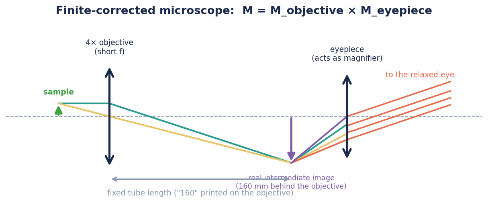
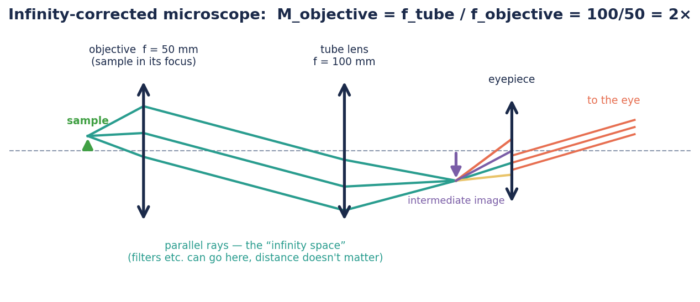

# How a microscope works

*Understanding-oriented. The deepest page of the CoreBox docs — worth it, because
after this you understand every research microscope you'll ever meet.*

A microscope is not "a stronger magnifying glass". It magnifies in **two stages**:
an **objective** forms an enlarged real image of the sample, and an **eyepiece**
magnifies that image again, like a loupe. Total magnification is the product:

$$M_\text{total} = M_\text{objective} \times M_\text{eyepiece}$$

The two microscope architectures in the CoreBox differ only in *how the objective
forms that first image.*

## The classical way: finite optics

The sample sits **just outside** the focal length of a short-f objective — the
"projector regime" pushed to the extreme
([see How images form](./how-images-form.md)). The objective casts a strongly
enlarged, real **intermediate image** at a fixed distance: the **tube length**,
160 mm by DIN convention, printed right on the barrel.

The CoreBox 4× objective works this way. Its magnification is fixed by design
(that's the "4×"), and the eyepiece adds its loupe factor:

$$M_\text{total} = 4 \times \frac{250\ \text{mm}}{f_\text{eyepiece}}$$

The catch: the geometry is **rigid**. The intermediate image must land exactly
160 mm away, so you cannot insert filters or extra optics into the tube without
shifting the image and breaking the objective's built-in aberration corrections.

## The modern way: infinity optics

Put the sample **exactly in the focal plane** of the objective and something
interesting happens: every point of the sample turns into a **parallel bundle** of
rays — the image "forms at infinity", i.e. nowhere yet. A second lens, the **tube
lens**, then focuses those bundles into the real intermediate image.

The objective magnification is now a *ratio of focal lengths*:

$$M_\text{objective} = \frac{f_\text{tube}}{f_\text{objective}}$$

In the [CoreBox build](../how-to/build-the-infinity-microscope.md): 100 mm / 50 mm =
2×, and with the 50 mm eyepiece (250/50 = 5×) a total of **10×**.

### Why bother? The infinity space

Between objective and tube lens the light is parallel — and parallel rays don't
care how far they travel:

You can stretch this **"infinity space"** and, more importantly, fill it with flat
optical components — colour filters, polarizers, beam splitters, fluorescence filter
cubes — **without shifting the image at all**. Every current research microscope
(Zeiss, Leica, Nikon, Olympus — with tube lens focal lengths of 165/200/200/180 mm
respectively) is built this way for exactly this reason. When you slide the tube
lens back and forth in your CoreBox build and the image refuses to move, you are
seeing the design principle of a €300,000 confocal microscope.

## Decoding the objective

The numbers engraved on the 4× objective:

| Marking | Meaning |
|---|---|
| **4×** | magnification (at the design tube length) |
| **0.10** | numerical aperture (NA) — see below |
| **160** | designed for 160 mm finite tube length ("∞" would mean infinity-corrected) |
| **0.17** | designed for a 0.17 mm cover slip |

Objectives up to 4× are often a single lens; higher magnifications hide entire
multi-lens systems in the barrel to fight aberrations.

## Numerical aperture: the real limit

Magnification you can always add — a shorter eyepiece, digital zoom. What you
**cannot** add afterwards is *detail*. The detail limit is set by the **numerical
aperture**, the sine of the half-angle of the light cone the objective accepts:

$$d_\text{min} \approx \frac{\lambda}{2\,\text{NA}}$$

For the CoreBox objective (NA 0.1, green light λ ≈ 550 nm):
$d_\text{min} \approx 2.8$ µm. Structures closer together than that merge into mush,
no matter how much you magnify — magnification beyond what the NA supports is
called **empty magnification**. (Why a light cone limits detail is a wave-optics
story — diffraction — and the [HoloBox](../../holobox/index.md) picks it up from
there.)

This one number explains the economics of microscopy: high-NA objectives need many
precisely made lenses in a tight cone above the sample — that is what you pay for,
not the magnification printed next to it.

## The eyepiece, briefly

An eyepiece is a magnifier for the intermediate image. The CoreBox ships a
**Ramsden eyepiece**: two identical plano-convex lenses a set distance apart. Versus
a single lens it gives a flatter, wider field with fewer colour errors at the edge —
compare them yourself in the
[smartphone microscope](../tutorials/your-first-microscope.md#try-this). The bright
little disc of light floating above the eyepiece (find it with a paper screen!) is
the **exit pupil** — your eye's pupil, or the phone camera, must sit exactly there,
which is why [phone positioning](../how-to/troubleshoot-the-smartphone-microscope.md)
is so fussy.

## Where this shows up in the CoreBox

| Idea on this page | You'll meet it in… |
|---|---|
| Finite optics, tube length | [Build the finite microscope](../how-to/build-the-finite-microscope.md) |
| Infinity space | [Build the infinity microscope](../how-to/build-the-infinity-microscope.md) |
| Two-stage magnification | [Calibrate the magnification](../how-to/calibrate-magnification.md) |
| Exit pupil | [Troubleshooting](../how-to/troubleshoot-the-smartphone-microscope.md) |

---

**Want wave optics next?** The CoreBox deliberately stops where geometrical optics
stops. Interference, diffraction and holography live in the
[HoloBox documentation](../../holobox/index.md).
