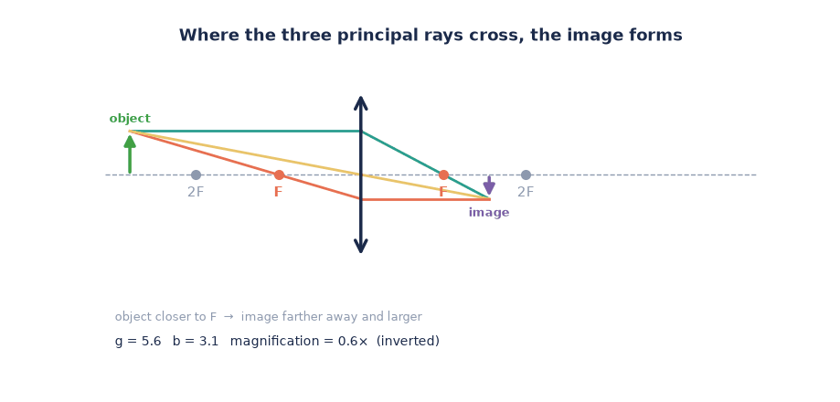
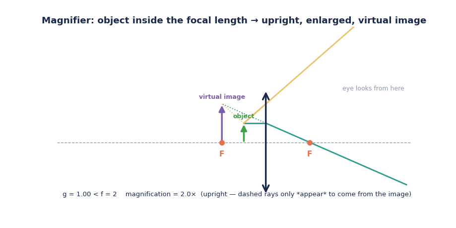
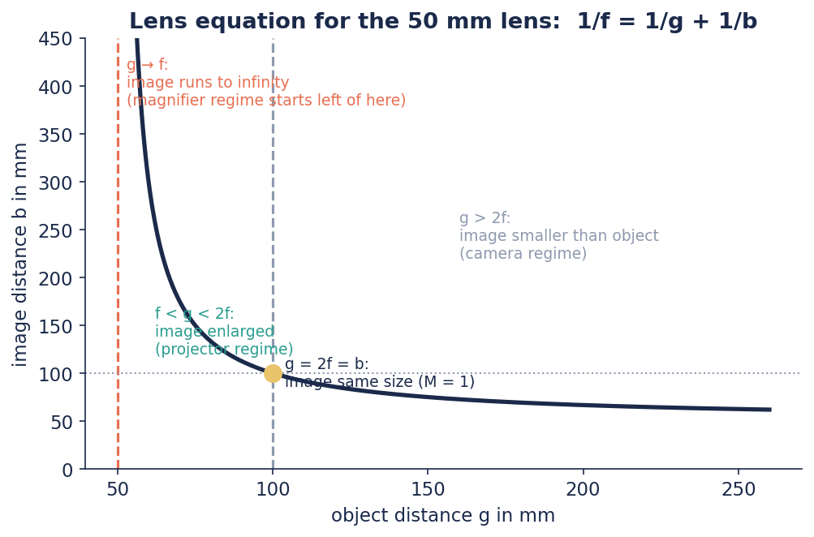
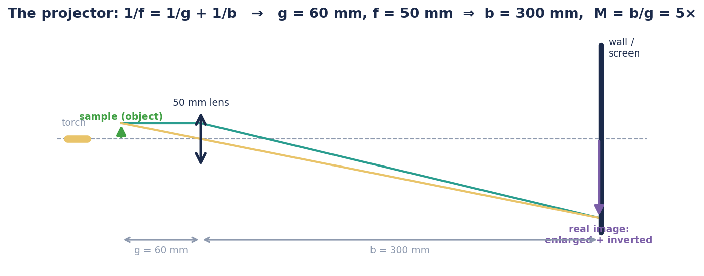

# How images form

*Understanding-oriented. The single most useful page in this documentation: one lens,
one formula, every regime.*

The same 50 mm lens projects a cinema-style image onto the wall **or** works as a
magnifying glass — depending only on **how far away the object is**. This page
explains why.

## The ray construction, animated

Take an object (green arrow), draw the [three principal rays](./light-rays-and-lenses.md#three-rays-you-can-always-draw)
from its tip, and the image sits where they cross. Watch what happens as the object
moves closer to the focal point:

Two things to notice:

- The image is **upside-down** (and left-right swapped). Rays from the top of the
  object end up at the bottom — an unavoidable property of a converging lens.
- As the object approaches **F**, the image races away and grows. *At* F it
  disappears to infinity.

## Real vs. virtual — the most important distinction in optics

A **real image** exists where light rays actually meet. You can put a screen there
and see it — the [projector](../tutorials/from-lens-to-projector.md) does exactly
that.

A **virtual image** is different: the rays never meet, they only *appear to come
from* a common point when your eye traces them backwards. You can see a virtual
image by looking into the lens — but a screen at its position shows nothing,
because no light is there.

Move the object **inside** the focal length and the real image is gone; instead an
upright, enlarged, virtual image appears — the **magnifier effect**:

## The lens equation

All of this — position, size, orientation — follows from one formula relating focal
length $f$, object distance $g$ and image distance $b$:

$$\frac{1}{f} = \frac{1}{g} + \frac{1}{b}$$

with the lateral magnification

$$M = \frac{b}{g}$$

Here is the whole behaviour of the 50 mm lens in one curve:

| Object distance | Image | Instrument |
|---|---|---|
| $g > 2f$ | real, inverted, **smaller** | camera, eye |
| $g = 2f$ | real, inverted, **same size** | 1:1 relay |
| $f < g < 2f$ | real, inverted, **enlarged** | **projector**, microscope objective |
| $g = f$ | no image (rays parallel) | collimator, "infinity" |
| $g < f$ | virtual, upright, enlarged | **magnifier**, eyepiece |

## The projector, quantitatively

With the sample 60 mm from the 50 mm lens, the equation predicts the image 300 mm
away and 5× enlarged — and that's what you measure in the
[tutorial](../tutorials/from-lens-to-projector.md). A cinema projector is the same
diagram with $g$ only a hair above $f$: tiny film frame, huge wall, $M$ in the
hundreds.

## Why does the magnifier magnify?

What limits how big something looks is the **angle** it takes up at your eye. You
can enlarge that angle by bringing the object closer — but closer than about 250 mm
(the standard "near point"), your eye can no longer focus.

The magnifier's trick: with the object inside the focal length, the lens creates a
virtual image **far away** that your relaxed eye can comfortably focus — while
covering the *large angle* of the close-up object. The standard measure compares
against the 250 mm near point:

$$M_\text{magnifier} = \frac{250\ \text{mm}}{f}$$

So the 50 mm lens gives 5×, the 100 mm lens 2.5× — and the 4× microscope objective
(f = 32 mm) used as a loupe about 8×. Shorter focal length, more magnification;
that's the entire arms race of microscopy in one sentence.

:::note ✏️ TODO — Benedict
Confirm f = 32 mm for the shipped 4× objective (stated in the old docs; a 160 mm
DIN 4× objective would nominally be nearer 40 mm).
:::

## Where this shows up in the CoreBox

| Idea on this page | You'll meet it in… |
|---|---|
| Real image + lens equation | [From lens to projector](../tutorials/from-lens-to-projector.md) |
| Real intermediate image | [Build a telescope](../tutorials/build-a-telescope.md) (Kepler), every microscope |
| Virtual image / magnifier | every eyepiece in the box |
| $g = f$: parallel rays | [infinity microscope](../how-to/build-the-infinity-microscope.md) |

---

**Next:** [How telescopes work →](./how-telescopes-work.md)
