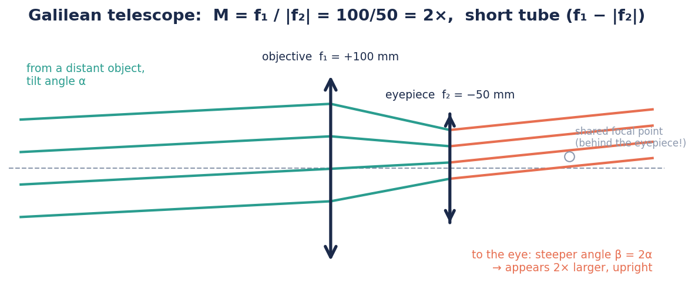
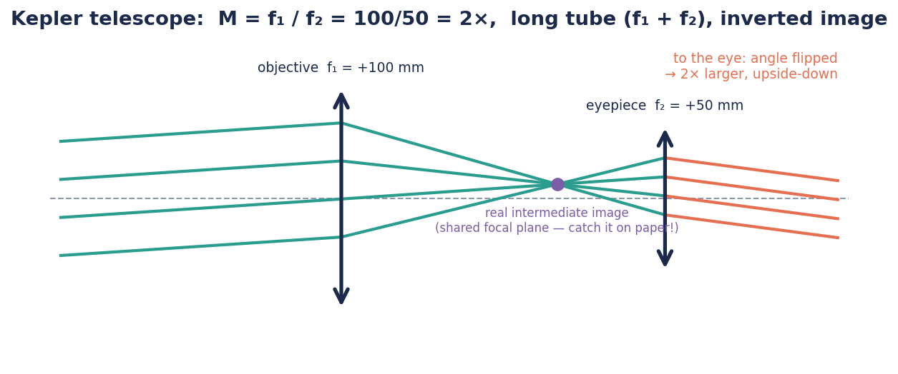

# How telescopes work

*Understanding-oriented. Read after (or instead of) building —
[the tutorial](../tutorials/build-a-telescope.md) is the hands-on version.*

A telescope does something odd if you think about it: the Moon is no brighter and no
closer after you build one. What a telescope really enlarges is the **angle** under
which you see things.

## Angles are everything

A distant object sends you practically **parallel rays**, arriving at some small
angle α to the axis. Your eye turns that angle into image size on the retina. A
telescope is an *angle amplifier*: parallel rays in at angle α, parallel rays out at
a larger angle β. The magnification is

$$M = \frac{\beta}{\alpha} = \frac{f_\text{objective}}{f_\text{eyepiece}}$$

Both CoreBox telescopes use the 100 mm objective, so with the 50 mm (or −50 mm)
eyepiece both give **M = 2**. The *way* they do it differs — and that difference
decides image orientation, tube length and field of view.

## The Galilean telescope: intercept before the focus

The objective starts bundling the rays towards its focal point — but the
**diverging eyepiece intercepts them first** and straightens them out again. The
two focal points coincide *behind* the eyepiece, so the tube is short:
$f_1 - |f_2| = 50$ mm.

Because the rays never cross, **the image stays upright** — which is why opera
glasses and cheap binoculars-toys use this design. The price: no real intermediate
image exists, the field of view is small, and high magnification is impractical.

## The Kepler telescope: go through the focus

Here the objective is allowed to finish the job: the rays **cross** in the shared
focal plane and form a **real intermediate image** — tiny, floating in the middle of
the tube, upside-down (as every real image is,
[see previous page](./how-images-form.md)). The converging eyepiece then works as a
magnifier looking at that image.

Consequences:

- The tube is long: $f_1 + f_2 = 150$ mm.
- The image is **inverted** — the eyepiece magnifies but doesn't un-flip.
- The intermediate image is a real place: you can put a paper screen there (try
  it!), or crosshairs — which is why rifle scopes and measuring telescopes are
  Kepler designs.
- Field of view and achievable magnification beat the Galilean, which is why
  **astronomy uses Kepler** — stars don't mind being upside-down.

## Side-by-side

| | Galilean | Kepler |
|---|---|---|
| Eyepiece | diverging (−50 mm) | converging (+50 mm) |
| Tube length | $f_1 - \lvert f_2\rvert$ = 50 mm | $f_1 + f_2$ = 150 mm |
| Image | upright | inverted |
| Intermediate image | none | real, accessible |
| Field of view | small | larger |
| Used in | opera glasses | astronomy, scopes |

## Making Kepler upright again: the spotting scope

Insert a third converging lens behind the intermediate image at 1:1 ([$g = 2f$](./how-images-form.md#the-lens-equation))
and it re-inverts the image without changing the magnification — the classical
**terrestrial telescope**. It works in the CoreBox but gets long; real binoculars
solve the same problem compactly with prisms.

## Two questions worth asking in class

- **Why not just use a stronger eyepiece for more magnification?** Try it: swap the
  Kepler eyepiece for a shorter focal length. The image grows — and gets darker,
  dimmer, shakier. Magnification without more collected light is empty.
- **What does the objective diameter do?** It collects light and sets resolution.
  That's why observatories build mirrors measured in metres — and why the same idea
  returns as **numerical aperture** in the
  [microscope](./how-a-microscope-works.md).

---

**Next:** [How a microscope works →](./how-a-microscope-works.md)
