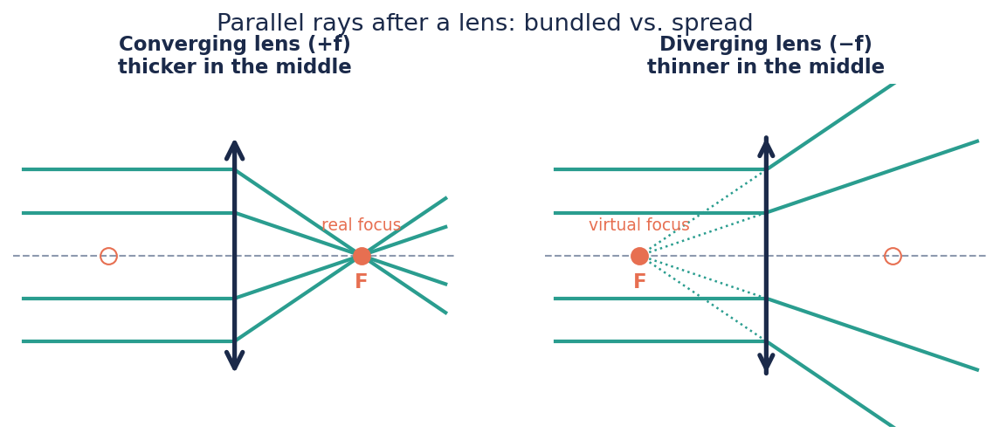

# Light rays and lenses

*Understanding-oriented. No equipment needed — read this before you build.*

Every experiment in the CoreBox rests on one simple model: **light travels in
straight lines, and lenses bend those lines in a predictable way.** This page
explains that model — it's all you need for magnifiers, projectors, telescopes and
microscopes.

## Light as rays

Light is physically a wave (the [HoloBox](../../holobox/index.md) is all about
that), but for lenses and mirrors a simpler picture works astonishingly well: draw
light as **rays** — arrows that travel in straight lines until something bends them.

This is called **geometrical optics**. Its two ground rules:

1. In air, rays go **straight**.
2. At a lens, rays are **refracted** (bent) — glass slows light down, and the curved
   surface turns that slowdown into a change of direction.

## Focal length: the one number that defines a lens

Send rays **parallel to the axis** into a converging lens and they all cross at one
point: the **focal point F**. Its distance from the lens is the **focal length f**,
given in millimetres and printed on every CoreBox lens holder (50, 100, −50).

- A **converging lens** (+f) is **thicker in the middle**. Parallel rays are bundled
  into a **real focus** behind the lens — you can catch it on paper (that's also how
  you [measure f](../how-to/measure-a-focal-length.md)).
- A **diverging lens** (−f) is **thinner in the middle**. Parallel rays spread out as
  if they came from a **virtual focus** *in front of* the lens. Nothing to catch on
  paper — but your eye can follow the spread-out rays back and "sees" that point.

:::tip Feel it with your hands
Sunlight (parallel rays!) through the 50 mm lens makes a hot bright dot at 5 cm.
The −50 mm lens never makes a dot, no matter how you hold it. That's the entire
difference in one experiment — with the usual warning: **never look at the sun
through any lens.**
:::

A handy way to compare lens strength is **optical power** $D = 1/f$ (f in metres),
measured in **dioptres** — the number on glasses prescriptions. The 50 mm lens has
+20 dpt, the 100 mm lens +10 dpt, the −50 mm lens −20 dpt. Shorter focal length =
stronger lens.

## The thin-lens simplification

Real lenses have thickness, two curved surfaces, and imperfections. For everything
in the CoreBox we treat each lens as a **thin lens**: a single flat plane that bends
rays, described *completely* by its focal length. This is why we can draw clean
diagrams and calculate with one small formula ([next page](./how-images-form.md)).

Where the simplification leaks, you can *see* it in your builds:

- **Chromatic aberration:** glass bends blue light slightly more than red, so each
  colour has its own focal point — the colour fringes at high-contrast edges.
- **Spherical aberration:** rays through the lens edge focus slightly closer than
  rays through the centre — the image can't be perfectly sharp everywhere at once.
  This is also why **lens orientation matters** in your builds: with the curved side
  facing the parallel beam, the bending is shared between the two surfaces and the
  error shrinks.

Finding these errors in your own setup is not failure — it's exactly what optical
engineers are paid to fight.

## Three rays you can always draw

For any object and any thin lens, three special rays are enough to construct the
image (watch them at work in the animation on the
[next page](./how-images-form.md)):

1. The **parallel ray** — runs parallel to the axis, then bends through the
   image-side focal point.
2. The **centre ray** — passes through the lens centre **unbent**.
3. The **focal ray** — passes through the object-side focal point, then leaves the
   lens parallel to the axis.

Where they cross, the image is. That construction — nothing more — explains every
instrument in this box.

## Where this shows up in the CoreBox

| Idea on this page | You'll meet it in… |
|---|---|
| Focal length | [Measure a focal length](../how-to/measure-a-focal-length.md) |
| Converging lens forms real images | [From lens to projector](../tutorials/from-lens-to-projector.md) |
| Diverging lens | Galilean eyepiece in [Build a telescope](../tutorials/build-a-telescope.md) |
| Ray construction | [How images form](./how-images-form.md) |

---

**Next:** [How images form →](./how-images-form.md)
