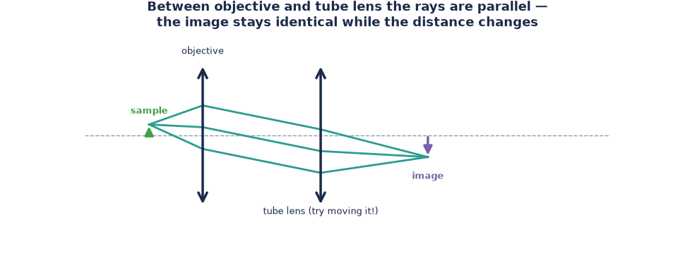

# How to build the infinity-corrected microscope

*Task-oriented. You've done the [telescope tutorial](../tutorials/build-a-telescope.md)
and want the microscope that works like the ones in modern research labs.*

Turn the Kepler telescope around and you have a microscope: this build uses the
**50 mm lens as objective**, the **100 mm lens as tube lens**, and a rotated 50 mm
lens (or the Ramsden eyepiece) to look in from above via a 45° mirror.

**Magnification:** objective $\times$ eyepiece $= \frac{f_\text{tube}}{f_\text{objective}} \cdot \frac{250\,\text{mm}}{f_\text{eyepiece}} = \frac{100}{50} \cdot \frac{250}{50} = 2 \times 5 = 10\times$

## What you need

- Sample holder cube + prepared sample
- 1× **50 mm lens cube** (objective)
- 1× **100 mm lens cube** (tube lens)
- 1× **50 mm lens cube, insert rotated 90°** (eyepiece, looking up) — see
  [Open and reconfigure a cube](./open-and-reconfigure-a-cube.md)
- 1× **45° mirror cube**, mirror facing up
- 2× empty cubes
- 10× puzzle base plates
- Torch

## Steps

1. Click **5 base plates** in a row.
2. Front of the row: **sample holder cube**, sample centred.
3. Behind it: the **50 mm objective** cube, then the **100 mm tube lens** cube.
4. Then one **empty cube**, and on the last plate the **45° mirror cube** with the
   mirror surface pointing **up**.
5. Stabilise with 5 plates on top.
6. On top of the mirror cube: the **rotated 50 mm eyepiece** cube.
7. Torch behind the sample holder, pointing at the sample.

*Sample holder joins the (former) Kepler telescope.*

*Empty cube and mirror cube extend the row.*

*Eyepiece on top of the mirror — mind its orientation.*

8. Switch on the torch, look down into the eyepiece, and slide the objective/tube
   lens gently in their cubes until the sample is sharp.

*If you see nothing, re-centre the slide first — alignment is everything.*

## Variant without the eyepiece: project the intermediate image

Skip mirror and eyepiece and let the tube lens throw the image directly onto a paper
screen ~100 mm behind it — a microscope you can watch as a group:

*Schematic: sample → objective → tube lens → screen.*

*Dim the room and the intermediate image appears on the paper.*

## The experiment that gives the design its name

With the image sharp, **change the distance between objective and tube lens** — the
image doesn't move and stays sharp:

Between the two lenses the rays travel **parallel** ("to infinity"). That's why
modern microscopes are built this way: filters, beam splitters and other modules can
be dropped into this space without shifting the image.
Full story: [How a microscope works](../explanation/how-a-microscope-works.md).

## Related

- [Build the finite microscope](./build-the-finite-microscope.md) — the classical alternative with the real 4× objective
- [How a microscope works](../explanation/how-a-microscope-works.md)
