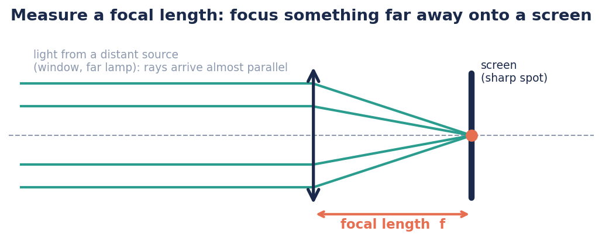

# How to measure a focal length

*Task-oriented. You know what a focal length is and want a number.*

## Converging lens (+50 mm, +100 mm): the distant-source method

The trick: light from a **far-away source arrives as (almost) parallel rays**, and
parallel rays meet exactly in the focal point.

1. Point the lens at something far away and bright — the window scene, or a ceiling
   lamp across the room. At least a few metres of distance.
2. Hold a piece of paper (the "screen") behind the lens, parallel to it.
3. Move the paper towards/away from the lens until a **small, sharp image** of the
   source appears (the window scene will be tiny and upside-down).
4. Measure the lens-to-paper distance with the ruler. **That distance is f.**

Expected: ≈ 50 mm and ≈ 100 mm for the CoreBox lenses (the printed value, within a
few millimetres).

:::tip More precise (Sek II): the lens-equation method
Use a nearby light source instead, measure object distance $g$ and image distance
$b$ for three different positions, and compute $f$ from
$\frac{1}{f} = \frac{1}{g} + \frac{1}{b}$ each time. Plotting $1/b$ against $1/g$
gives a straight line with intercepts $1/f$ — a nice measurement exercise.
:::

## Diverging lens (−50 mm): combine it with a known lens

A diverging lens never forms an image on a screen (its focus is *virtual*), so
measure it indirectly:

1. Hold the **+50 mm and the −50 mm lens directly together** and repeat the
   distant-source method.
2. For thin lenses in contact the powers add:

$$\frac{1}{f_\text{combo}} = \frac{1}{f_1} + \frac{1}{f_2} = \frac{1}{50} + \frac{1}{-50} = 0$$

   Zero power — the pair behaves like a flat window: **no image forms at any
   distance**. That's your proof the negative lens really has ≈ −50 mm.
3. For an actual number, pair the −50 mm with the **+100 mm** lens instead. Ideally
   the combination has $f_\text{combo} = \left(\frac{1}{100} - \frac{1}{50}\right)^{-1} = -100$ mm — still diverging.
   Pairing it with a stronger positive lens than +50 mm would give a measurable real
   focus; within the CoreBox, the window-pane experiment in step 2 is the clean result.

## Quick sanity check without any setup

Look through the lens at text and pull it away from the page:

- The distance where the magnified image **blurs and flips upside-down** ≈ the focal
  length of a converging lens.
- If it never flips and never magnifies → it's the diverging lens.

## Related

- [Light rays and lenses](../explanation/light-rays-and-lenses.md) — what the focal length means
- [From lens to projector](../tutorials/from-lens-to-projector.md) — use the measured value
