# Smartphone Fluorescence Microscope

This tutorial gives an idea how easy it can be to build a fluorescence microscope. It uses a high power LED with the appropriate filter set to for example image GFP-labelled samples. Here, we give you a quick intro how to setup the device. **Disclaimer:** This Tutorial uses the white light source from the coreBOX, but you will get better contrast with the fluorescence high power LED. 

## Tutorial

The is written by Lara Pötsch from the Friedrich Schiller University! Thanks! :) 

### Necessary Materials:

a)  three 45°-mirrors
b)  dichroic mirror
c)  infinity-corrected objective
d)  eyepiece
e)  manual z-stage
f)  sample holder
g)  three empty cubes
h)  torch
i)  torch holder (optional)
j)  phone holder (optional)
k)  eleven base plates
l)  light diffuser (optional)
m)  fluorescent sample
n)  smartphone/camera

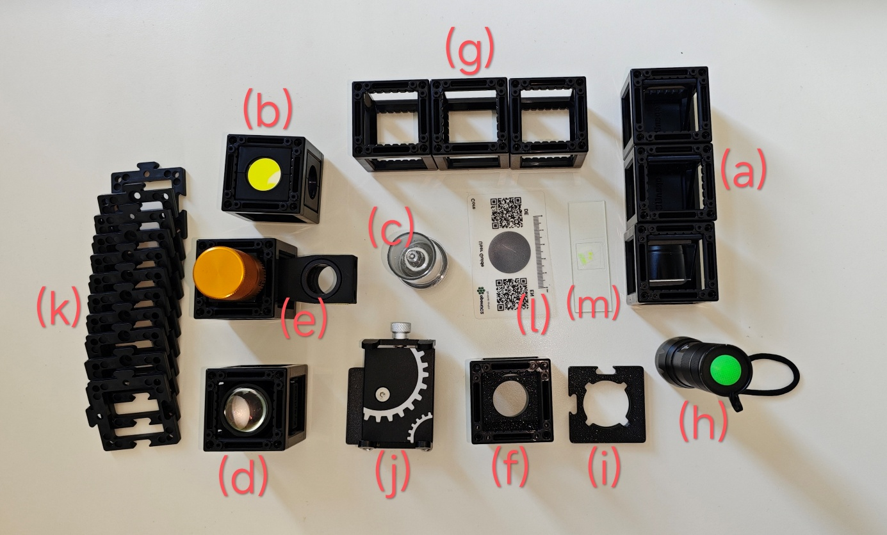

## Diagram:

<iframe
  src="https://youseetoo.github.io/configurator/viewer/?json=https://github.com/beniroquai/openUC2-OptiKit-Store/raw/7f2a476366afaeb70b4769c8aa5aa9388228cfe6/setups/setup-1758601890024.json"
  width="100%"
  height="500"
  frameborder="0"
></iframe>

## Building the microscope bottom to top:

1.  **Building the base plate:** Arrange 5 base plates like the image
    below. There the positions are labelled 1 through 4 for reference.
    This will create the ground structure of the microscope and connect
    the cubes for the mirrors, including the dichroic mirror, as well as
    the stage and detection unit.

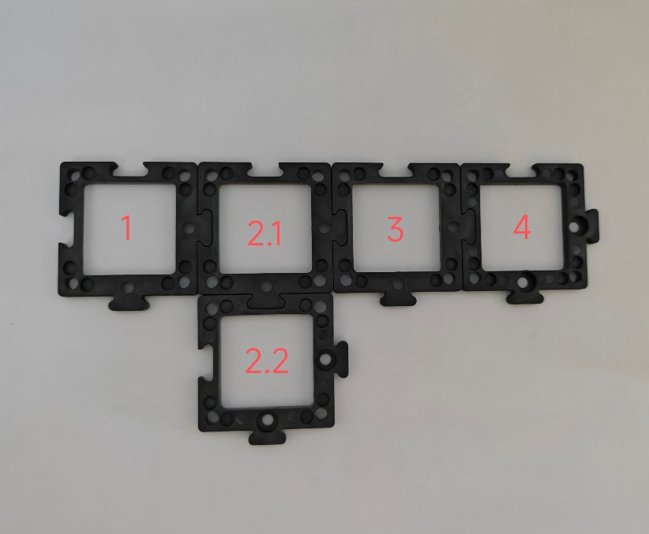

1.  **Finding the right orientation for the dichroic mirror:** The
    dichroic mirror has 3 circular cut-outs. One contains a
    yellow-looking and another one a blue-looking filter -- the
    respective colours are reflected and not transmitted. Since we are
    working with fluorescence, the excitation filter should pass lower
    wavelengths than the emission filter. Therefore, the yellow-looking
    but blue-transmitting filter should point towards the light source.
    The excitation light is then reflected towards the circular opening
    without a filter. In this direction the stage unit should be placed.
    The detection unit is built in the direction of the blue-looking but
    green/yellow-transmitting filter.

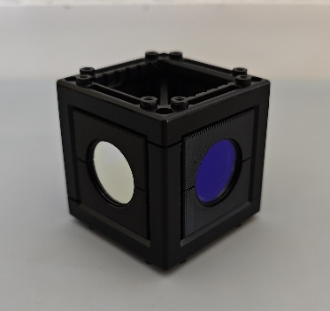

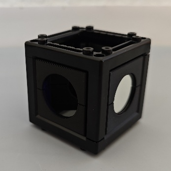

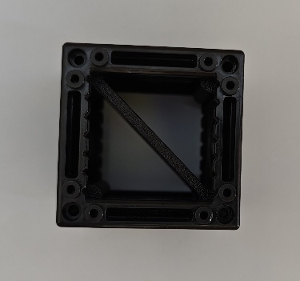

1.  **Placing the lowest row of components:** Place a 45°-mirror on the
    1^st^ and 3^rd^ base plate so that the mirrors point to each other
    like in the images below. Add a third 45°-mirror on position 2.2 in
    direction of base plate 2.1. Stick the dichroic mirror in between
    the 45°-mirrors so that the circular opening without a filter points
    to base plate 1 and the yellow-looking filter points to base plate
    2.2. Next, click an empty cube on base plate 4.

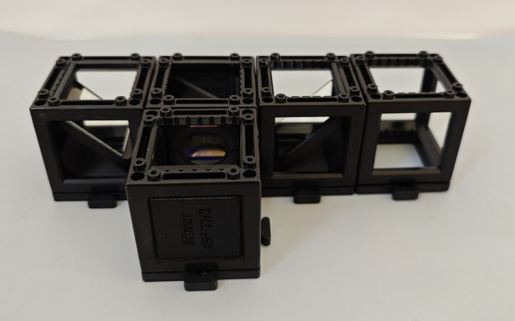

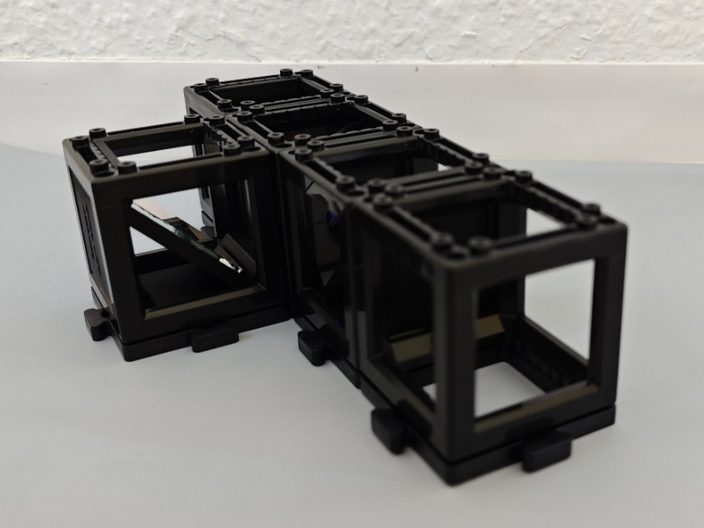

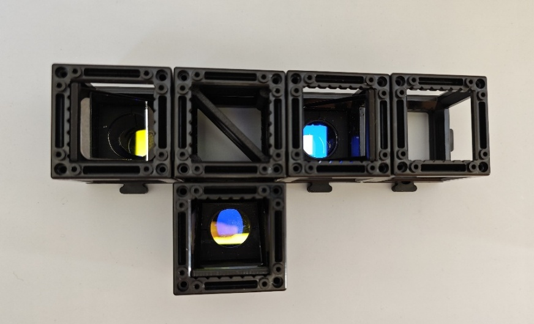

1.  **Stabilizing and preparing for the next row:** Place base plates on
    top of all cubes except 2.2. Instead, add the torch holder on top of
    the cube on position 2.2.

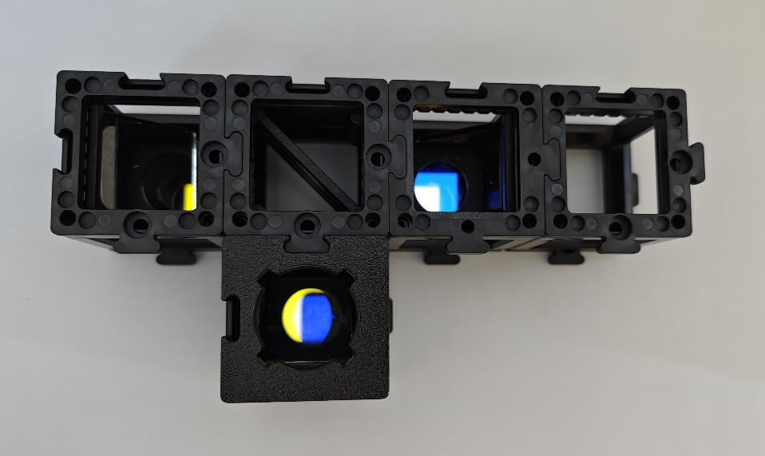

1.  **Assemble the stage unit:** Take the manual z-stage with the
    objective insert and place an empty cube around the objective
    insert. Add two base plates on top of the two cubes for
    stabilization like in the images below. Screw in your
    infinity-corrected objective of choice.

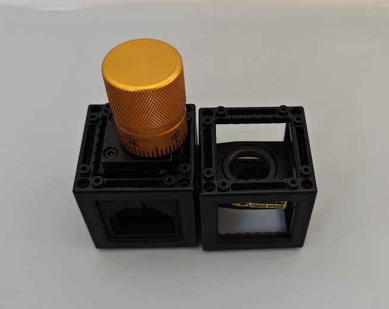

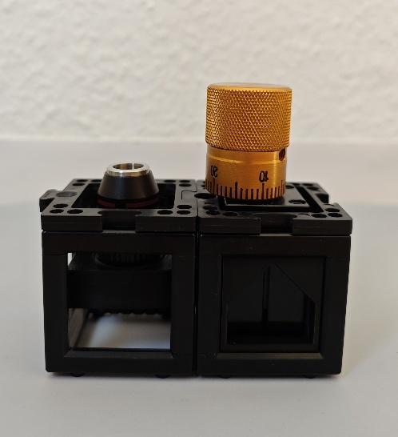

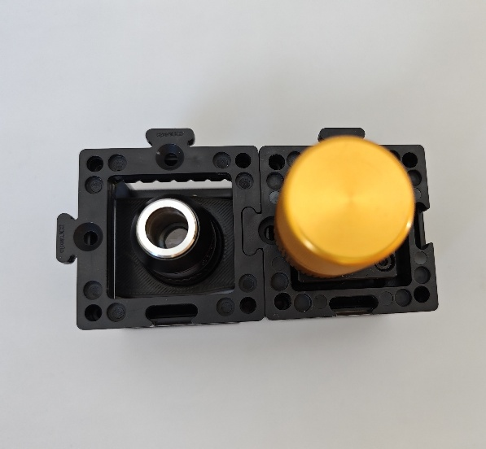

1.  **Adding the next row of components:** Now place the stage unit on
    top of cubes 1 and 2.1 with the objective insert directly above the
    mirror in position 1 like shown below. Stick the eyepiece on
    position 3 and another empty cube on position 4.

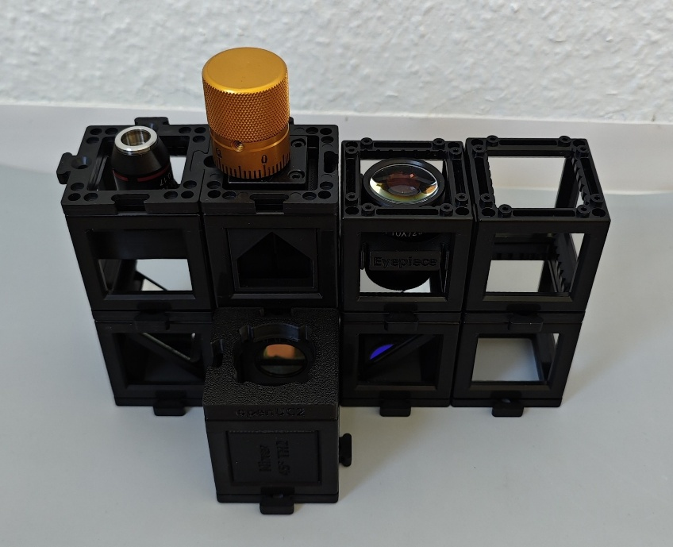

7.  **Adding the sample holder and phone mount:** Place the sample
    holder on top of the cube with the objective. Make sure that you
    orient the magnetic clip in a way that the sample slide later does
    not hit the focusing knob. Place the phone holder on the 4^th^
    position: this fixes your phone in place, so that you don't lose
    your field of view and you can adjust the focus and sample easily --
    however this is optional.

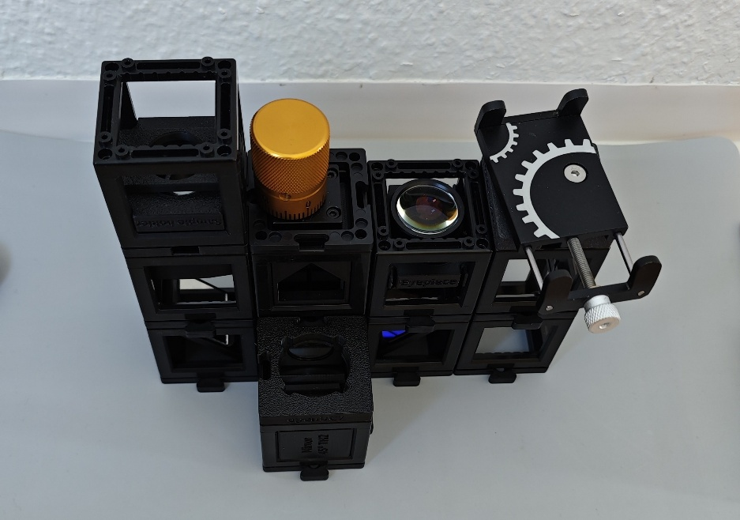

1.  **Adding the sample, the light and detection unit (aka your
    phone):** Place your sample slide in the magnetic clip with the
    cover glass pointing towards the objective. Finally, put the torch
    on the torch holder in position 2.2 and turn it on. Now you can
    place your phone in the phone holder and adjust it until you see the
    sample plane -- a bright spot.

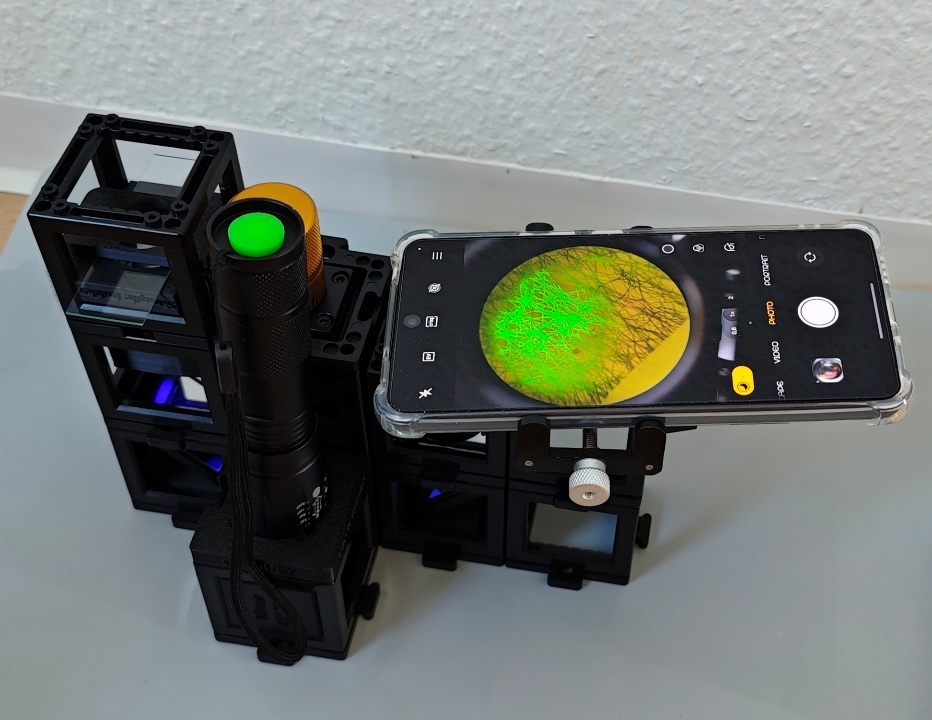

1.  **Final touches:** Focus the sample with the focus knob and/or by
    adjusting the height of the sample holder. The size of the
    illuminated area depends on the collimation of the torch. You can
    change the collimation by pulling or pushing the front part of the
    torch.

### Your Microscope can do Fluorescence AND Brightfield microscopy!

Fluorescence microscopy is achieved by placing the torch on top of the
dichroic mirror. The resulting image is the fluorescence overlayed
with the brightfield image due to the room light entering the
microscope from the top of the sample. If you cover the top of the
sample, you are left with the pure fluorescence image. However, some
reflections from room light entering other components might be seen as
well. To avoid this, you can darken the room or cover all components.

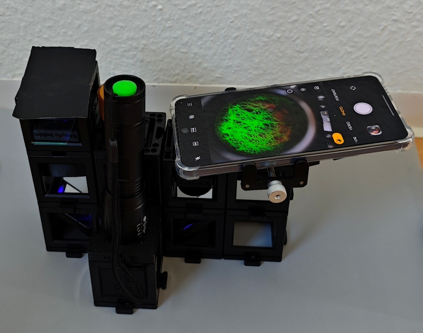

Set-up with a cover on top of the sample holder.

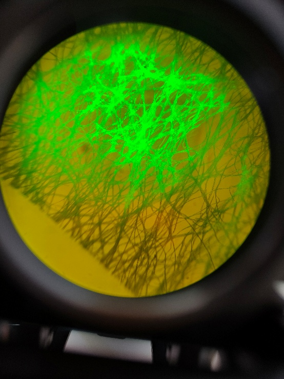

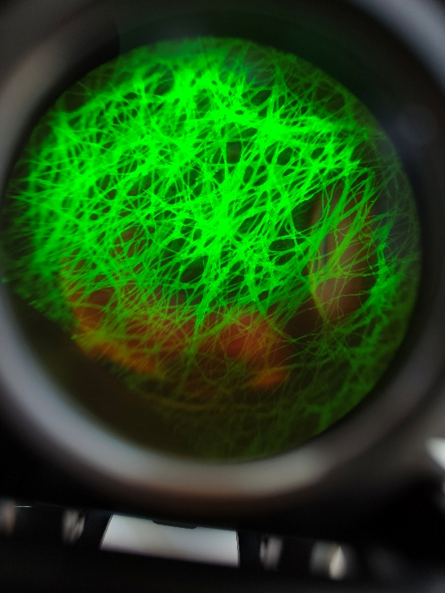

Fibers coloured with a highlighter pen. Left: Fluorescence image
overlayed with the brightfield image created from room light. Right:
Fluorescence image when the top of the sample holder is covered from
light.

To achieve the typical brightfield image, place the torch with the
torch insert on top of the sample holder. If you don't want to move
the torch holder, you can place a diffuser or a piece of rigid plastic
on the sample holder on which the torch can stand but transmits the
light.

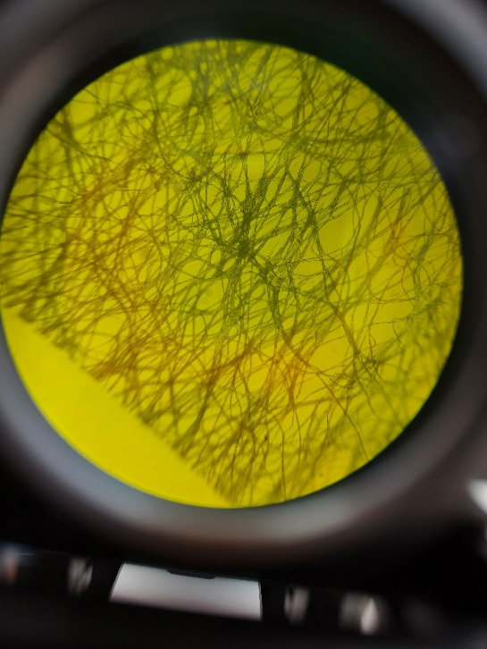

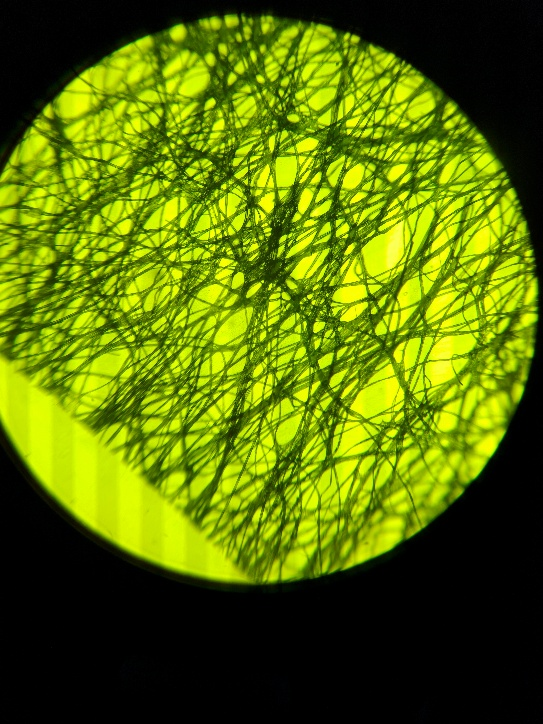

Brightfield image of fibers. Left: without any torch, just from the
room light. Right: with the torch on top of the diffuser on the sample
holder.

## Results 

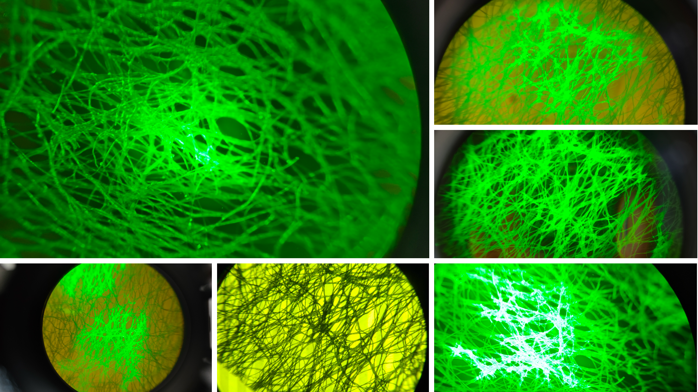

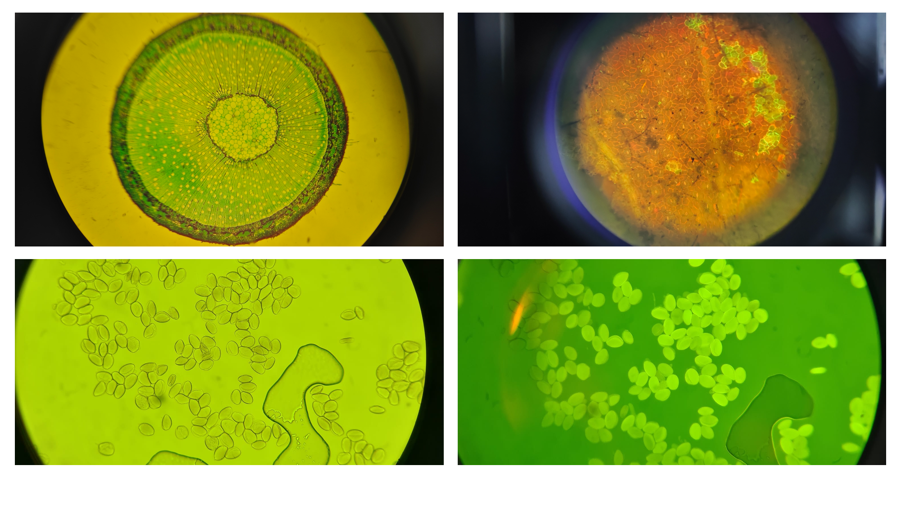

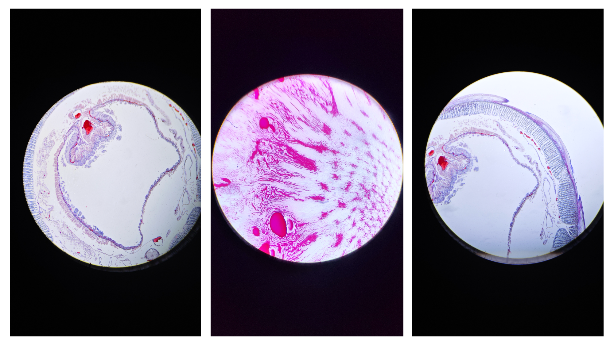