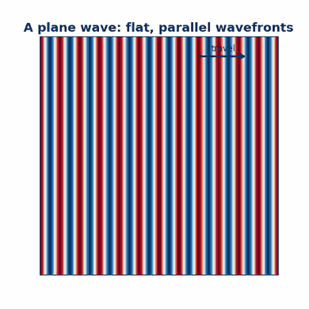
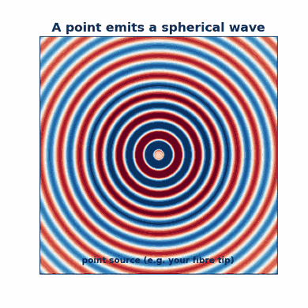
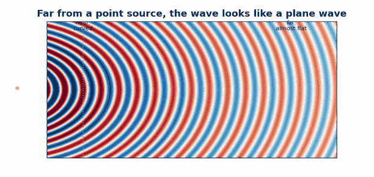
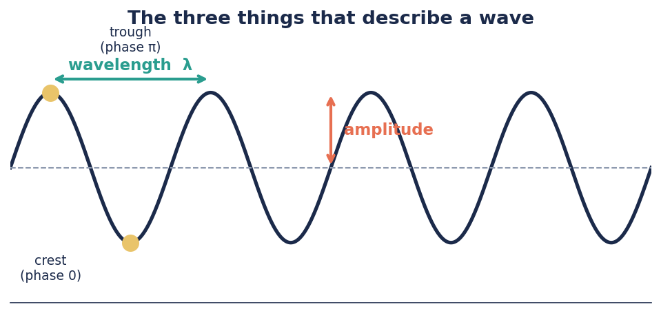
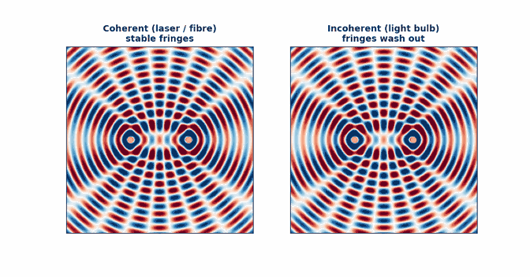

# Light as a wave

*Understanding-oriented. No equipment needed — read this before you build.*

Every experiment in the HoloBox depends the idea that **light behaves like a wave.**
This page explains what that actually means using visuals to get this concept intuitively.

## Waves transport energy

Here is the first trap. When we say "light is a wave," it is tempting to picture a wave *made of something*, like a wave on water, or a wave you send down a skipping rope. That picture is misleading.

A water wave needs water. A rope wave needs rope. But a **light wave needs nothing at all** — it travels happily through empty space, all the way from the Sun. What is "waving" is not a material. It is the strength of an **electric field** at each point in space, rising and falling, over and over, incredibly fast. It transports energy!

So when we draw light as a wavy line, the up-and-down of that line does **not** mean the light is physically moving up and down through the air. It is a graph of *how strong the field is*, plotted as the wave moves forward.

 
*A plane wave over time*

 
*A point source/spherical wave over time*

 
*A point source that becomes a plane wave at very long distances*

:::tip Keep this in mind
"Light is a wave" is a statement about **behaviour**, not about substance. Light *does the things waves do* — it interferes, it diffracts — without being made of any stuff.
:::

## The concept of wavelength, phase, amplitude

A wave repeats. To describe one, we only need three things.

**Wavelength (λ)** is the distance from one crest to the next. For visible light it is tiny — around 0.0005 millimetres. Different wavelengths look like different **colours**:
red light has a longer wavelength (~650 nm), green is in the middle (~530 nm), blue is shorter (~450 nm). The "nm" is a *nanometre*, a billionth of a metre.

**Amplitude** is the height of the wave — how strong the field gets. Bigger amplitude means **brighter** light.

**Phase** is *where in its cycle* the wave is right now; is it at a valley, a trough, or somewhere in between? You can't see phase
directly, but it decides everything when two waves meet (see
[Interference and diffraction](./interference-and-diffraction.md)).

## Why can't we see the phase of the wave?

Why doesn't ordinary light *look* like a wave? Because it wiggles far too fast for any eye or camera to follow. This is hundreds of trillions of times per second. So instead of seeing the wave itself, our eyes and cameras only register the **average brightness**, which we call **intensity**. The phase indicates the current state of the wave. Since it moves so fast, we can never see its actual state.

This matters a lot later: a camera records intensity, which means it **throws away the phase information.** Getting that phase back is the central puzzle of holography. (More in [What is a hologram?](./what-is-a-hologram.md).)

## Coherence: why we need a laser or a pinhole

For wave effects like interference to show up cleanly, the light has to be **coherent**.
Coherence means the wave is *orderly and predictable* — its crests and troughs march in step instead of being a jumbled mess.

There are two kinds:

- **Temporal coherence** ("coherence in time") means the light is close to a single pure colour. A laser is highly temporally coherent. A normal white LED is a chaotic mix of many colours, so we tame it with a **colour filter** to keep just a narrow band.
- **Spatial coherence** ("coherence across the beam") means the wavefronts are smooth and uniform across the beam. We improve this by sending the light through a **tiny pinhole**, which acts like a single, clean point source.

This is exactly why the experiments use either a **laser pointer** (the interferometers) or an **LED + colour filter + pinhole** (the holographic microscope). Both are just ways of producing orderly, coherent light.

 

## Where this shows up in the HoloBox

| Idea on this page | You'll meet it in… |
|---|---|
| Light is a wave | every experiment |
| Phase | [What is a hologram?](./what-is-a-hologram.md) |
| Coherence (laser) | [First Michelson fringes](../tutorials/first-michelson-fringes.md) |
| Coherence (LED + pinhole) | [Your first hologram](../tutorials/your-first-hologram.md) |

---

**Next:** [Interference and diffraction →](./interference-and-diffraction.md)
