# How to build a Mach–Zehnder interferometer

*Task-oriented. Best attempted after you've succeeded with the
[Michelson](../tutorials/first-michelson-fringes.md), since the alignment skills carry
over.*

The **Mach–Zehnder** interferometer does the same fundamental thing as the Michelson: 
split a beam, send the halves on different journeys, recombine them and interfere. But
with one practical difference: the two paths are **completely separate loops** instead of
back-and-forth arms. That gives you a clear, open path where you can **slide a sample into
one beam only**, which is what makes it useful for looking at transparent objects.

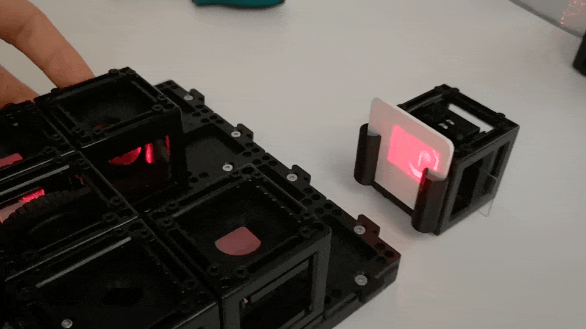
*The Interferometer fully assembled acts as a very senstive seismic detector*

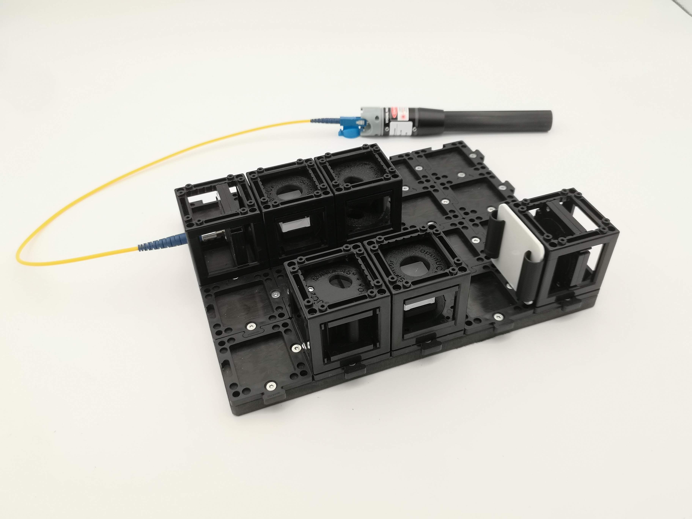
*In the end you will build something that looks like this*

## What you need

- Laser diode (650 nm) + fiber 
- **Two** beam-splitter cubes (one to split, one to recombine)
- One kinematic mirror, one static mirror cubes both set to 45° 
- A converging lens (beam conditioning)
- ~8 cubes and base plate
- The 1.5 mm hex screwdriver
- Screen
- Optional: camera

:::danger Laser safety
Keep the beam horizontal and below eye level, wear the goggles, and remove reflective
jewellery. Trace where **every** split beam goes — a Mach–Zehnder has more stray
reflections than a Michelson. The laser is general thought to be eye-safe, but better be safe than sorry! 
:::

## The layout: a rectangle of light

The beam travels around a rectangle:

0. **Setup the illumination** - let's place the fiber-coupled laser on the base plate

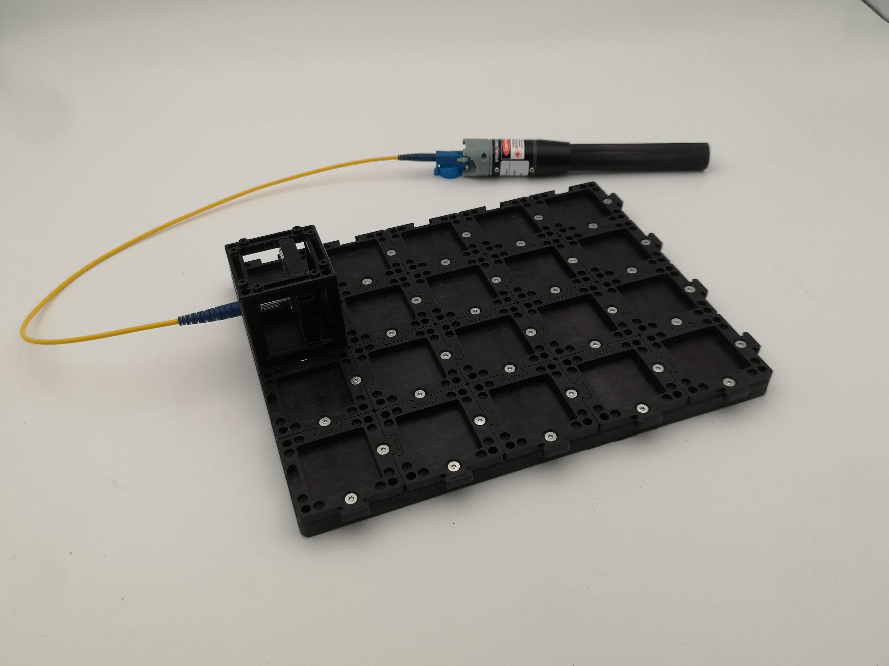

1. **First beam splitter** — divides the laser into two beams (call them the upper and
   lower path).

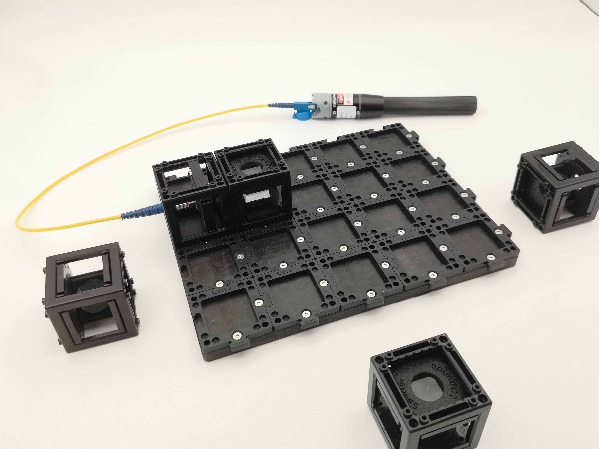

2. **Prepare Mirrors** - open the mirrors and set them to 45°, Place them on the grid; Each path has a **mirror** that turns it 90° so the two paths run parallel, then head
   toward the far corner.

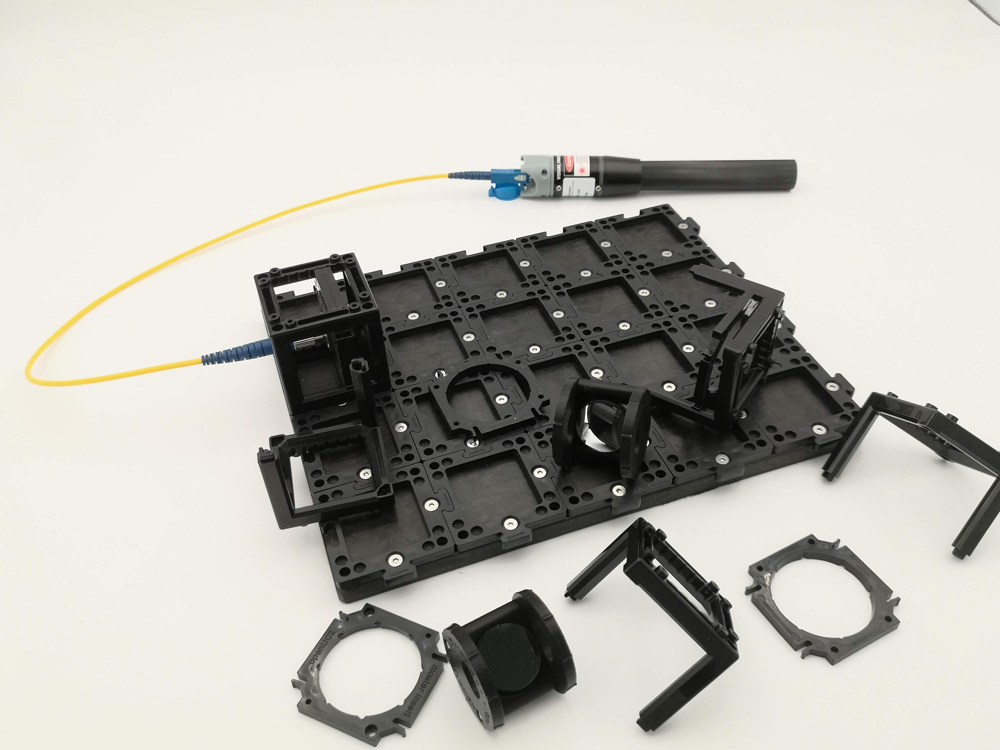

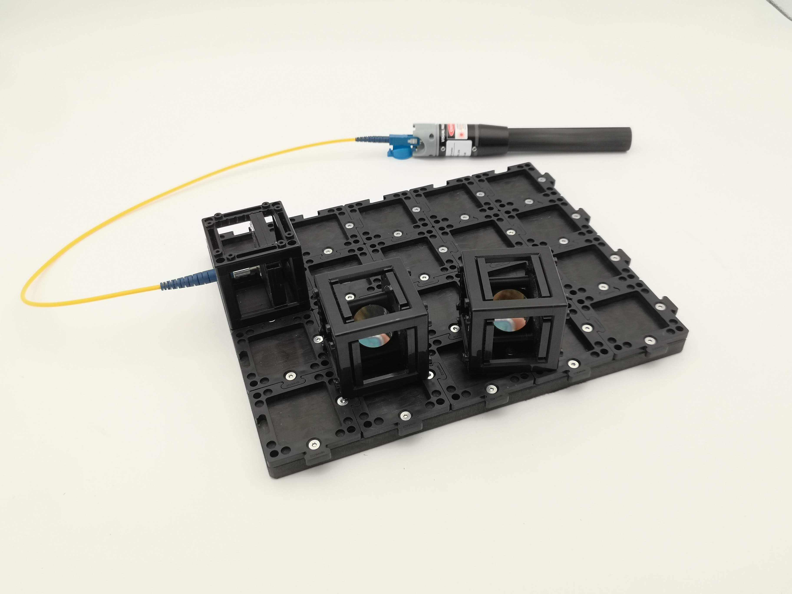

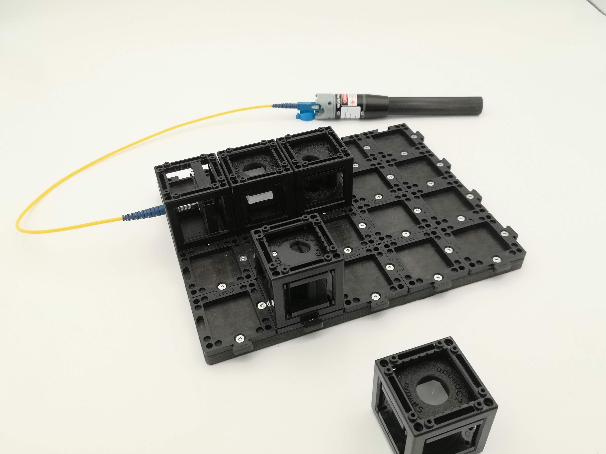

3. **Reunite the beams** - add the second beam splitter + the screen 

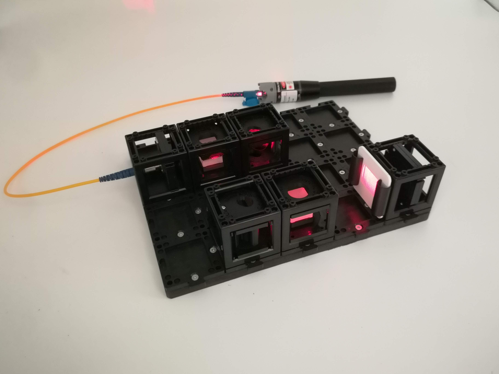

4. **Add a polarizing filter:** to tune the two contributing intensity of one of the beams. In the end they should have the same intensity to have best contrast (see Michelson Contrast)

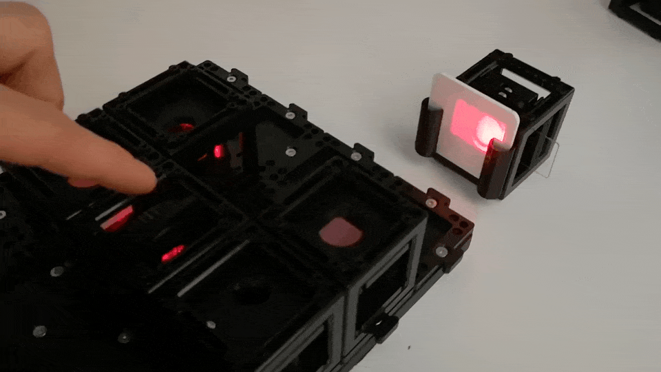
*Rotating the polarizer will dimm down one of the intensities in one arm. Ensure both arms have roughly the same intensity on the screen (obscure both sequentially and watch by eye)*

5. **Adjust the kinematic mirror:** match the two beams on the screen so that dust that sits in front of the first beamsplitter is reunited on the scree. This is a lot more involved than the michelson interfereomter since a parallel shift of one of the mirror w.r.t. the cube's center can move the coherence volume to the side a lot. Also polarization plays a role since the beamsplitter are not non-polarizing
6. 

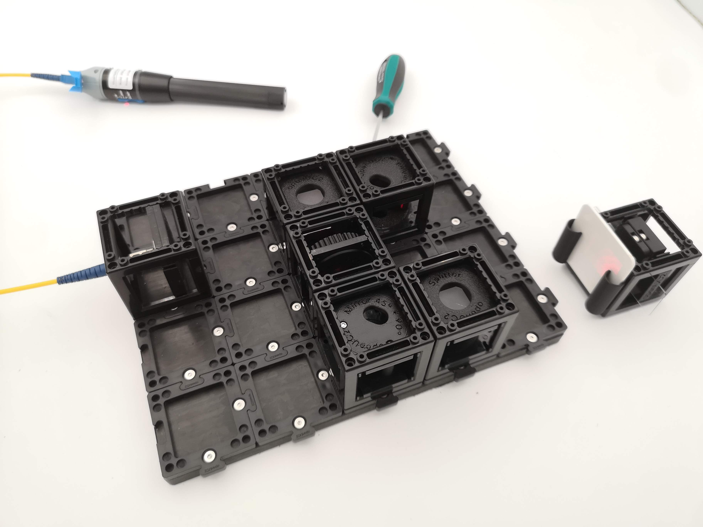

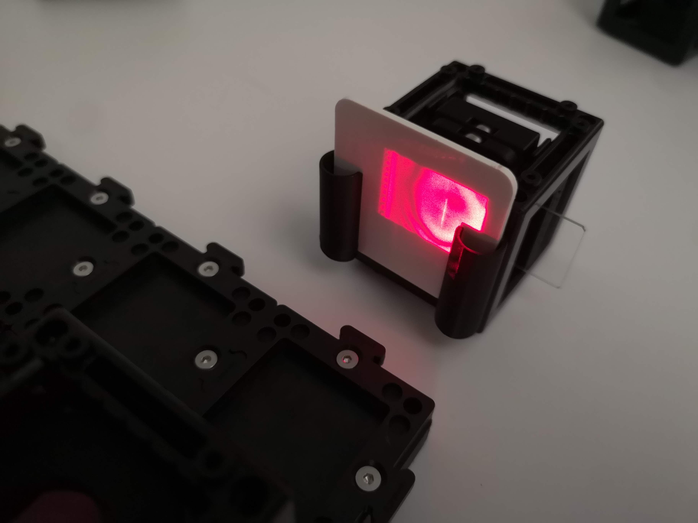
*A good interferogramm looks like this*

7. **Screen or camera** catches the pattern.
You can place the raspberry pi camera in place of the screen. With this it's a lot easier to align the interferometer since we see fine stripes on the ~pixel scale (several micrometer) and can iterate on the screws much faster. With the openUC2 Off Axis Holo APP running on the ImSwitch SD Card you can also observe the peaks in Fourier space and eventually reconstrct an off-axis hologramm: 

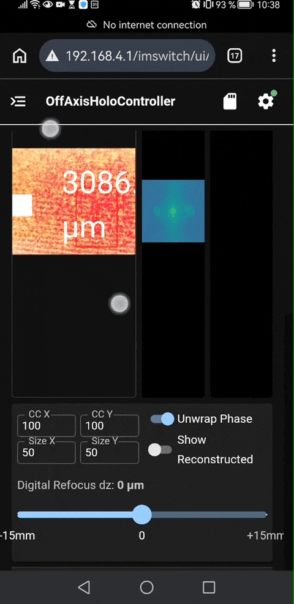

## Aligning it

The principle is the same as the [Michelson alignment guide](./align-an-interferometer.md):
get the **two output spots to overlap** using the kinematic mirror screws, **one screw at a
time**, then expand the beam to see fringes.

The extra challenge is that you have **two** mirrors and **two** beam splitters, so there
are more things to get square. Work methodically:

- First make each path hit the **centre** of its next component.
- Then use the kinematic mirror for the final overlap at BS2.
- Keep the whole rectangle rigid — every cube on puzzle pieces, on a solid surface.

## Add a sample: see phase (highly advanced)

Once you have stable fringes, gently slide a thin transparent object (a coverslip, a wisp
of clear tape, a drop of liquid) into **one** arm. Watch the fringes **bend or shift**.

That shift is the sample changing the **phase** of the light in that arm — light travels a
hair slower through glass than through air. The Mach–Zehnder has just turned an invisible,
perfectly transparent object into a visible, measurable fringe shift. That's the basic idea
behind **quantitative phase imaging** and **off-axis holography**, the more advanced
techniques this geometry leads into.

:::tip Michelson vs Mach–Zehnder — which when?
Use the **Michelson** to *see* interference and measure tiny distances (fringe counting).
Use the **Mach–Zehnder** when you want to put a **sample in one beam** and study how it
changes the light — it has a clean, accessible path the Michelson lacks.
:::

## Related

- [Align an interferometer](./align-an-interferometer.md) — the alignment recipe in detail.
- [What is a hologram?](../explanation/what-is-a-hologram.md) — where the two-beam idea
  leads.
