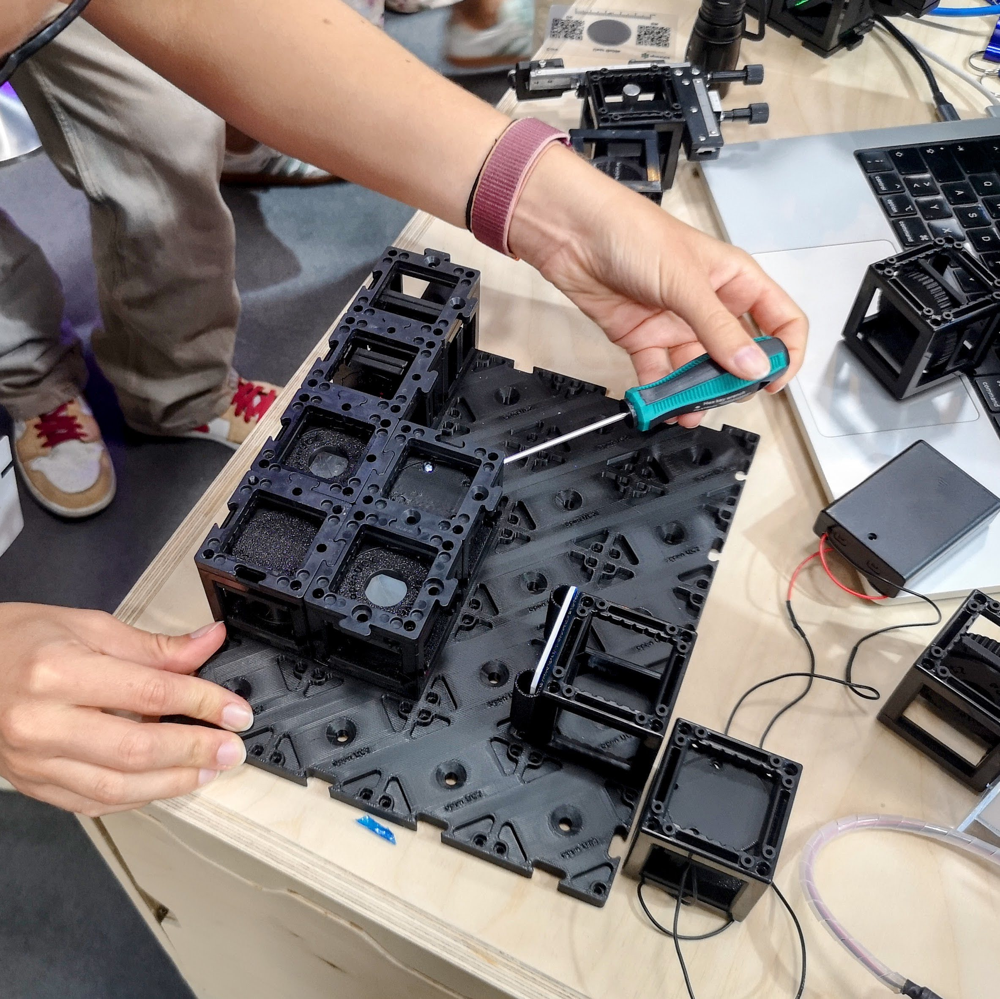

# HoloBox for Schools

*Build real optics experiments, see light behave like a wave, and record your own digital holograms — no expensive lab required.*

The **HoloBox** is a box of openUC2 cubes plus a small "smart camera" in the form of a Raspberry Pi 5 + Camera Module v2.1. With it you can build the same kinds of experiments that won Nobel Prizes: (Yay!)
* **Michelson interferometer**
* **Mach–Zehnder interferometer**
* **lensless holographic microscope** (Well Gabor won it for Holography, but still! :)

...  and then reconstruct the holograms on a computer.

These pages are written for **high-school students and their teachers**. You don't need university maths. The only thing you need: curiosity!


**Show:** As part of the holobox you can build a Mach Zehnder Interferometer, where the camera acquires fringes.


```
Universität Münster
Mathematisch-Naturwissenschaftliche Fakultät
Institut der Didaktik für Physik
Masterarbeit zum Thema:
Entwicklung von Unterrichtsmaterialien für
Experimente zur digitalen Inline-Holografie.
Development of Teaching Materials for Experiments in Digital Inline Holography.
Vorgelegt von:
Clara Hofmann
Hermannstraße 41, 48151 Münster
clara.hofmann@uni-muenster.de
```

## Where do I start?

This documentation is following Diataxis (https://diataxis.fr/) and is  split into four kinds of page. Pick the one that matches what you want **right now**:

### I want to build something today => **Tutorials**

Step-by-step, can't-fail walkthroughs. Start here if you have the box in front of you.

- [**Your first interference pattern (Michelson)**](./tutorials/first-michelson-fringes.md) — the friendliest first success. ~30 min.
- [**Your first hologram (inline holography)**](./tutorials/your-first-hologram.md) — record a hologram and bring a hidden image into focus on the computer. ~45 min.

### I know the basics and have a specific goal => **How-to guides**

Short, practical recipes for one task each.

- [Align an interferometer](./how-to/align-an-interferometer.md)
- [Build a Mach–Zehnder interferometer](./how-to/build-a-mach-zehnder.md)
- [Troubleshoot a bad hologram](./how-to/troubleshoot-holograms.md)

### I want to understand *why* it works => **Explanation**

Read these on the sofa. No equipment needed.

- [Light as a wave](./explanation/light-as-a-wave.md)
- [Interference and diffraction](./explanation/interference-and-diffraction.md)
- [**What *is* a hologram?**](./explanation/what-is-a-hologram.md) — the one idea most people get wrong.
- [How the computer reconstruction works](./explanation/how-reconstruction-works.md)

### I just need a number or a definition => **Reference**

- [Parts and parameters](./glossary/parts-and-parameters.md)
- [Glossary](./glossary/glossary.md) (English + German terms)

## A suggested classroom journey

If you're a teacher planning a unit, this order matches the physics build-up used in the
Münster teaching materials:

1. **Read** [Light as a wave](./explanation/light-as-a-wave.md) and
   [Interference and diffraction](./explanation/interference-and-diffraction.md).
2. **Build** the [Michelson interferometer](./tutorials/first-michelson-fringes.md) — students *see* interference with their own eyes.
1. **Discuss** [What is a hologram?](./explanation/what-is-a-hologram.md) — connect what they saw to the idea of recording a wave.
2. **Build** the [inline holographic microscope](./tutorials/your-first-hologram.md) and reconstruct a real sample.
3. **Go deeper** with [how reconstruction works](./explanation/how-reconstruction-works.md).

## What can you actually observe?

- Bright and dark **interference fringes** that shift when you nudge a mirror by less than a thousandth of a millimetre.
- A **hologram**: a pattern of fine rings that looks like nothing — until the computer turns it into a sharp picture of a tiny object.
- **Refocusing after the image is taken** - something an ordinary camera can never do.

## Open source

Everything about the HoloBox is open: the hardware (CAD files), the firmware, the reconstruction software, and these teaching materials. You may copy, remix, and reprint them for your class. See the [openUC2 docs home](https://docs.openuc2.com/) for licences.
