# Tutorial: Your first interference pattern

*Learning-oriented. Follow along start to finish — by the end you will have seen interference with your own eyes. About 30 minutes.*

In this tutorial you'll build a **Michelson interferometer** and watch two beams of light combine into a pattern of bright and dark rings. You'll even see light **cancel itself into darkness** — the clearest proof there is that light travels as a wave.

You don't need to understand the theory first. Just build it and look. (If you get curious afterwards, [Interference and diffraction](../explanation/interference-and-diffraction.md) explains what you saw.)

## Diagram:

<iframe
  src="https://youseetoo.github.io/configurator/viewer/?json=https://raw.githubusercontent.com/beniroquai/openUC2-OptiKit-Store/refs/heads/main/setups/setup-1753696751799.json"
  width="100%"
  height="500"
  frameborder="0"
></iframe>

:::note 🖼️ Image placeholder — `michelson-finished.jpg`
**Show:** The finished Michelson interferometer built from openUC2 cubes, with a clear
circular fringe pattern visible on the screen. This is the "you'll make this" promise
shot.
:::

## What you need

From the HoloBox Base Set:

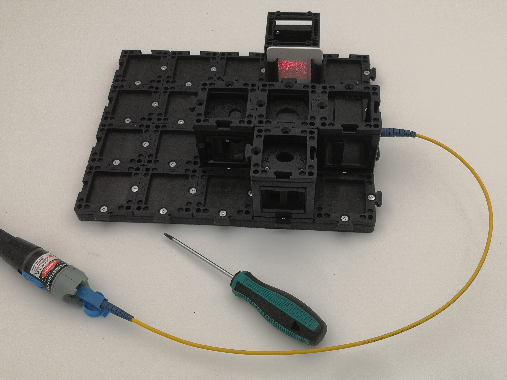
*The fully assembled Michelson Interferometer*

- red laser module (650 nm) in the form of a fiber tester 
- the glass fiber 
- the fiber adapter cube (SMA fiber insert)
- Beam-splitter cube
- Two mirror cubes (at least one must be the **kinematic** / adjustable one)
- A converging lens (optional)
- A screen
- Base plates and puzzle pieces
- The 1.5 mm hex screwdriver

:::danger Laser safety — read first
- **Never look into the laser beam or its reflections.**
- Keep the beam **horizontal and below eye level.** Sit so your eyes are well above it.
- Take off shiny watches and rings — they make stray reflections.
- A red laser pointer is low power, but treat it with respect.
:::

## Step 1 — Lay out the beam splitter and laser

Click the fiber adapter cube and the beam-splitter cube onto base plates so the laser fires straight into the beam splitter. Don't turn the laser on yet. We insert the fiber into the lsaer-based fiber tester. 

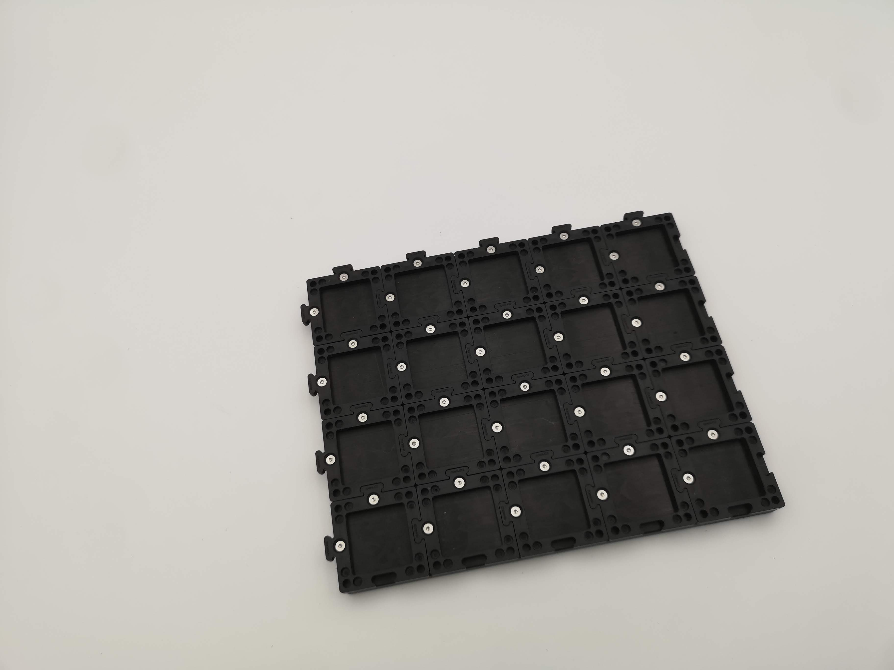
*Plate with puzzle pieces to mount cubes*

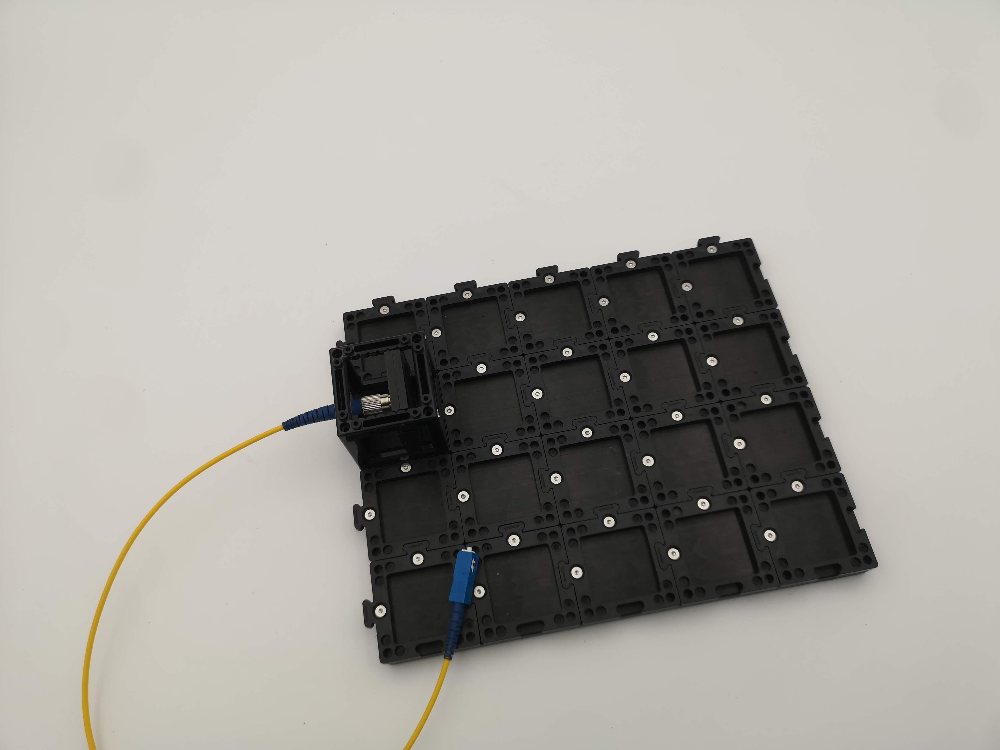
*Add the fiber + fiber holder cube to the plate*

The beam splitter does exactly what its name says: it splits the incoming beam into **two** beams that head off at 90° to each other. Later, those two beams will come back and meet again — that meeting is where interference happens.

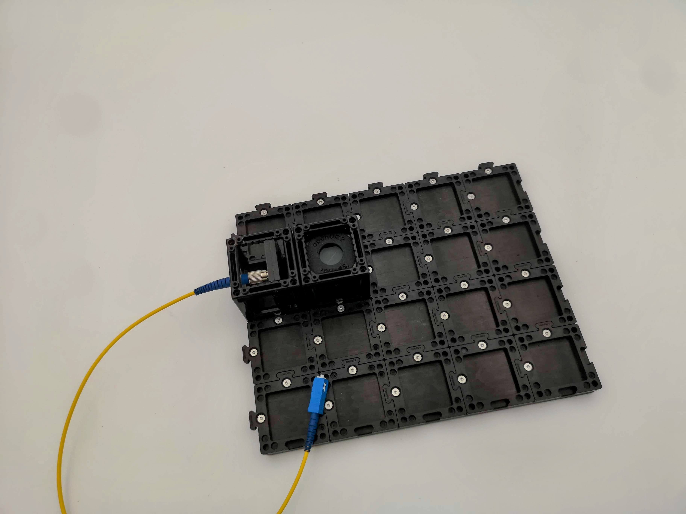
*The beam splitter cube will .. well .. split the beam in to two*

## Step 2 — Add the two mirrors

Place a mirror cube on each of the two beam-splitter outputs — one "straight ahead," one "off to the side." Make sure the **adjustable (kinematic) mirror** is one of them; its screws are how you'll fine-tune the pattern later.

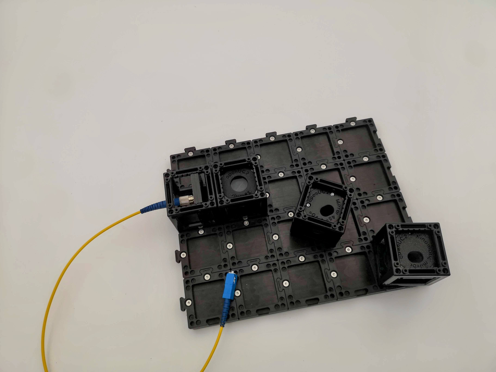
*Two mirrors - maybe they are oriented at 90° or 45°*

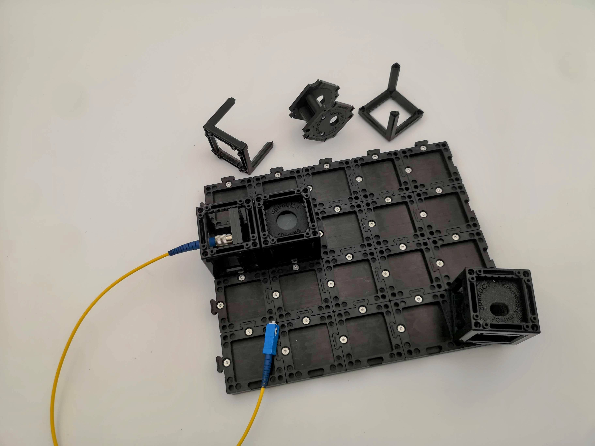
*In case it's not 90° - open the cube*

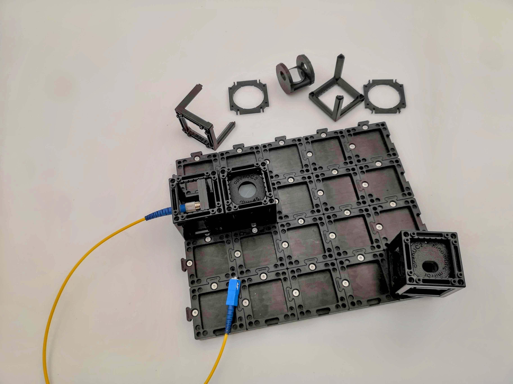
*Unmount the inner mirror bit*

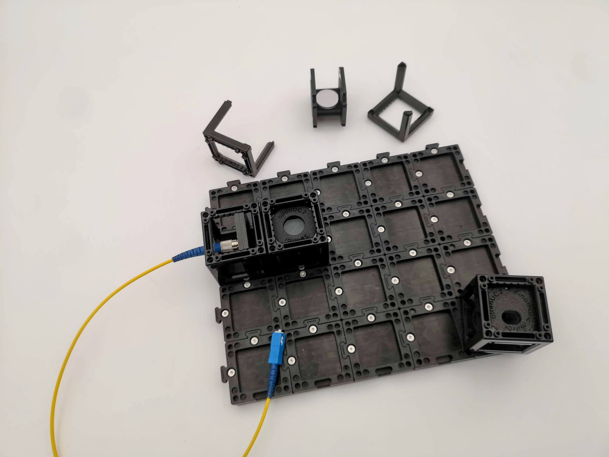
*PUt it back in so that it arrives at 90°*

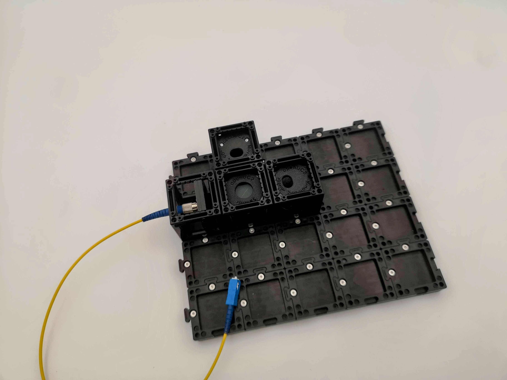
*Add both mirrors to the plate*

Each mirror bounces its beam straight back into the beam splitter, where the two beams recombine and head toward the screen.

## Step 3 — Add the screen and switch on

Put the screen on the fourth side of the beam splitter (opposite the laser). Now turn the laser on.

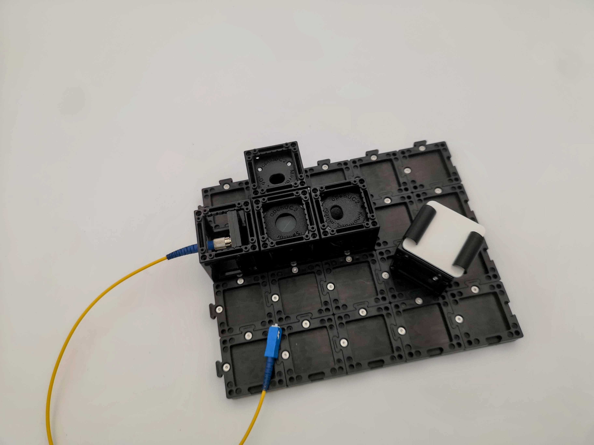
*add the screen*

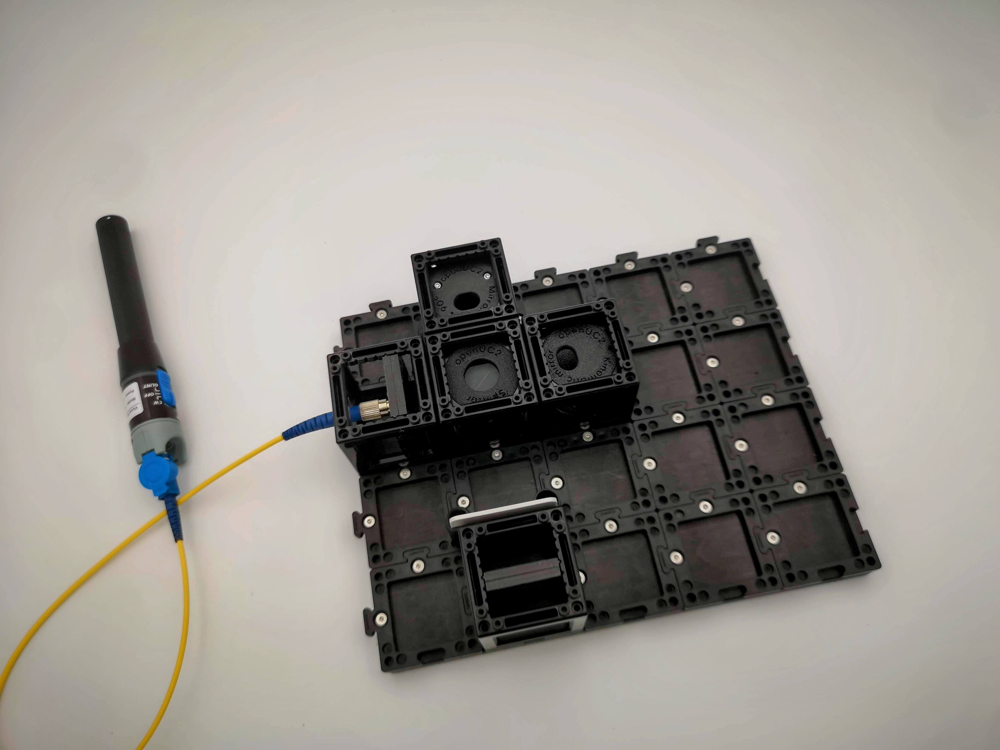
*Add the laser to the fiber*

You'll probably see **two separate red dots or red circles** on the screen — one from each mirror. Two dots means the beams aren't lined up yet. That's expected.

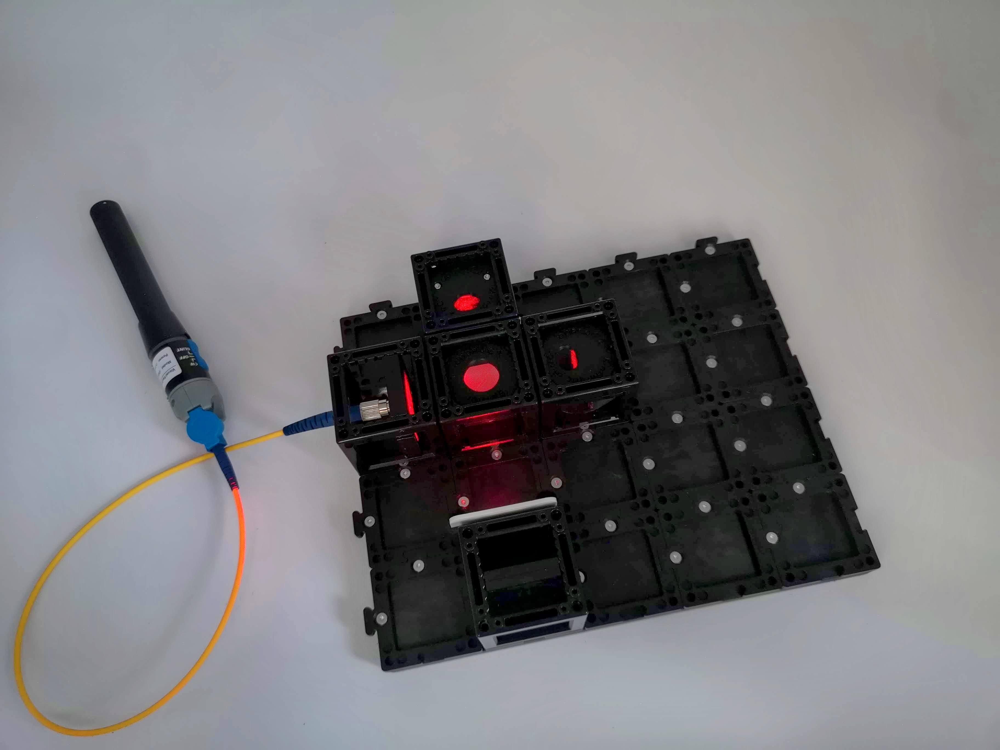

## Step 4 — Overlap the two dots

Using the hex screwdriver, gently turn the **two screws on the adjustable mirror**. Watch one of the dots move. Walk it across the screen until it sits **exactly on top of** the other dot.

Go slowly — a small turn moves the dot a long way. Patience here is the whole game.

## Step 5 — Add the lens and find the fringes

Now click the converging **lens** into the beam path between the laser and the beam splitter. This spreads each dot into a broad disc of light. Where the two discs overlap, you'll start to see **fringes** — and as you fine-tune the screws, they curl into a set of
**concentric rings** (called Newton's rings).

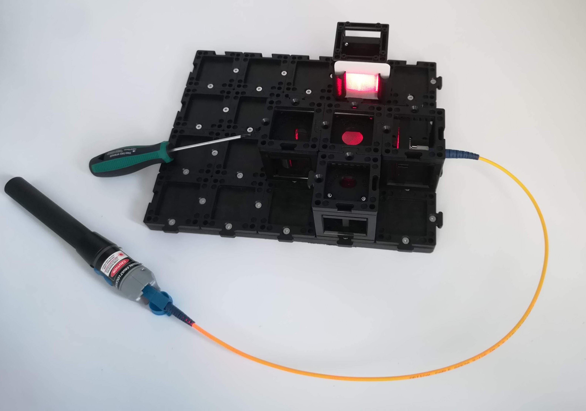

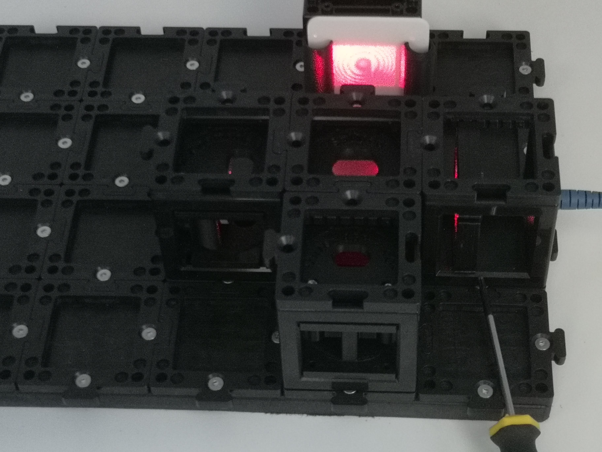

**That ring pattern is interference.** The dark rings are places where the two light waves arrived exactly out of step and cancelled out — light plus light making darkness.

**You did it.** You've built a working interferometer and seen light interfere.

## Try this: make the rings move

Very gently tap the table, or breathe warm air across one arm of the interferometer, and watch the rings **swim and shift.** Each time a ring moves in by one, that light path changed by just **half a wavelength** — about 0.00027 mm. You're watching a measurement of
distance far finer than any ruler.

## What's next?

- **It wouldn't align?** → [Align an interferometer](../how-to/align-an-interferometer.md) has a dedicated, patient walkthrough.
- **Understand what you saw** => 
  [Interference and diffraction](../explanation/interference-and-diffraction.md).
- **Ready for holograms?** → [Your first hologram](./your-first-hologram.md).
