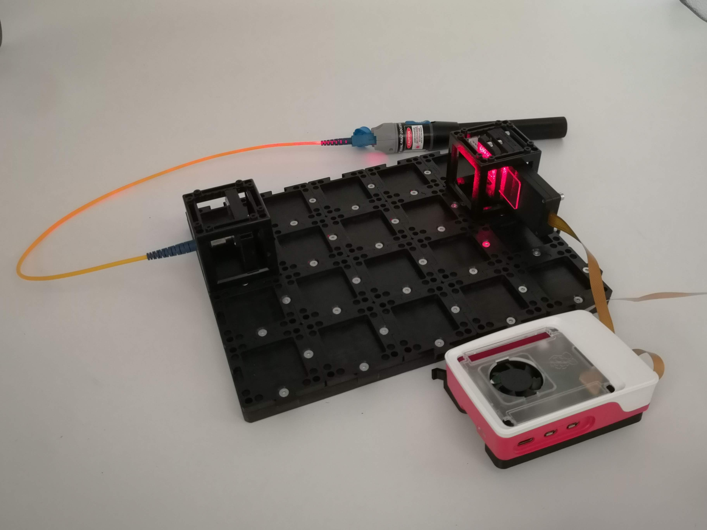
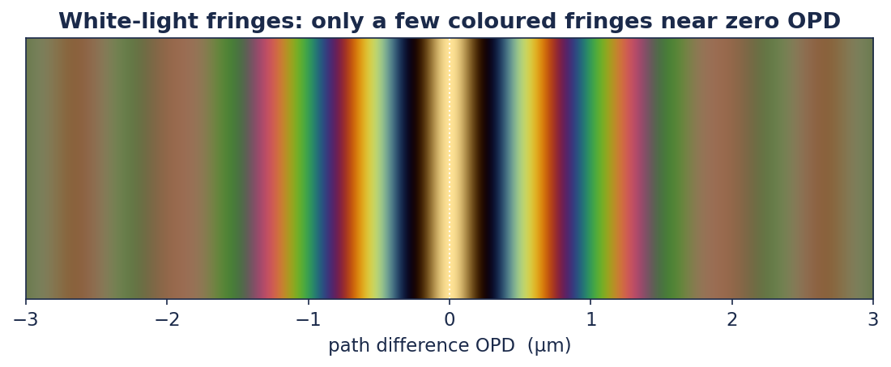
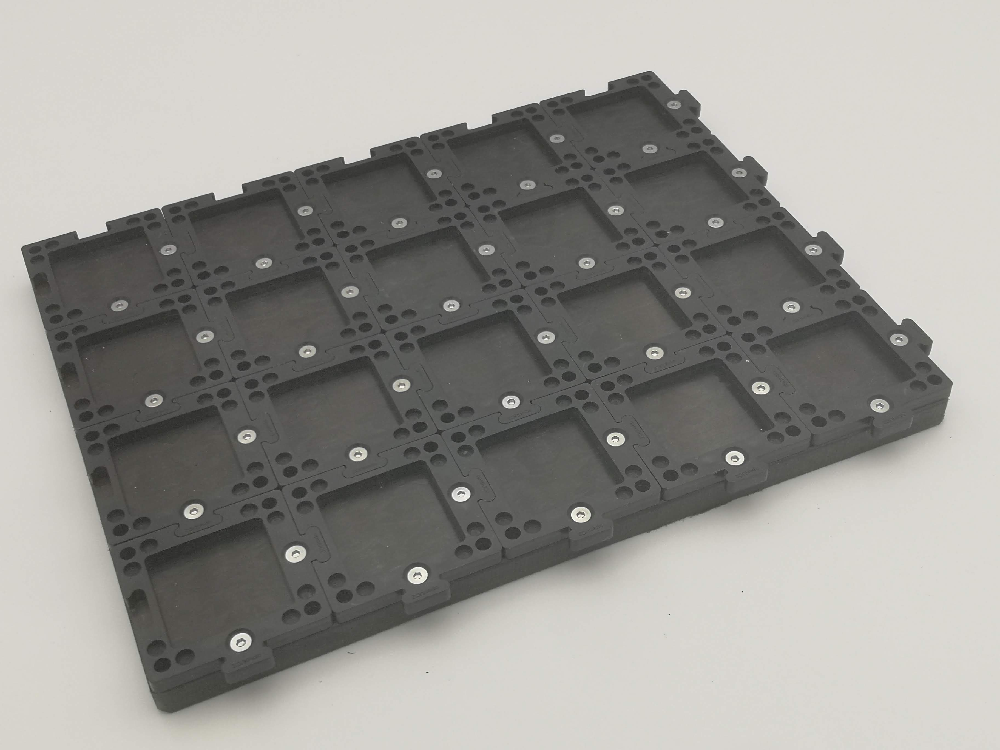
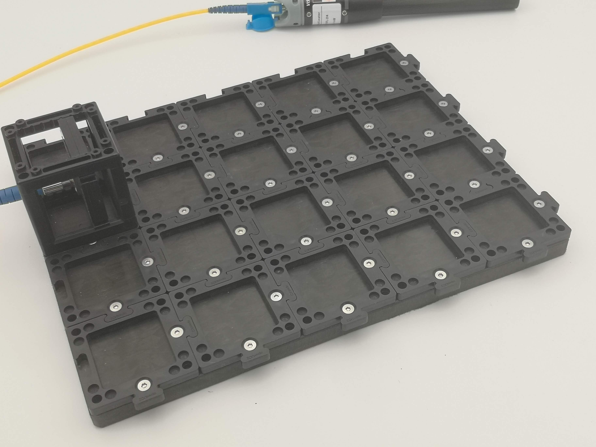
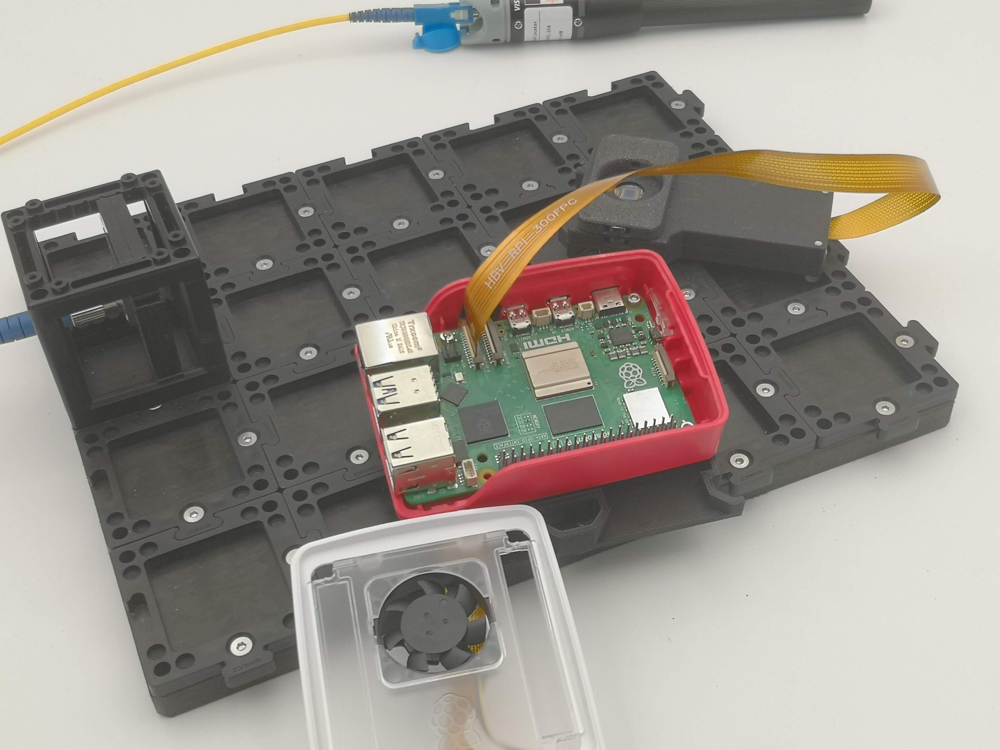
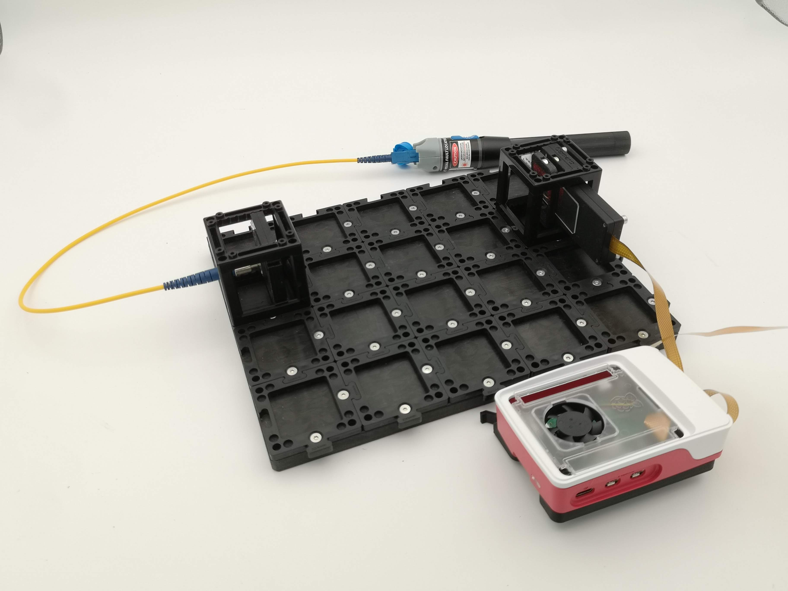
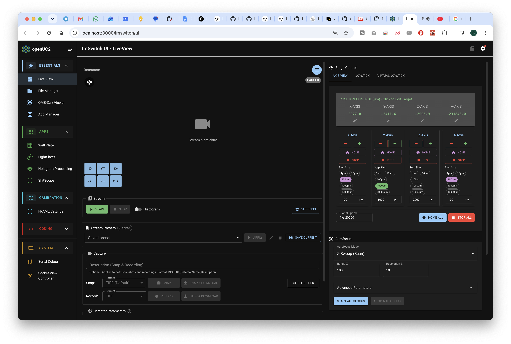
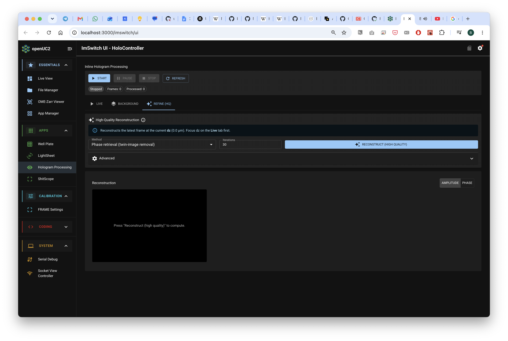

# Tutorial: Your first hologram

*Learning-oriented. By the end you'll have recorded a real hologram and brought a hidden sample into focus on screen. About 45 minutes.*

This is the main HoloBox experiment: a **lensless microscope**. There are no lenses at all, just a point of light, a tiny sample, and a camera. We "simulate" the lens (or at least the backpropagation) in the software as a virtual reonstruction after we acquired the hologram.

It helps to have read [What is a hologram?](../explanation/what-is-a-hologram.md) first. Especially the part
about the hologram being the *ringy pattern*, not the final image.

*The finished four-cube inline holography setup with the Raspberry Pi camera*

## What you need

- The Holo target which is a PCB that features 3 LEDs (RGB) that can be driven via USB-C
- Alternatively: Fiber-coupled red laser with openUC2 fiber mount
- The **Raspberry Pi camera** smart-camera module
- A transparent, **sparse** sample (see the tip below)
- openUC2 base plates, puzzle pieces
- Raspberry Pi 5 with our SD card image 
- A computer or phone with Wi-Fi

:::tip What makes a good first sample "Sparse" means *mostly empty with a few isolated objects*. That's when holography works best. Great beginner samples: a smear of **dust or pollen** on a coverslip, a few grains of **fine sand**, or **cheek cells**. Avoid thick or crowded samples at first. They scatter too much and the hologram turns to mush. The reason: Spackles and goying beyond the first order born approximation (i.e. multiple scattering)
:::

## Step 1 — Make a coherent point source

The microscope needs clean, coherent light (here's [why](../explanation/light-as-a-wave.md)). The Holobox gives you two options to play with: 
1. A spatially and temporally coherent light-source in the form of a fiber-coupled laser
2. A spatially and temporally partially coherent light-source in the form of a small quasi-monochrome LED

Let's start with the LED (the images of the setup have the Laser, but you can simply replace the cube!)

1. Click the LED into its holder on one cube **OR** place the Fiber-coupled Laser that is connected to the fiber holder cube onto the baseplate

In case of the LED: Since the spectrum of the LED is rather narrow ~20nm, the temporal coherence is several micrometer. What does this mean? Light that travels at different paths differences still can interfere and produce contrast. You can visualize this with the white-light interference, where only a few wavelengths of path difference can lead to a visible contrast. The fewer different wavelengths contribute to the interference, the longer the coherence length. That's why for a laser the coherence length can be several meters or kilometers even. This is inversely proportional to the bandwidth (e.g. how broad the spectrum is) of the light-source is. 
Their spatial coherence is determined by the area of which the light is emitted and how many independent waves contribute to the formation of contrast - each eventually carrying a different phase and frequency. 

## Step 2 — Build with cubes

Inline holography is a straight line - so all in-line.. Click four cubes onto base plates in this order:

1. **Light-source cube** (from Step 1, either Laser or LED)
2. *Optional* **Empty cube** (spacer)
3. *Optional* **Empty cube** (spacer)
4. **Sample + camera cube**

Place everything on the base plate:

Then mount all the components on the plate:

For the last cube, mount the sample **as close to the camera sensor as you possibly can**, almost touching it. In case of the rather incoherent LED light-source, the small sample-to-sensor gap is the reason, why we see rings at all. This is because of the small coherence length. With the larger distance from source-to-sample w.r.t. sample-to-camera, we virtually scale the light-source's spatial coherence. A larger distance (which you can try for the Laser), produces a larger magnification of the sample. Yet the resolution is determined by the product of number of pixels, pixel-size and distance between sample and detector and of course the illuminating wavelength (see
[What is a hologram?](../explanation/what-is-a-hologram.md#inline-holography-the-simplest-possible-setup)).

Mount every cube on puzzle pieces top and bottom so the whole line is rigid. 

## Step 3 — Power up and connect to the camera

The full setup fully assembled with the Fiber-coupled Laser instead of the Holo target (LED Module with R, G, B micro leds):

1. Turn on the Raspberry Pi camera module and the LED or LASER. (in case of the LED use the button that turns on the RED LED)
2. On your computer or phone, connect to the camera's **Wi-Fi hotspot**
   (password `youseetoo` for the OpenUC2 ImSwitch OS image, the SSID is something like `openUC-XXX-XXX-XXXX`with some combination of words and numbers).
3. Open a browser and go to **`http://192.168.4.1`**.
4. Go to the **Microscope Control: This machine's microscope control interface (ImSwitch)**

You should see the live camera view in the ImSwitch web interface:

We assume the lensless Raspberry Pi camera is fully connected and working. 

## Step 4 — Get a clean shadow

Look at the live image. With a good sample you may already see faint **rings or a soft shadow** where the sample sits — that's the hologram forming, or basically interference fringes. 

Believe it or not: The best sample is **DUST**. It's sparse and small, perfect point scatterer. So look out for these. 

If the image is washed out and low-contrast, **stray room light** is the culprit. Drape a box or dark cloth over the setup so only the LED reaches the sensor. Contrast should jump. 
If the image looks weird (e.g. too red), maybe you are over saturated => try reducing the exposure time. An **Exposure time of ~ 1ms** is typically sufficient.

:::tip
No fringes at all? Don't panic — that's the single most common first-build issue. The
[hologram troubleshooting guide](../how-to/troubleshoot-holograms.md) walks through every
cause (pinhole too big, sample too far, too much stray light) in order.
:::

## Step 5 — Reconstruct: turn rings into a picture

Open the **inline-holography widget** in ImSwitch. This is the software "lens." It takes the
ringy pattern and computes what the sample really looks like (the idea is explained in
[How reconstruction works](../explanation/how-reconstruction-works.md)).

The below video walk through gives you a step-by-step explanation of how our software helps you to reconstruct the hologram. 

<iframe width="560" height="315" src="https://www.youtube.com/embed/IWndIUPZuAg?si=_bfKqQDg39imK8kC" title="YouTube video player" frameborder="0" allow="accelerometer; autoplay; clipboard-write; encrypted-media; gyroscope; picture-in-picture; web-share" referrerpolicy="strict-origin-when-cross-origin" allowfullscreen></iframe>

Set the basic parameters to match your hardware:

| Setting | Start value | What it is |
|---|---|---|
| **Wavelength** | match your lightsource (e.g. 650 nm green, 450 nm blue) | colour of your light |
| **Pixel size** | `3.45 µm` (Raspberry Pi camera default) | size of one sensor pixel |
| **Colour channel** | the colour of your filter (e.g. red filter → red channel) | which channel to read |
| **Distance `dz`** | start at `0`, then drag | how far to "rewind" the wave |

Full details and ranges are in [Parts and parameters](../glossary/parts-and-parameters.md).

## Step 6 — Find focus with the distance slider

Now the magic. Slowly drag the **`dz` (distance)** slider.

As you move it, the blurry rings will **collapse into a sharp image** of your sample at one
particular distance, then blur again as you pass through. Hunt back and forth until it's as
crisp as you can get it. You are **refocusing a photo that was already taken** — something
no ordinary camera can do.

You'll likely notice a faint halo around the sample. That's the **twin image**, and it's a
normal, expected feature of simple inline holography — not a mistake. ([Why it's
there.](../explanation/what-is-a-hologram.md#the-catch-the-twin-image))

*You can remove the twin image with a background estimation with an iterative Fourier Transfer Algorithm (IFTA)*

**Congratulations** — you've recorded and reconstructed your own digital hologram with a
lensless microscope.

## Take it further

- **Different depths:** if your sample has features at different heights, find a separate
  best-focus `dz` for each. You've just done optical sectioning.
- **Swap samples:** pollen, sand, salt crystals, onion skin — compare how their holograms
  differ.
- **Bad result?** → [Troubleshoot holograms](../how-to/troubleshoot-holograms.md).
- **Curious how the software does it?** →
  [How reconstruction works](../explanation/how-reconstruction-works.md).
- **Improve Hologram:** Remove the background using the remove background tab or the refine tab that estimates the sample mask. 

## Want to do it offline in Python?

If you'd rather capture a still and reconstruct it yourself in a Jupyter notebook (no live
widget), there's a short reconstruction script and walkthrough in
[Parts and parameters → Offline reconstruction](../glossary/parts-and-parameters.md#offline-reconstruction-in-python).
It's a nice bridge into a coding lesson.

