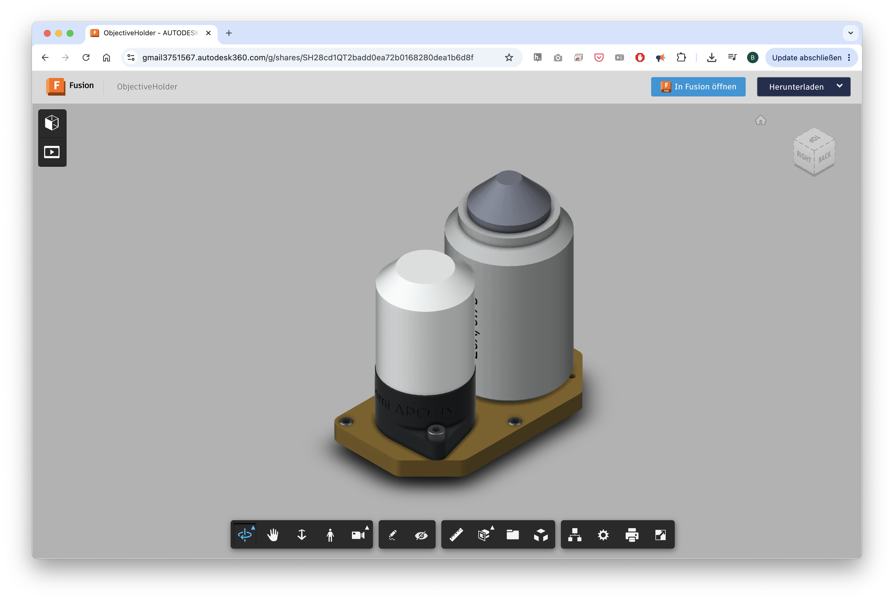
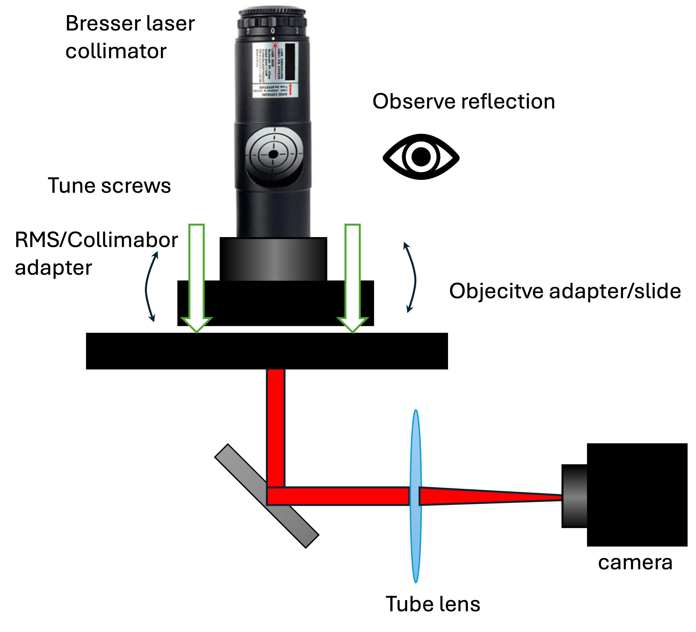
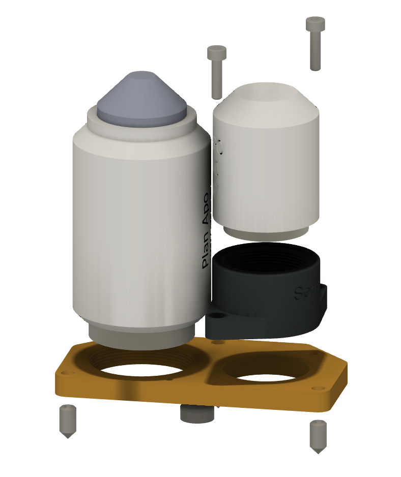
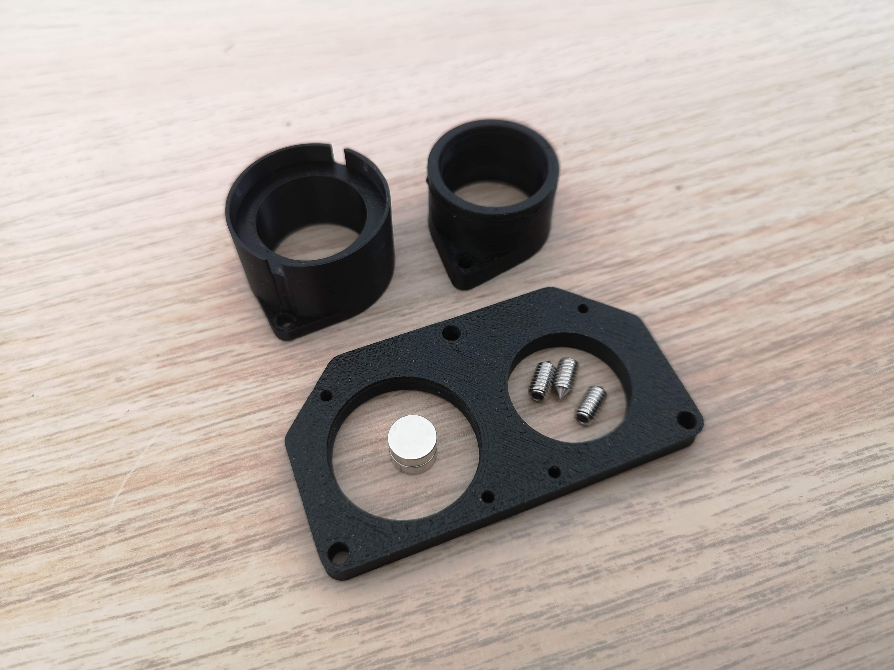
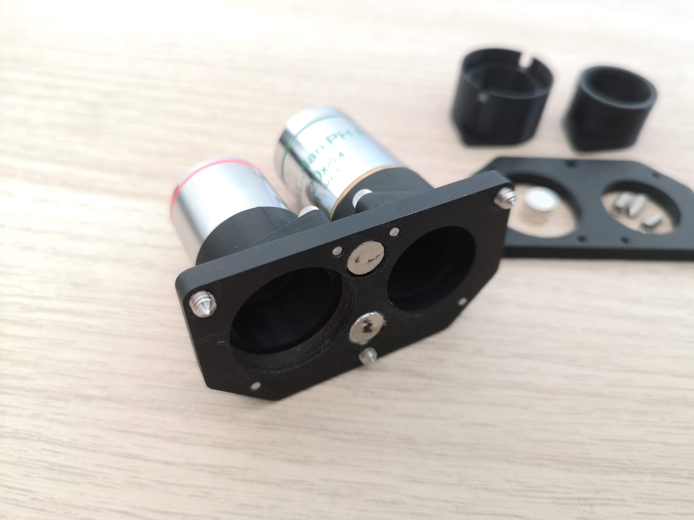
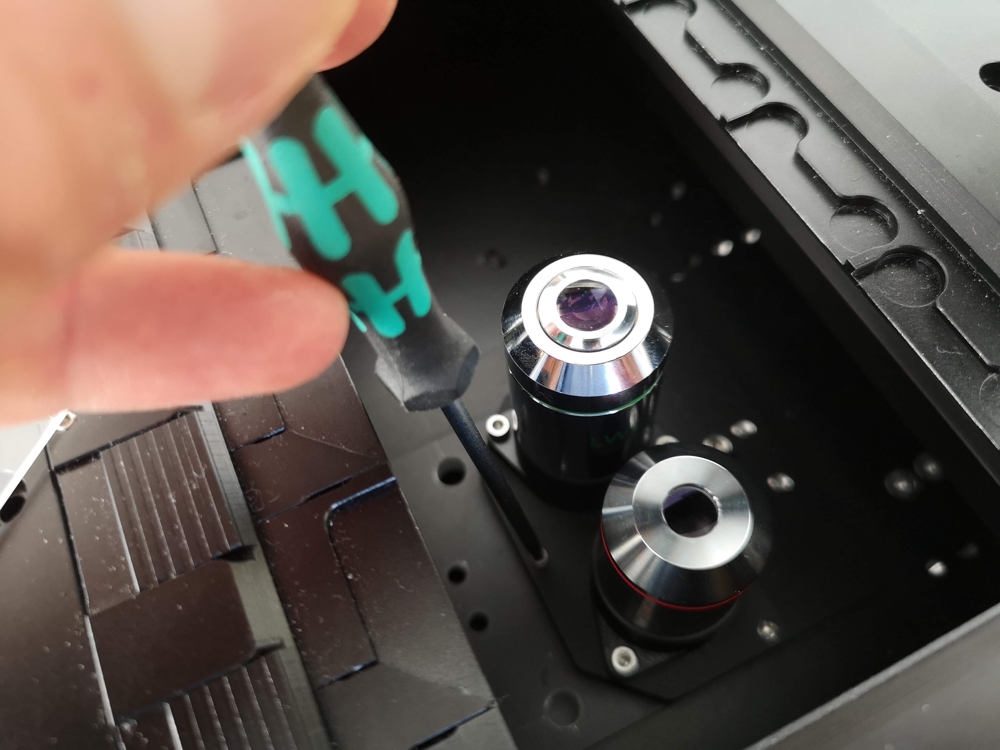

# Objective Holder for the FRAME Microscope

## Overview

The objective holder for the FRAME microscope is designed to be as simple as possible to build, allowing users to bring their own objectives. The system accommodates two objectives on a motorized carriage that moves freely along the X-axis, driven by a stepper motor for precise positioning.

*Available online as CAD [here](https://a360.co/4vDQlSb)*

A dedicated objective controller allows calibration of the respective positions, which are stored in the device.

## Design Principles

- **Two objectives** sit on a single carriage, motorized along the X-axis
- A **three-point kinematic mount** (3-point bearing / kinematic mount) ensures the objective plane is perfectly parallel to the sensor plane — the sensor plane itself is defined by the camera behind the fold mirror
- Positions are **freely calibrated and stored** via the objective controller
- Standard CAD files are provided so users can fabricate their own adapters for the objective plate

For alignment of the objective plane, an autocollimator or a telescope eyepiece alignment tool (e.g., from Bresser https://www.bresser.de/p/bresser-laser-kollimator-31-7mm-1-25-4910200) can be used.

## Bill of Materials

| Item | Specification | Quantity |
|---|---|---|
| Neodymium magnets | Ø 8 mm, height 3 mm | 2 |
| Set screws with tip | M3×5 (Madenschrauben mit Spitze) | 3 |
| Mounting screws (objective adapter) | M2.5 | as required |

## Parts & CAD Files

The objective adapter (which holds the objective) sits on the removable objective adapter plate and is fastened with **M2.5 screws**.

- **Objective Adapter Plate (Carriage):** [CAD File – Autodesk 360](https://a360.co/4vDQlSb)
- **Adapter Plate (Removable):** [CAD File – Autodesk 360](https://a360.co/4vDQlSb)

For threads in Fusion 360, use [Stefan's Thread Library for Fusion 360](https://www.printables.com/model/247411-photo-thread-library-for-autodesk-fusion).

## Assembly

*Explosion view of the assembly*

### Step 1 – Print or Machine the Parts

The system consists of two main components:

1. **Objective adapter (plastic)** — holds the individual objectives
2. **Objective plate (metal or plastic)** — the carriage on which adapters are mounted

#### Recommended Materials

| Part | Recommended Material | Notes |
|---|---|---|
| Objective adapter | SLA resin | Higher precision; minimal thermal expansion; ideal for printing threads |
| Objective plate | Anodized aluminum (black) | Dimensionally stable; also usable as FDM (e.g., PA) for prototypes |

> **Note:** For initial prototypes, an FDM printer with the lowest possible layer height is sufficient. SLA is strongly recommended for final builds due to better dimensional accuracy and thread quality.

### Step 2 – Install the Kinematic Mount

The objective plate uses a **three-point kinematic mount** to ensure repeatable, precise alignment with the carriage.

1. Press the **2× Neodymium magnets** (Ø 8 mm × 3 mm) into their recesses on the plate
2. Thread in the **3× M3×5 set screws with tip** into the corresponding positions on the carriage
3. Set the plate onto the carriage — the magnets hold it in place while the set screws define the three contact points

> **Note:** Ensure the polarity matches the moving slide in the microscope

### Step 3 – Mount the Objective Adapters

1. Place each objective into its respective plastic adapter
2. Attach the adapter to the objective plate using **M2.5 screws**
3. Ensure both objectives are at the **same height along the Y-axis** (in microscope coordinates)
   - Along the X-axis, positions are freely motorized and calibrated via software

### Step 4 – Calibrate

Use the **objective controller** to calibrate and store the X-axis positions for each objective.

For optical alignment (parallelism of objective plane to sensor plane):
- Use an **autocollimator**, or
- A **telescope eyepiece alignment tool** (e.g., Bresser)

## Alignment & Calibration Notes

| Parameter | Requirement |
|---|---|
| Y-axis (height) | Both objectives must be at equal height |
| X-axis (lateral) | Freely motorized; calibrated via objective controller in the ImSwitch Frontend |
| Parfocal distance | Must match the objective specification (thread-to-object distance) |
| Objective thread | Must match adapter design |
| Objective diameter | Must fit within the adapter slot |

> The system is pre-designed to accommodate a **Nikon 20×/0.75** objective alongside a **4×/0.1** objective.

## Available Objectives (Included in Package)

| Magnification | Included |
|---|---|
| 20× | ✓ |
| 4× | ✓ |

*For details on thread specification, parfocal distance, and manufacturer, please contact us.*

## Calibration Targets

To calibrate the system after assembly, the following are available:

- **Calibration chart** (available for purchase)
- **Pinhole slides** — used for absolute XY stage positioning: the stage scans an XY plane, finds the brightest tile, and determines the physical stage position

> More information on this later. 

## Custom Objective Support

If you have objectives with non-standard threads or dimensions, contact the supplier for custom adapter design support. Key parameters needed:

- Thread type
- Parfocal distance (thread-to-object distance)
- Objective outer diameter

## Fabrication 

The holder can be built using standard university lab equipment:

- **FDM 3D printer** => suitable for prototyping the objective adapter and plate (use lowest layer height, PA material recommended for the plate)
- **SLA 3D printer** => strongly recommended for final objective adapters (precision threads, low thermal drift)
- **CNC milling machine** => suitable for machining the aluminum objective plate

*For further assistance or custom designs, contact the FRAME microscope team and have a look in our forum at https://openuc2.discourse.group.*