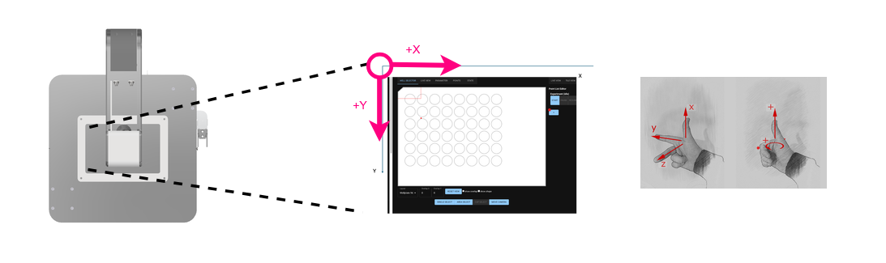
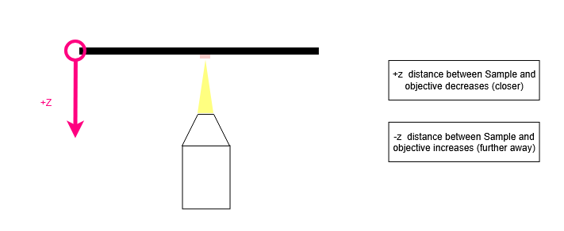
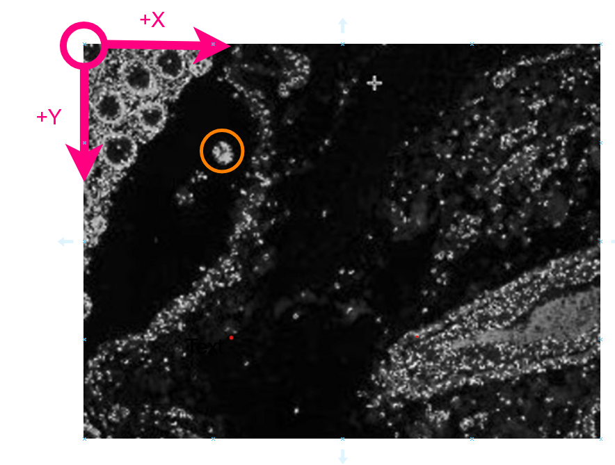
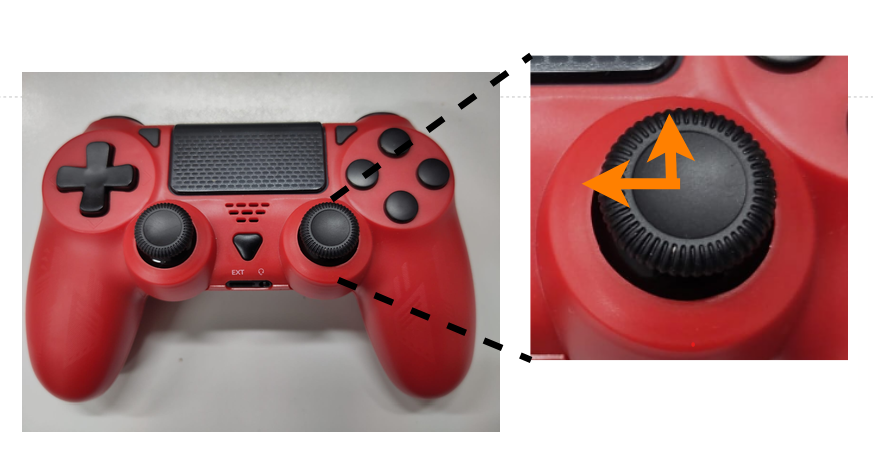
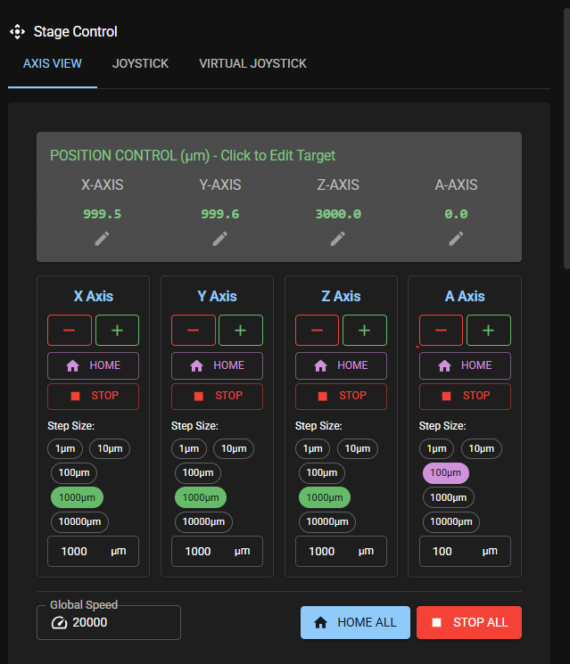
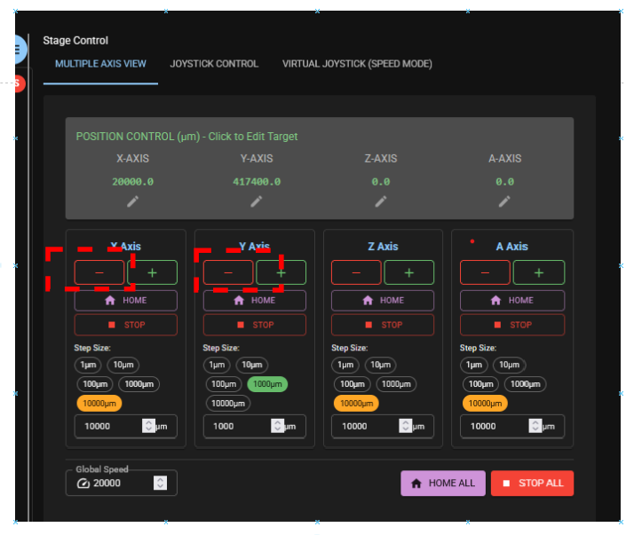
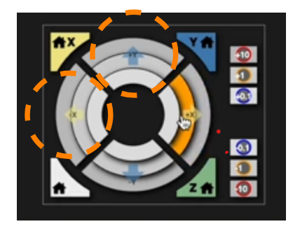

# Principles of sample movement

This guide helps you to understand basic settings in sample movement and corresponding movement of axes based on the coordinate system chosen.
There are different approaches to this, let's do it step by step.

## Step 1 - implemented sample coordinate system

Let's look at the sample coordinate system first. The image below shows the FRAME from a bird's perspective and the sample holder. It also shows the origin of the sample coordinate system in the upper right hand corner of the sample holder and X and Y axis as well as their positive direction. According to the right hand rule positive Z is facing "into the screen", which means that positive that is bringing the sample closer to the objective.

## Step 2 - using different controls to move the sample

In the picture below we want to center the structure marked with an *orange circle* into the middle of the camera *preview* window. Let us look at the 4 main options available to do that.

### Using the Game Controller

We can use the game controller to move the sample. For instructions on how to pair and use the game controller please refer to the [Controller instructions](../controller/README.md).

Since our point of interest is towards the upper left hand corner of the *preview* we will get there by moving the joystick up and left as depicted in the image.

### Using the Click-Function in the preview window

Another way to get there is by simply double clicking on the structure we want to center in the middle of the *preview* window - in this case the orange circeled structure.

### Using the *Axis View* tab in the Stage Control Section

You can access the *Stage Control* section in the column on the right hand side in the *Live View* App. Choose the tab *Axis View* (usually the default tab).

It comes with a lot of options so first look at them one by one:
- In the top row you can manually enter a position value for each axis by double clicking on the current position value and entering the new value.
`Attention` Be careful with that option especially in Z to avoid the risk of the objective colliding with the sample or the stage!
- Below you find a column for each axis with a similar set of options. Use the "+" and "-" symbol to move the corresponding axis. The stage will move with the selected step size (marked green, e.g. 1000µm for X Axis), so before pressing make sure you have selected the correct step size. You can also enter any desired step size into the square window at the buttom of each column. Just double-click and enter the value.
- You can also *Home* or stop each axis individually.
- In the bottom row you can change the *global speed* for all axes. The default is "20.000". And you can *Home all* or *Stop all*.

Let us come back to our task of centering the structure in the orange circle. Refering to the sample coordinate system as depicted above we need to move in negative X and Y to center the structure (`Note` Step size is not selected adequately in below image probably 10µm or 100µm would work best in above case).    

## Using the *Joystick* tab in the Stage Control Section

You can access the *Stage Control* section in the column on the right hand side in the *Live View* App. Choose the tab *Joystick*.

First select the desired step size for X and Y (not shown in the image below). Then, as with the game controller use the buttons to the left and up to center the structure selected. The different rings of the Joystick let you move with different step sizes.

