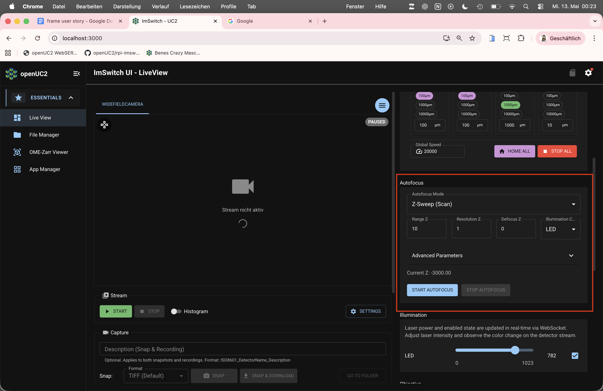
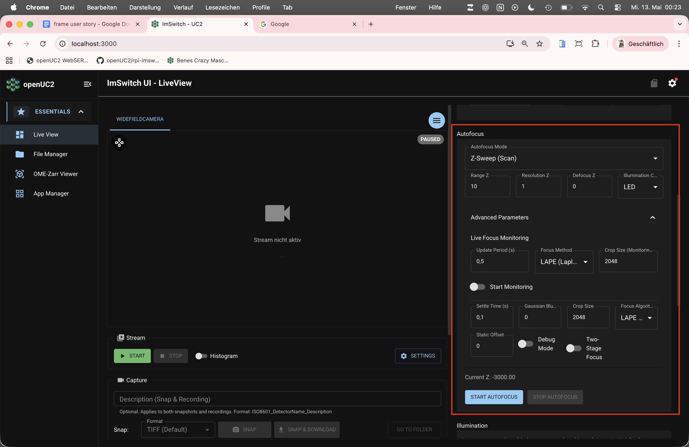

# Autofocus

:::note Draft outline
Scaffold. Replace the bullet prompts with your own text and delete this banner when done.
:::

*How-to, for operators.* Choose and configure autofocus.

## Image-based vs. hardware-based

- The two modes; when to use each (link to the [explanation](../../../explanations/autofocus-explained/README.md)).

## Basic settings

- Z-range and number of steps; automatic stop at stage limits.
- Advanced settings hidden by default.

*Basic vs. Advanced autofocus settings (from TASK-FR025, v1.6.3).*

:::note TODO
Reused from Notion `TASK-FR025`. Confirm these still match the current UI; consider a
clean re-shot pair for publication.
:::

## Troubleshooting stability

- Symptoms of unstable autofocus and what to change.

:::note TODO
Notion source: `TASK-FR027 Software Autofocus not stable`. Hardware focus lock:
[focus-lock add-on](../../../addons/focus-lock/README.md).
:::

## Related

- [Focus map tutorial](../../../tutorials/day-2/focus-map/README.md)
