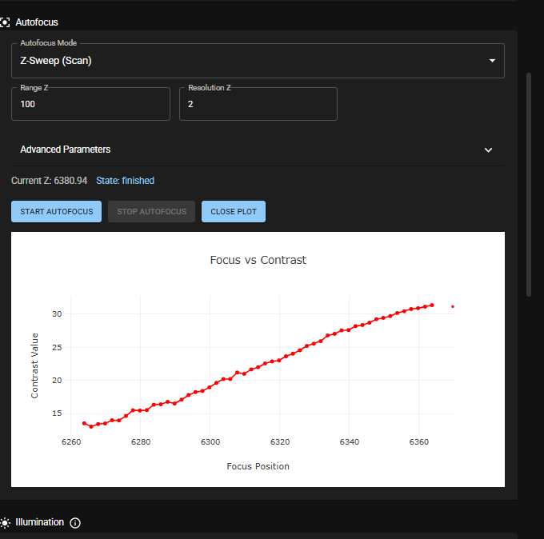
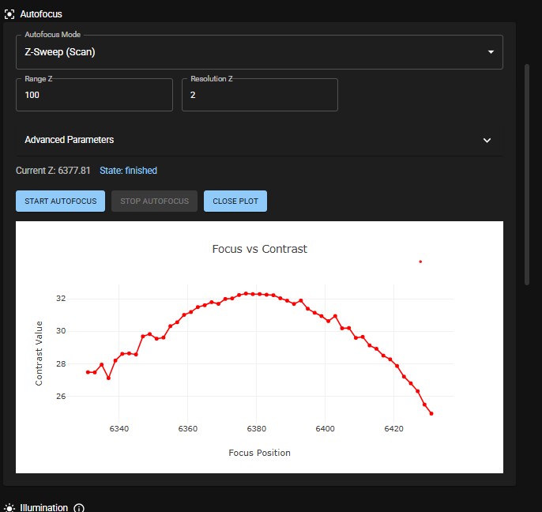
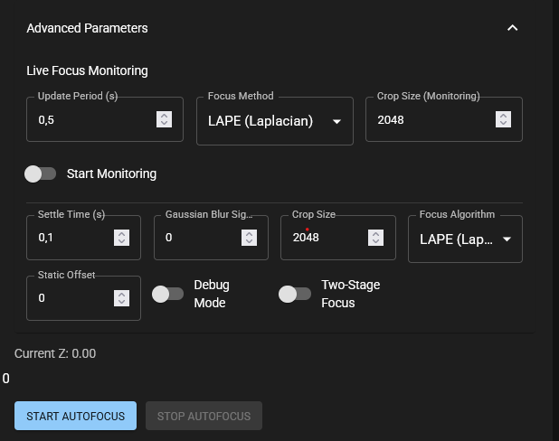

# Autofocus

This guide explains the Image-based and Hardware-based autofocus.

## Image-based Autofocus

In the right column of the *Live View* App in ImSwitch, which has the *Stage Control* section, scroll down to the *Autofocus* section. The default parameters are shown in below picture. *Range Z = 100* will make a sweep of +/-50um with respect to the *Current Z: 4501.56*-position displayed above the *Start Autofocus* button. *Resolution Z = 10* will make the algorithm take an image in steps of 10um, which would equal 11 images with the settings displayed and find the one with the best focus.    

Click the button *Start Autofocus* and the algorithm will start running.
When it is done it will display a new *Current Z* value and *State finished*.
In addition, the *Show Plot* button will become available. Click on it and it will display a plot of the *(image) Contrast value* vs *focus position*.

As a rule of thumb:
- in a first step select a wider *Range Z*, e.g. 200-300um and leave the *Resolution Z* at 10.
- in a second step select a more narrow *Range Z*, e.g. 50-100um and change the *Resolution Z* to a smaller value, e.g. 2-5um.

`Important` The plot allows you to see whether your *Range Z* is properly centered. In the below picture you can see that the *Range Z* is not yet properly centered, so that another run with a more centered *Range Z* is required to find the optimum focal position.

A well-centered *Range Z* looks similar to the below picture.

To access more advanced autofocus parameters click on the dropdown menu *Advanced parameters*.

## Hardware-based Autofocus

Available soon.

## Related

- [Focus map tutorial](../../../tutorials/day-2/focus-map/README.md)
