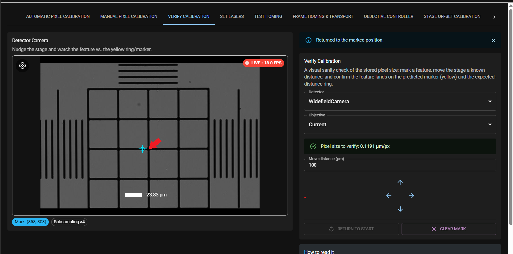

# Axis Backlash

When you move e.g. 100µm in the positive direction of the axis and then move 100µm back in the negative direction there will be a small offset (a few µm), which is called backlash. It is a result of the tolerances of all the mechanical parts of the axis.

## How to check Axis Backlash

The Backlash should be well below 10µm for each axis.
To check this choose a sample slide for calibration - minimum requirement: a clearly identifiable structure. Insert the sample slide into one of the sample holder positions for slides. In the *live view* app choose a suitable camera and objective. Then move to the structure of your choice and obtain a proper image of the structure.

In the app *FRAME Settings* choose the tab *Verify calibration*.
Make sure the correct camera and objective is selected under *detector* and *objective*. Choose a movement distance (in the image below 100µm).  
`Note` Please, account manually for backlash of the axis by moving to the structure of your choice in the same direction as you will move it later in the verification step.

Click on the structure of your choice once you have moved there. A light blue cross hair appears. In the below example the middle of the 4x4 square was chosen. Choose the movement direction by clicking on one of the 4x arrows (in the image below a red marked arrow indicates the chosen movement direction - here X). After clicking the stage will move by the depicted amount in that direction. A yellow circle with a radius of in this case 100µm will be drawn based on the stored pixel calibration value. If calibration is correct, the structure of your choice will come to lay exactly on the yellow circle.

Now move back by 100µm pressing the arrow of in the opposite direction.
In an ideal case the light blue cross hair will be centered on the structure of your choice again. In reality it will look something like this - a backlash on the order of 6-7µm. The red arrow points to the center of the structure of choice (which was the starting point).

 

To check backlash you can enter the estimated amount into *move distance* and then move. The light blue cross hair should now be centered on the structure of your choice again.
