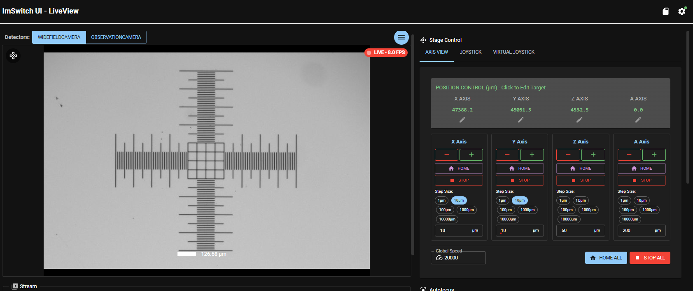
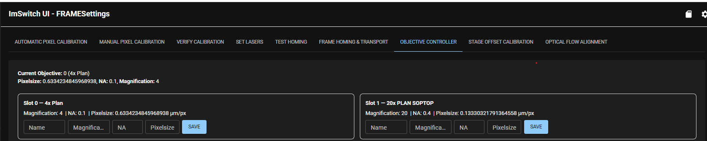
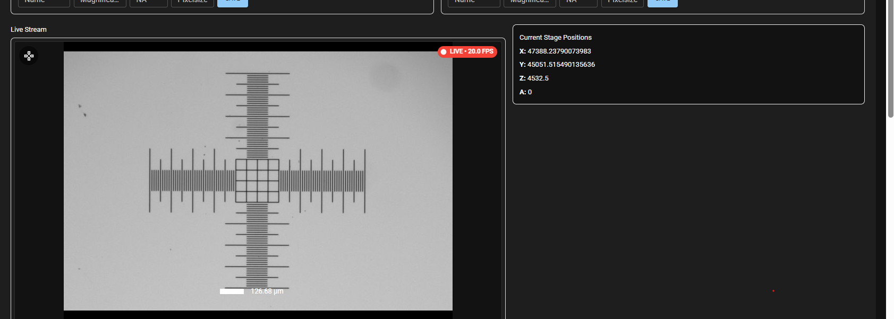
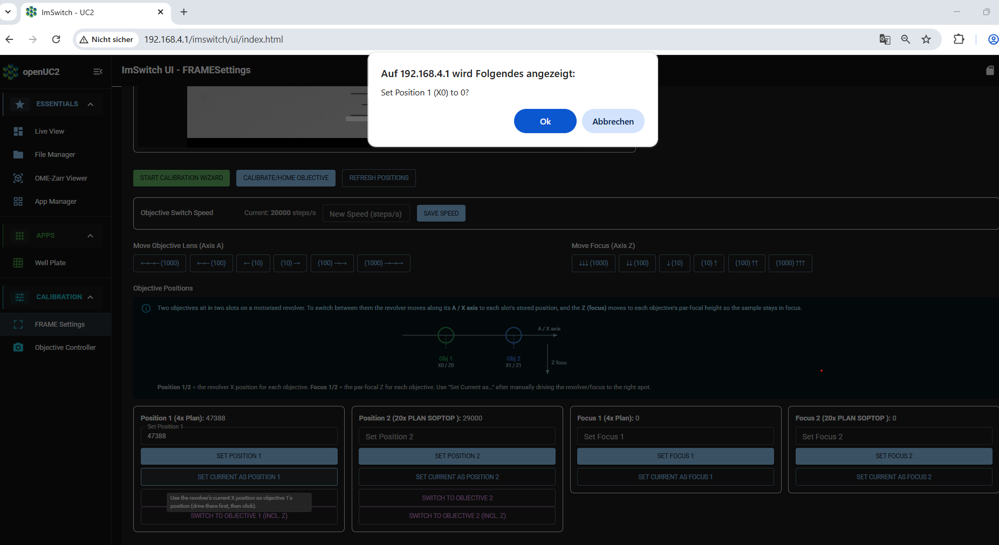
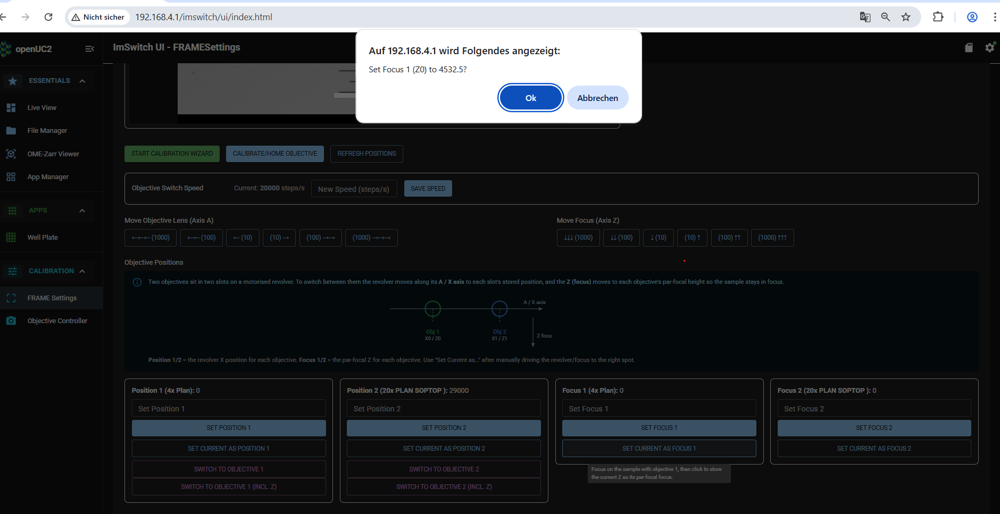
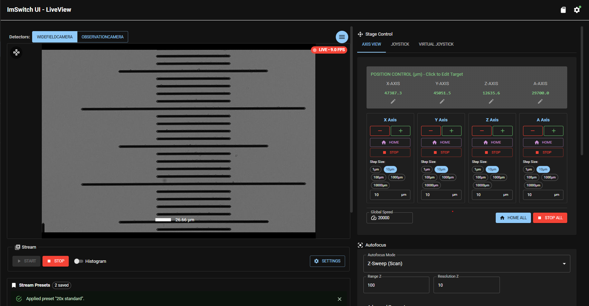
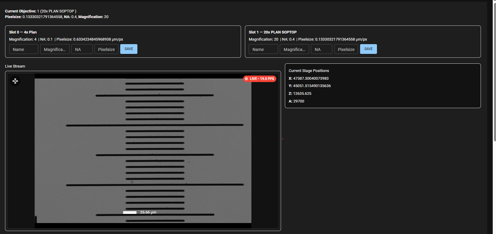
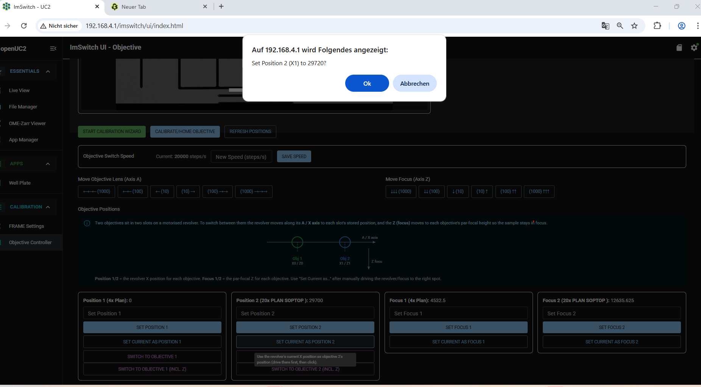
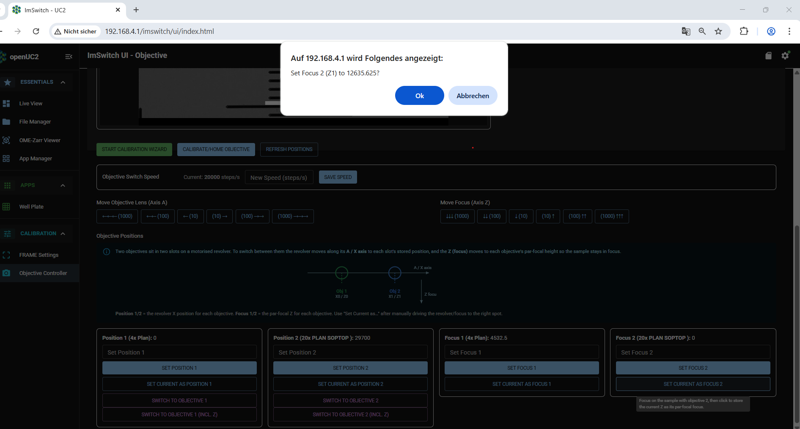
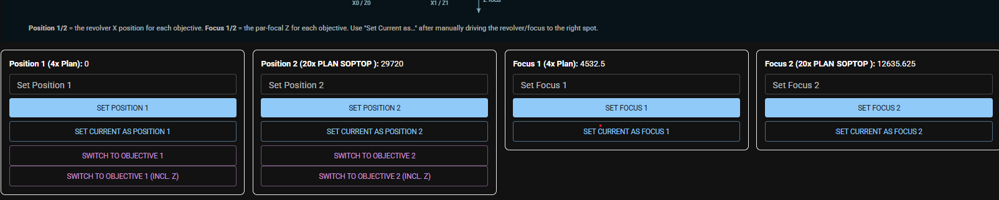

# Objective calibration

Objective calibration ensures that when switching objectives the structure of interest will remain centered and in focus for both objectives.

## When to do this

Objective calibration is recommended after you have done any mechanical work on the objective holder, e.g. removing it or exchanging an objective or if you notice, that when switching objectives the structure of interest will not remain centered or in focus anymore.

## Calibration Workflow

Choose a sample slide for calibration - minimum requirement: a clearly identifiable structure. Insert the sample slide into one of the sample holder positions for slides. In the *live view* app choose the objective with the smaller magnification in Pos 1 (e.g. 4x). The A-Axis, which is the axis for moving the objective holder, should display a value of 0. Then move to the structure of your choice, choose proper image settings, center the image in X and Y and focus.

In the app sidebar menu on the left go to the App *FRAME Settings*. Choose the tab *Objective Controller*.
At the very top you will see information for both objectives and also which is the *current objective*.

Below you will see the live view image and the current parameters for all axes.

  Now scroll to the bottom (ignore the rest). Start with *Position 1* and press *Set current as position 1*. This will set the Current A-Axis value of 0 for the 4x objective in position 1. A popup window will ask you for confirmation.
`note` The popup says *Set Position 1 (X0) to 0*. But it will set the A-Axis.

Now go to *Focus 1* and press *Set current as focus 1*. This will set the Current Z-Axis value of 4533µm for the 4x objective as focus value. A popup window will ask you for confirmation.

Now go back to the *live view* app and switch to the objective with the higher magnification in Pos 2 (e.g. 20x). The A-Axis, which is the axis for moving the objective holder, will display a preset value (here A=29200).

Focus the structure. If the structure is not centered in X-Direction center it by moving `ONLY THE A-AXIS`.  
`Ìmportant` Do not move in X and Y. If the structure is not centered in Y like in the image below this is due to a small mechanical tilt between X- and A-Axis, which both run parallel to each other. It cannot be corrected by this calibration procedure.   

Go back to the *Frame settings* app and the tab *Objective Controller*.
You will see information of the *current objective* displayed as well as the live view and current parameters for all axes.

Now scroll again to the bottom. Continue with *Position 2* and press *Set current as position 2*. This will set the Current A-Axis value of in this case 27920µm for the 20x objective in position 2. A popup window will ask you for confirmation.  
`note` The popup says *Set Position 2 (X1) to 29720*. But it will set the A-Axis.

Now go to *Focus 2* and press *Set current as focus 2*. This will set the Current Z-Axis value of 12636µm for the 20x objective as focus value. A popup window will ask you for confirmation.

Now all objective calibration values are properly stored and are displayed accordingly.

## Related

- [Pixel-size calibration](../calibrate-pixel-size/README.md)
- [Change the objective](../../../tutorials/day-2/reconfigure/change-objective.md)
