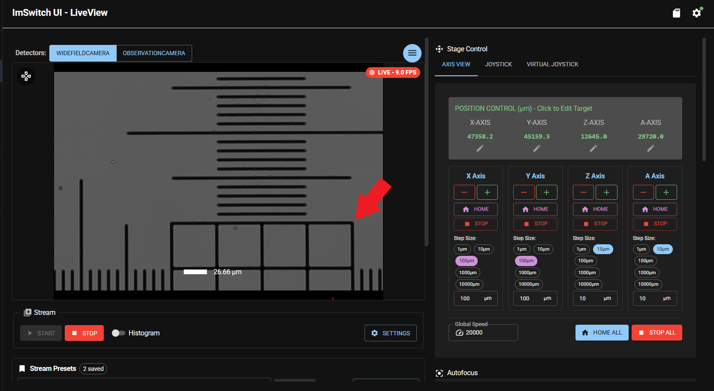
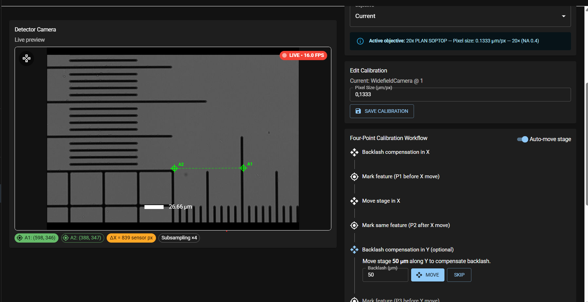
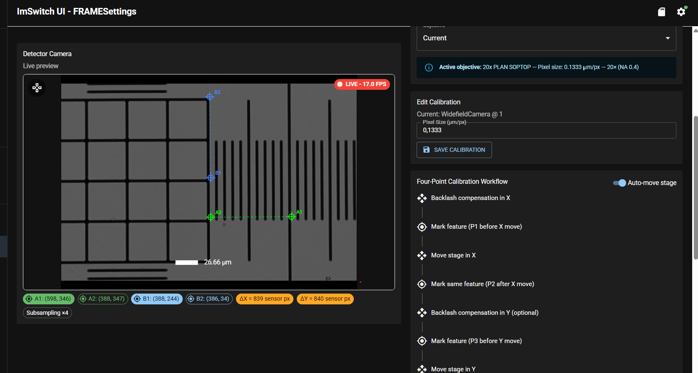
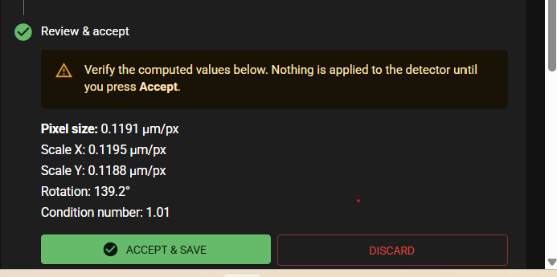
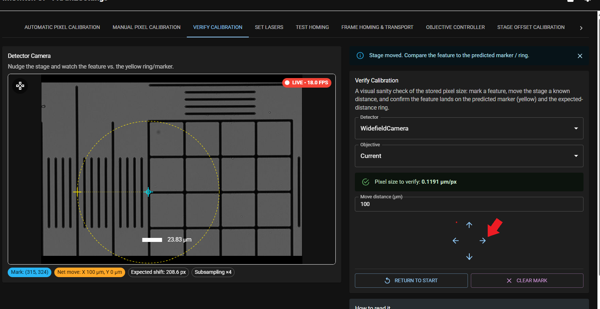
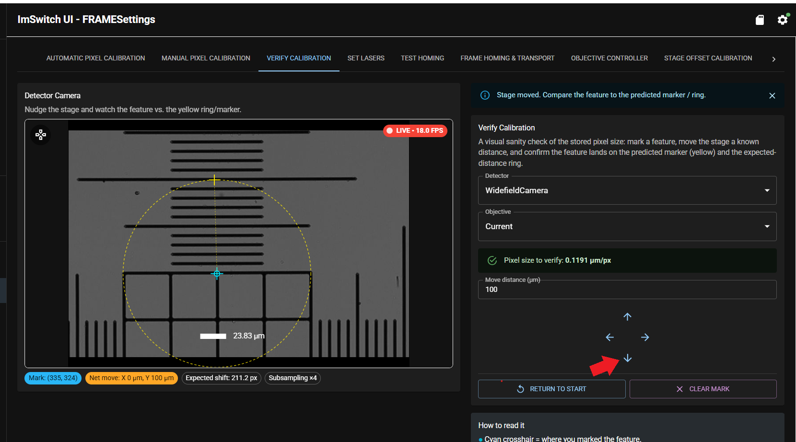

# Pixel Size Calibration

Pixel Size calibration defines micrometres-per-pixel for each objective/camera combination, so that scale bars in images, stitching of images and measurements within images work properly.

## Calibration workflow

This workflow needs to be done for each camera/objective combination on your machine.

Choose a sample slide for calibration - minimum requirement: a clearly identifiable structure. Insert the sample slide into one of the sample holder positions for slides. In the *live view* app choose your camera and your objective. Then move to the structure of your choice and obtain a proper image of the structure.

In the app sidebar menu on the left go to the App *FRAME Settings*. Choose the tab *Manual pixel calibration*.

Follow the instructions of the manual calibration procedure.

Here is an example of a manual calibration procedure.  
Camera: WideField  
Objective: 20x  
Sample: Calibration target  

In the picture below you see a properly focused and positioned structure of a calibration sample in the *live view* app. The actual structure used for the procedure will be the upper right hand corner of the 4x4 square (marked with a red arrow).

`Note`   This structure is positioned in the lower right hand corner of the live view image due to the range of movements performed later in the calibration process.

After switching to the *FRAME settings* app and the tab *Manual pixel calibration*, please, follow the *Four-point calibration Workflow*. Click on *Backlash compensation X*. This moves the sample in X by the depicted amount in the same direction, as it will be moved in the following calibration step (e.g. 50um). This ensures that any backlash from the X-axis is eliminated prior to the following calibration step (see  [axis-backlash](../axis-backlash/README.md)) for more information on Axis backlash).

The next step is *Mark feature (P1 before X move)*. Click on the structure of your choice (here the corner) and a green cross-hair A1 will appear. Then click *Move stage in X* and the stage will be moved by the depicted amount in X (e.g. 100um). Make sure travel range does not exceed the live view window (structure not visible anymore). Then click *Mark same feature (P2 after X move)*. A second green cross-hair A2 and a line will appear. At the bottom of the image you will also see Pixel information for point A1 and A2 including the delta and the subsampling rate.

Now the workflow starts the same procedure for the Y-Axis. First click on *backlash compensation in Y*. This moves the sample in Y by the depicted amount in the same direction, as it will be moved in the following calibration step (e.g. 50um).

The next step is *Mark feature (P3 before Y move)*. Click on the structure of your choice (here the corner) and a blue cross-hair B1 will appear. Then click *Move stage in Y* and the stage will be moved by the depicted amount in Y (e.g. 100um). Make sure travel range does not exceed the live view window (structure not visible anymore). Then click *Mark same feature (P4 after Y move)*. A second blue cross-hair B2 and a line will appear. At the bottom of the image you will now also see Pixel information for point B1 and B2 including the delta and the subsampling rate.

Then click on *compute affine calibration* and your Pixel Calibration data will be displayed. Press *Accept & Save* and the values will be stored and applied.

## Verifying Pixel calibration

In the *live view* app choose your camera and your objective. Then move to the structure of your choice and obtain a proper image of the structure.

In the app *FRAME Settings* choose the tab *Verify calibration*.
Make sure the correct camera and objective is selected under *detector* and *objective*. Choose a movement distance (in the image below 100um).

`Note` Please, account manually for backlash of the axis by moving to the structure of your choice in the same direction as you will move it later in the verification step.

Click on the structure of your choice. A light blue cross hair appears. In the below example the middle of the 4x4 square was chosen. Choose the movement direction by clicking on one of the 4x arrows (in the image below a red marked arrow indicates the chosen movement direction - here X). After clicking the stage will move by the depicted amount in that direction. A yellow circle with a radius of in this case 100um will be drawn based on the stored pixel calibration value. If calibration is correct, the structure of your choice will come to lay exactly on the yellow circle.

You can repeat this procedure for the Y-Axis.

## Related

- [Calibrate an objective](../calibrate-objective/README.md)
- Concept: [How scanning works](../../../explanations/how-scanning-works/README.md)
