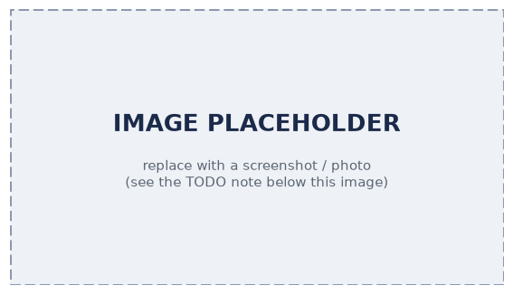

# Pixel Size Calibration

Pixel Size calibration defines micrometres-per-pixel for each objective/camera combination, so that scale bars in images, stitching of images and measurements within images work properly.

## Steps (per objective/camera)

Choose a sample slide for calibration - minimum requirement: a clearly identifiable structure. Insert into one of the sample holder positions for slides. In the live view app choose your camera and your objective, move to structure of your choice and obtain a proper image of the structure.

In the app sidebar menu on the right go to the App *FRAME Settings*. Choose the tab *Manual Pixel Calibration*.

The settings for both objectives including Pixel Size are displayed at the top.

- Image a calibration target / known feature; measure; enter the pixel size.
- Repeat for each objective (4x, 20x, ...) and the overview camera.
- Verify against a second feature.

:::note TODO image
Pixel-calibration screenshots. Notion source: `FAT FRAME #0007 Korea - Part 5`
("Pixel calibration widefield camera with 20x/4x", "Verify calibration",
"Pixel calibration Overview camera").
:::

## Widefield vs. overview (observation) camera

- Calibrate both; note they differ.

## Related

- [Calibrate an objective](../calibrate-objective/README.md)
- Concept: [How scanning works](../../../explanations/how-scanning-works/README.md)
