# Calibrate the stage

Stage calibration ensures you to make proper use of the *wellplate* app navigation features. E.g. when using the 4 slide sample holder (see below), if stage calibration is done correctly you can move to any point of any of the 4 slide position by just clicking on this position in the app.

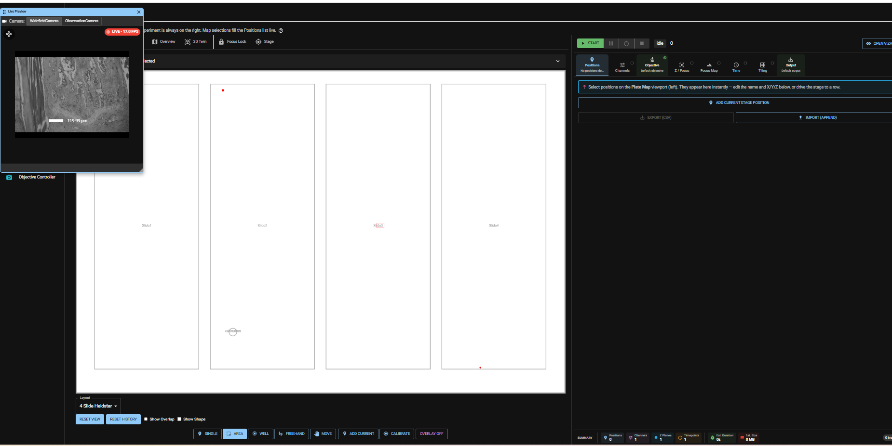

## When to do this

Stage calibration is recommended if you notice, that when navigating to specific points on one of the 4 sample positions does not work properly anymore (offsets).

## Calibration Workflow

Choose a sample slide for calibr
Put the *openUC2 Pinhole Slide* in Slot 1 of the 4x sample holder. For stage calibration the pinhole *0.6/0.3mm* in the center of the slide will be used. It is designwise in the center of the slide, so it does not matter whether the sample is rotated or flipped. The distance from this middle pinhole to the edges of the probe is known and stored as reference value in *Imswitch*.

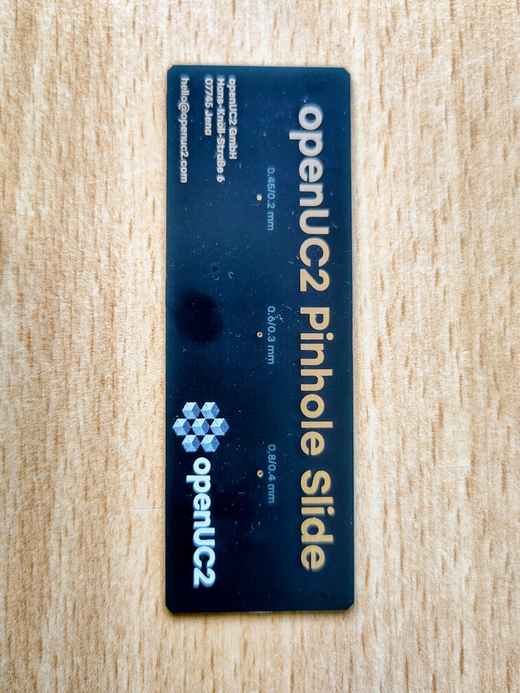

Choose an objective with low magnification (e.g. 4x). Make sure the *LED* light source is switched on.
Home all axes.  
Go to the app “FRAME Settings”and the tab “Stage offset calibration”. Use the live view image to move to the pinhole so that it is roughly in the center of the live view.    

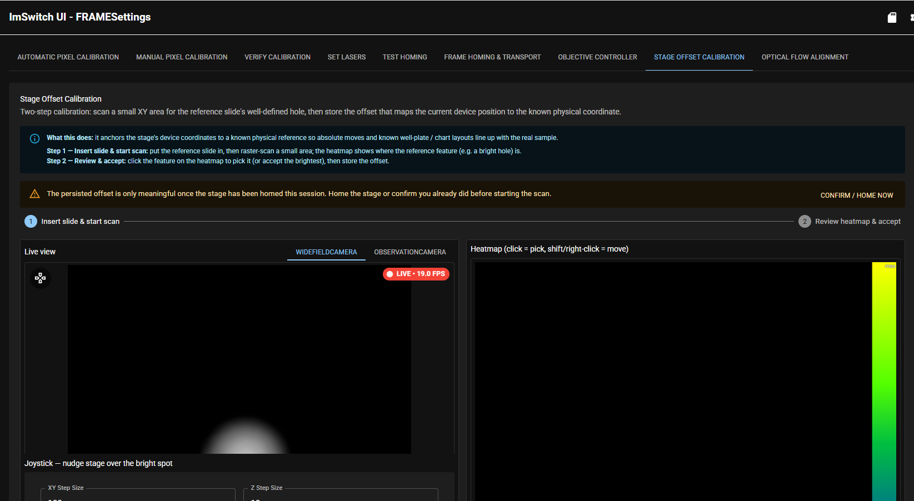

Below the live view image are some more settings. Make sure the *reference layout* is set to *Heidstar 4x Histosample*. You will also see information on the scan, which is performed to determine the exact location of the center of the pinhole (# of tiles captured, objective used ...). On the right handside the coordinates of the expected position of the pinhole are shown (*expected/known calibration point*).   

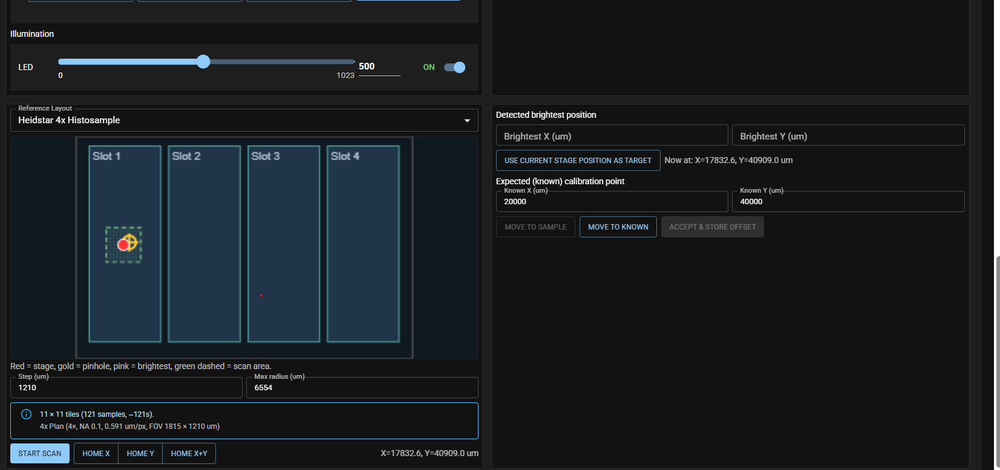

Start the scan by clicking *Start scan*. Scan is performed and the actual measured stage position where the center of the pinhole is, is displayed as well the shift to the known center.

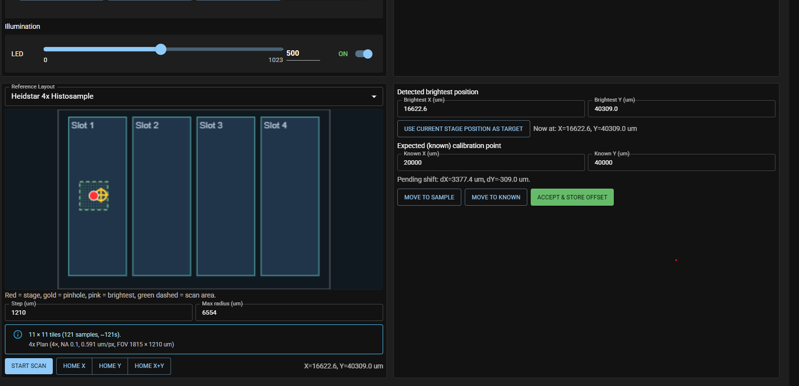

Press *Accept & store offset* to save the actual values.

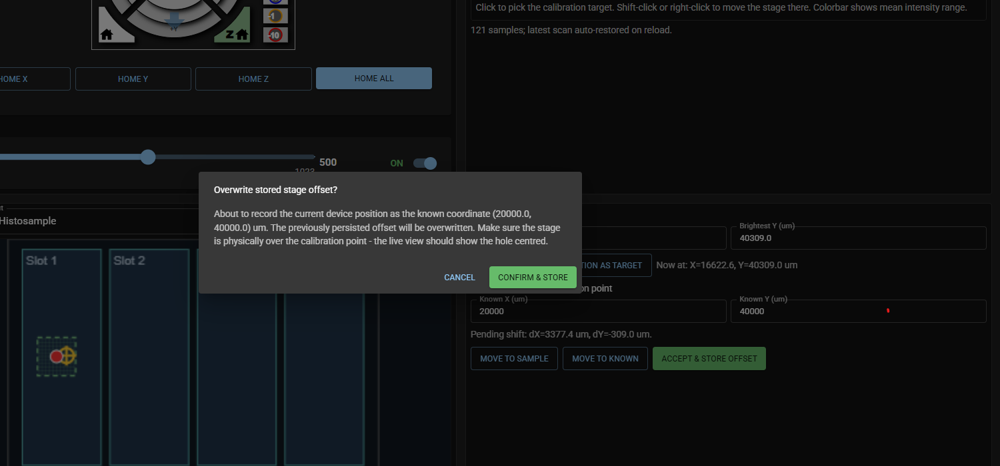

## Verify stage Calibration

To approximately verify stage calibration use the following procedure.

Select 4x objective.

In the *wellplate* app first click on the upper left corner of slide 1. The image will be dark since the objective is underneath the holder. Move it in positive Y direction until you see the edge of the holder and the side of the pinhole slide and center. It should roughly look like the image below.

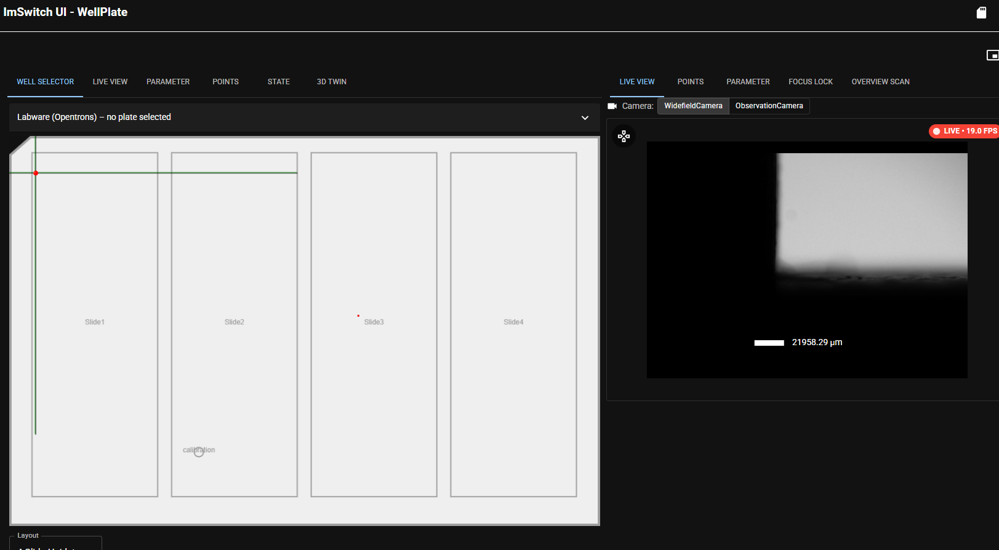

Then click on the opposite site of the sample in X (upper right corner). Follow the same centering procedure.

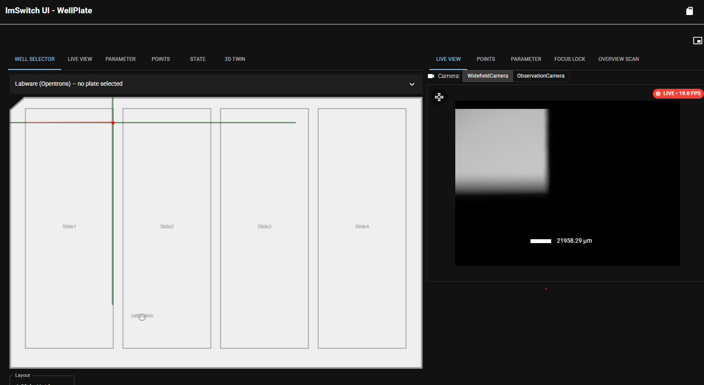

Then click on the opposite site of the sample in Y (lower right corner). Follow the same centering procedure.

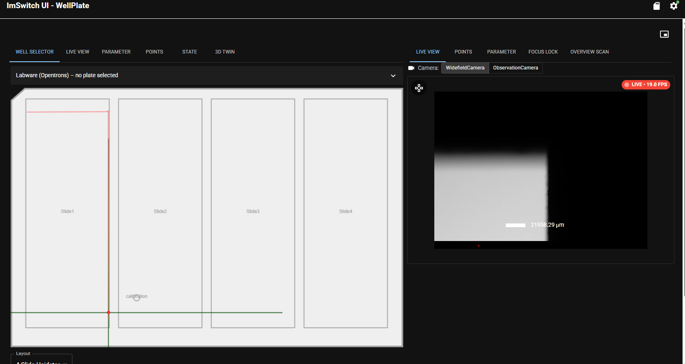

Then click on the opposite site of the sample in X (lower left corner). Follow the same centering procedure.

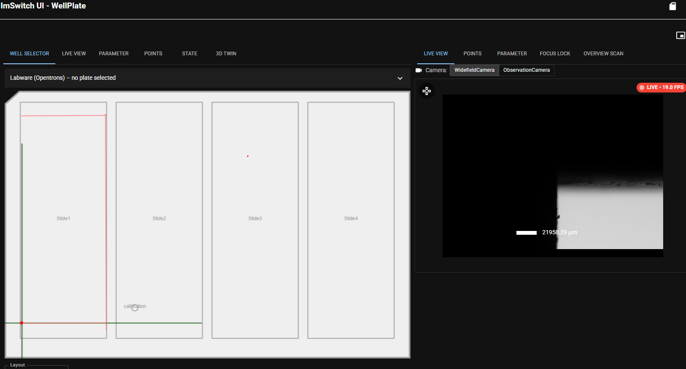

And move back to the starting point. The resultant red square should be aligned in x and y to the marked sample position.

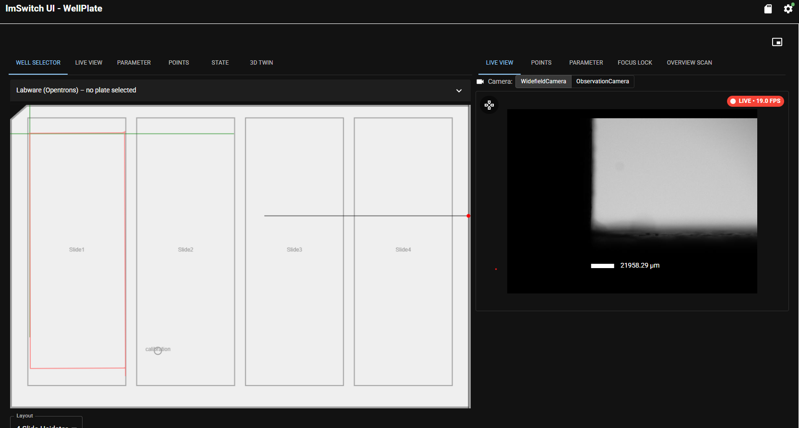

## Related

- Concept: [How scanning works](../../../explanations/how-scanning-works/README.md)
- Troubleshooting: [motion and homing](../../troubleshooting/motion-homing/README.md)
