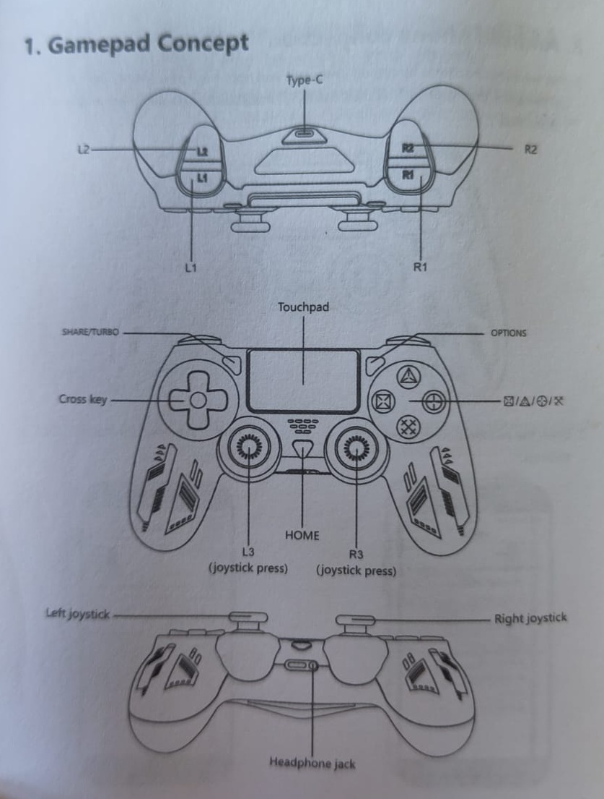
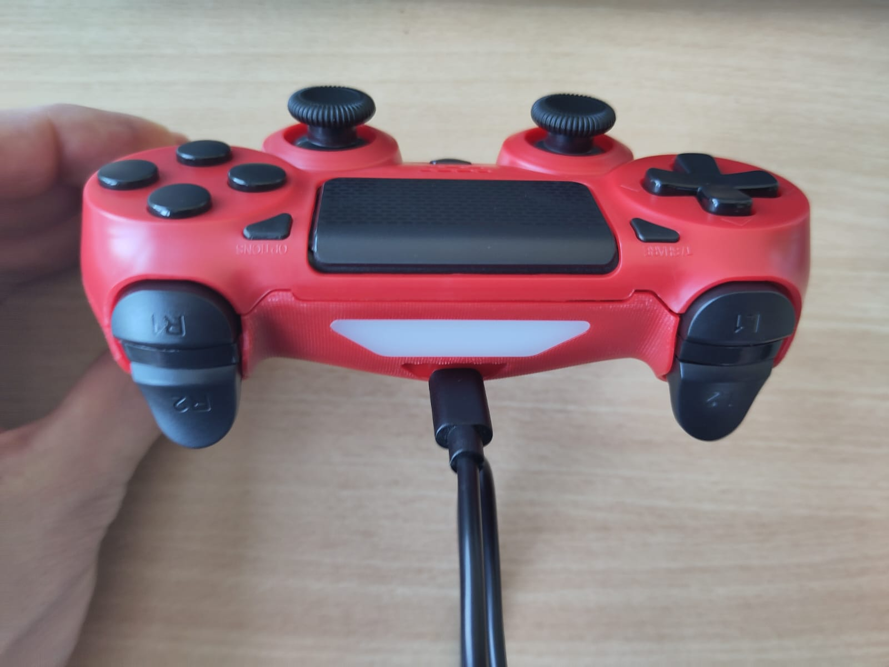
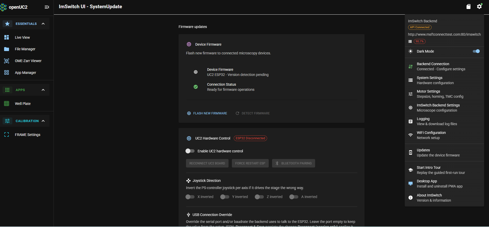
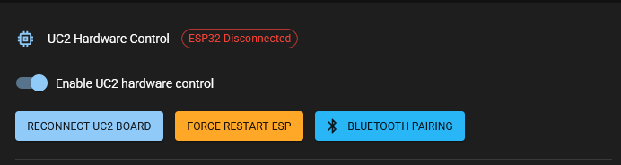
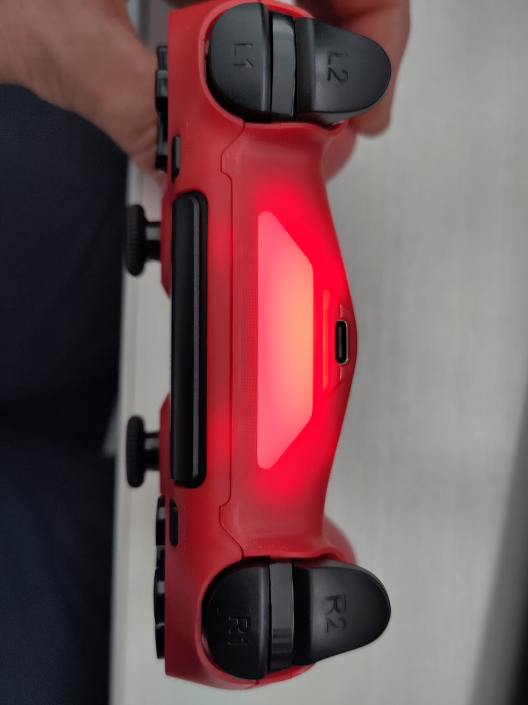

# Using the game controller to move the stage

This documentation guides you through specifics on "How to pair your controller with your FRAME?" and "How to use the controller?".

## Gamepad Concept

For a description of all buttons and joysticks see the picture below.

  

## Pair the controller

First, make sure that the controller is sufficiently charged. To charge it use the USB3 input and the included cable.

  

Put the controller in pairing mode by first pressing and holding the *Share/Turbo* button and then pressing the *home* button until the light bar starts blinking.

In ImSwitch go to *settings* and select *Updates* from the dropdown menu. This brings you to the *ImSwitch UI - SystemUpate* page.

Toggle the button *Enable UC2 hardware control* to on. The button *Bluetooth Pairing* becomes now available (blue). Click the button and pairing starts.

After succesful pairing the light bar of the *game controller* stops blinking and looks like in the below picture.

## Use the controller

Use the joystick R3 to move X and Y axis.
Use the joystick R4 to move coarse Z.
Use the L2 and R2 button to move fine Z.
