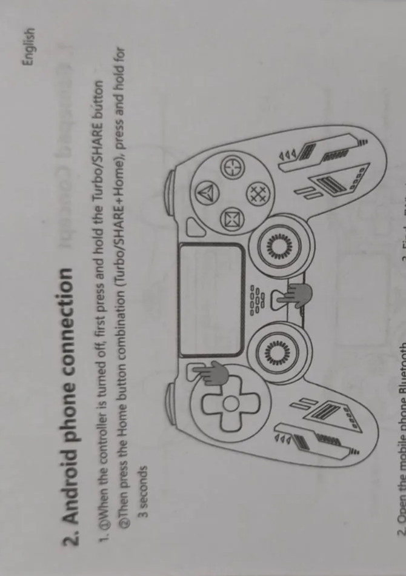

# Using the game controller to move the stage

:::note Draft outline
Scaffold. Replace the bullet prompts with your own text and delete this banner when done.
:::

*How-to, for operators.* Pair and use a PS4/Bluetooth controller to jog the stage.

## Pair the controller

- Put the controller in pairing mode; connect via Bluetooth.

*Pairing via ImSwitch → Hardware Settings → System Update → "Bluetooth pairing"
(from FAT #0007 Part 2).*

:::note TODO
Reused from Notion `FAT FRAME #0007 Korea - Part 2`. More pairing screenshots
(`grafik 1..25.png`) are in that folder if you want a step sequence.
:::

## Control mapping

- Which sticks/buttons move X/Y/Z, change speed, trigger capture.
- Note the axis-direction convention.

:::note TODO
Notion source: `FAT FRAME #0007 Korea - part 7`/`Part 8` ("PS4 Controller direction").
Reference: [coordinates and axes](../../../reference/coordinates-and-axes/README.md).
:::
