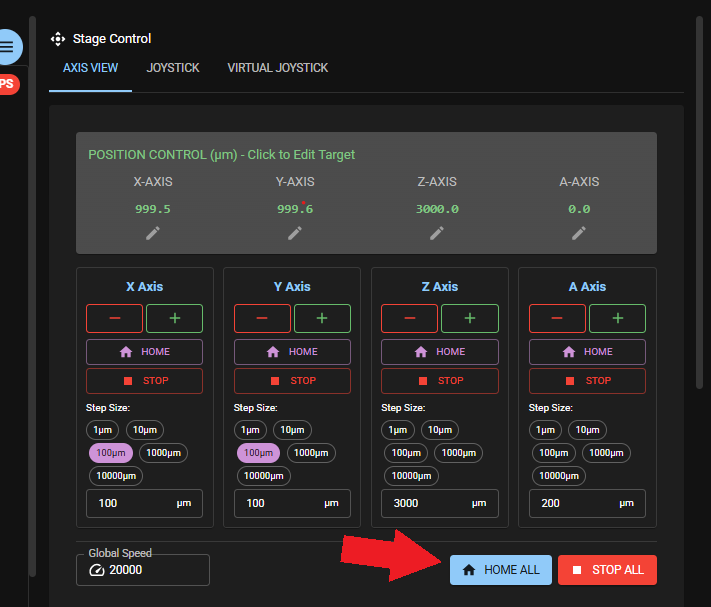
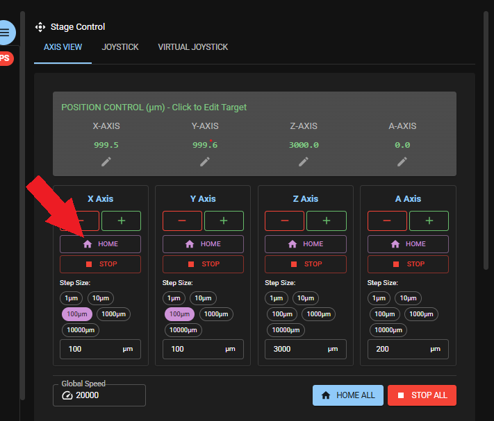
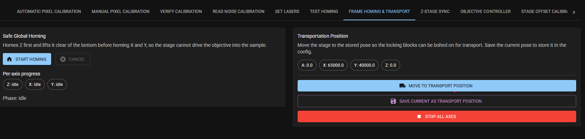

# Homing

Homing reestablishes the stage's reference position, when needed.

## When to do this

Homing is typically performed after power-up and recommended after hitting an endstop or any mechanical collision.  

## How to home

Use one of the following options to home:

- In the *live view* app use the button *home all* to home all axes at once (X/Y/Z/A). This will be done in a predefined flow to mitigate the risk of objective/stage collision.

- In the *live view* app use the button *home* for each axes to home only this axis.  
`IMPORTANT`: Move stage in Z high enough to make sure objective does not collide with stage.

- Go to the *Frame settings* App and the tab *FRAME Homing & Transport*. Press *Start homing*.

