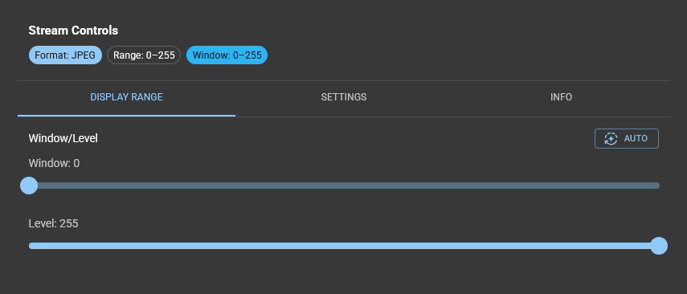
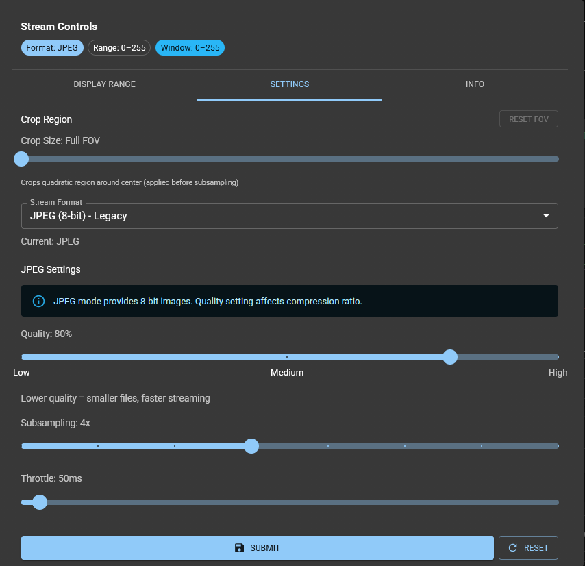

# Preview Image Settings

This sections guides you through the preview image settings.

In the main column of the *Live View* App in ImSwitch underneath the preview window you will find a *settings* button.

Click on it and you have access to the *preview image settings*.
In the tab *display range* you can see and edit the display range.

In the tab *settings* you can see and edit:
- the *stream format*, e.g. jpeg and specific settings for this stream format.
- the *subsampling rate* and *throttle*.

Click *Submit* to save any changes you do.

