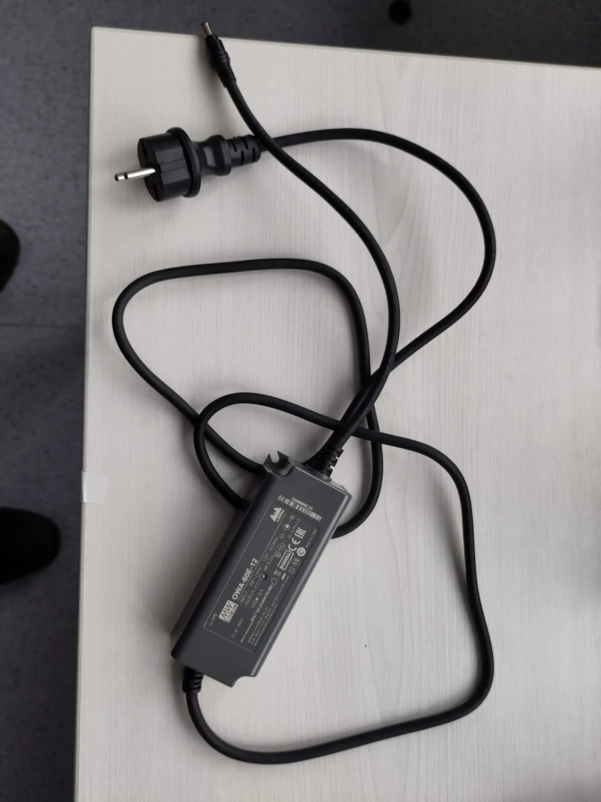
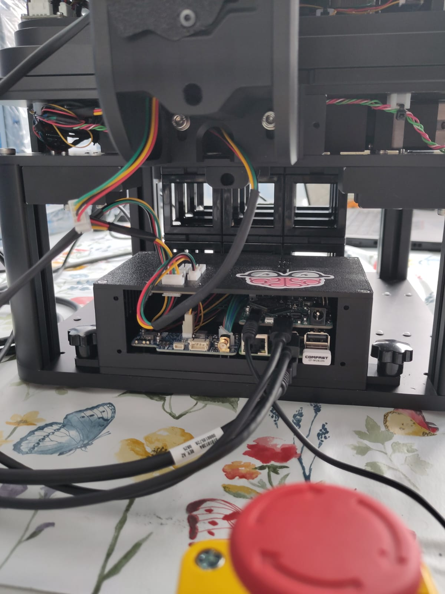
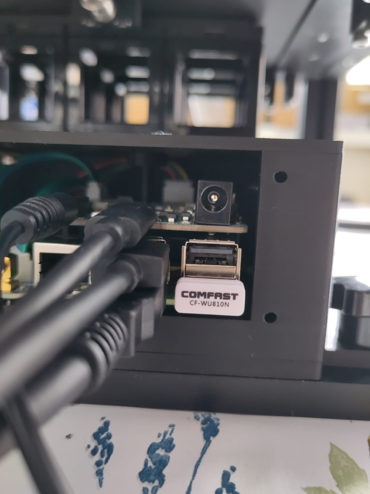
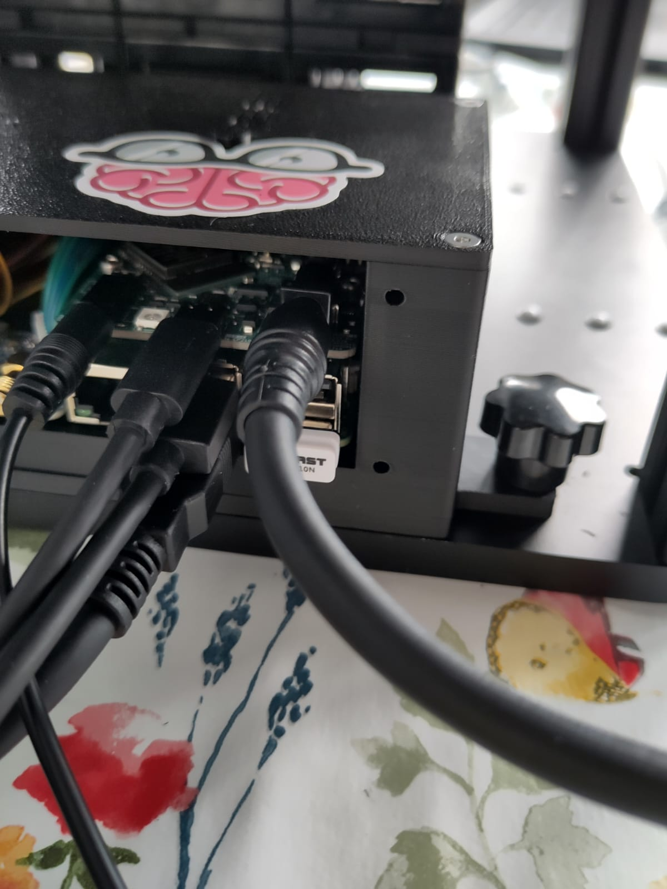
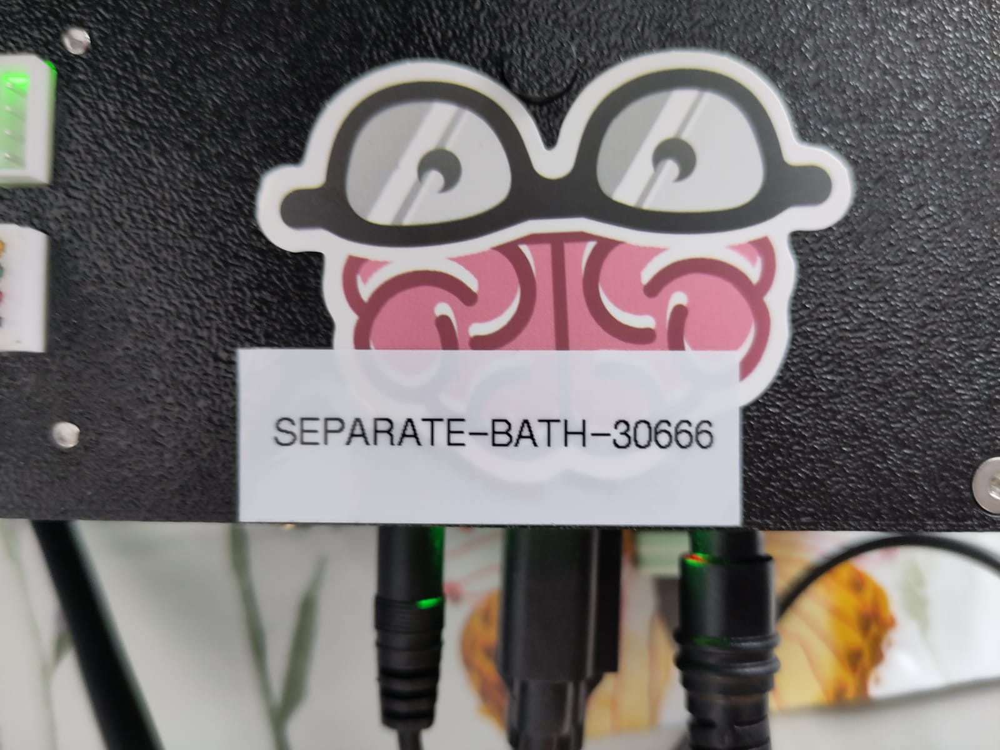
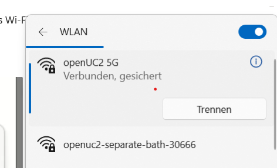
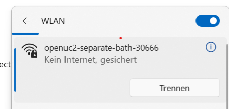
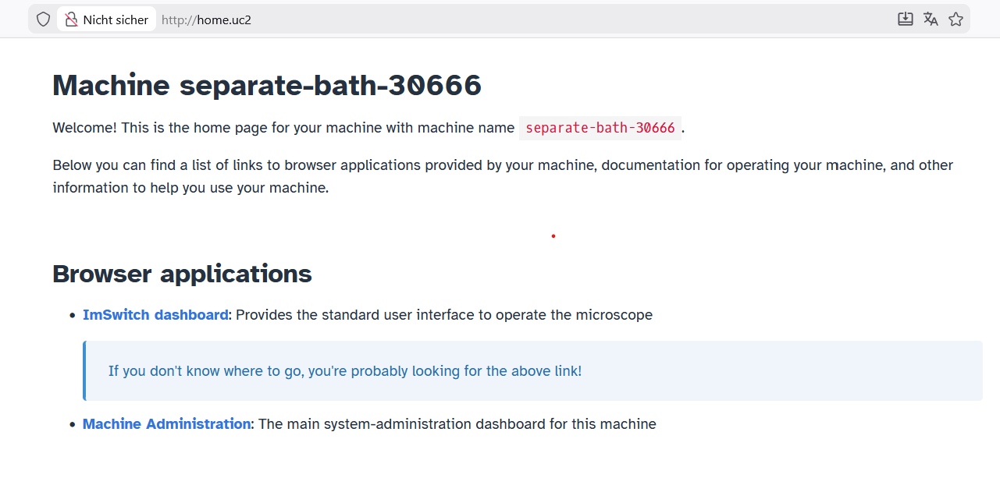
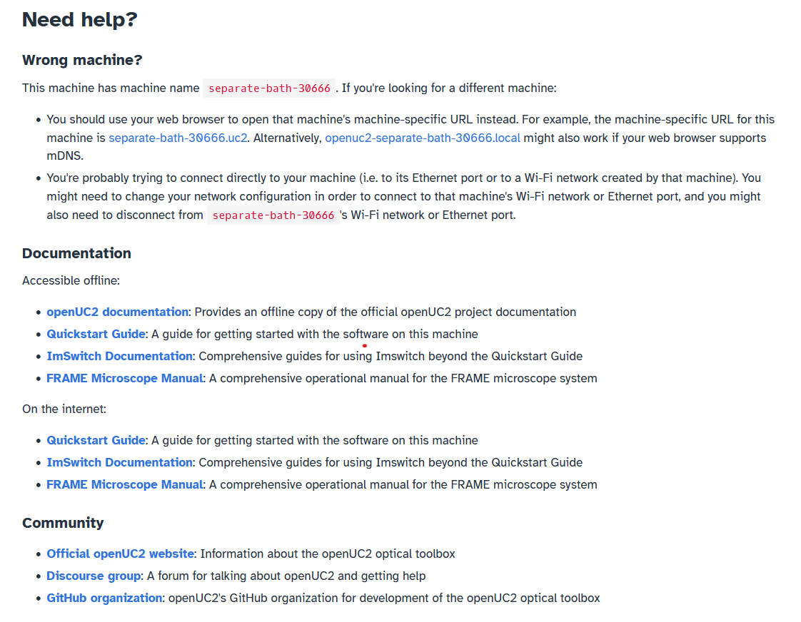
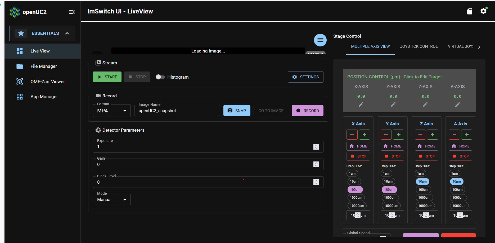

# Establish Your First Connection to the FRAME

In this tutorial, we will connect to your FRAME machine and open ImSwitch for the first time, so that you know how to access the software on your FRAME machine.

## Turn on the FRAME

First, let's turn on your FRAME machine by plugging in power.
To do this, you will use the power adapter included with your FRAME:

Plug the wall plug of this power adapter into a wall outlet.

Next, we will insert the DC barrel plug of the power adapter into the DC barrel jack of your FRAME.
This jack is located in a box at the rear of your FRAME:

The DC barrel jack is the round jack in the upper-right of the rear panel of the box.
Now insert the power adapter's plug into that jack:

| Before | After |
| ------ | ----- |
|  |  |

The FRAME includes a small embedded Raspberry Pi computer, which we'll refer to as the FRAME's *RPi*.
It has a statistically-unique *machine name*, which is also written on a sticker on the FRAME:

In the image above, the machine name is `separate-bath-30666`.
As you can see, the machine name is written in the format `{word}-{word}-{number}`.

## Check LED status

Now that you've plugged in power to your FRAME, the RPi will begin booting up.
Throughout this process, the FRAME's indicator LEDs will report what it's doing and whether any problems have occurred.

## Connect to the FRAME's Wi-Fi hotspot

Now that the FRAME has finished booting up, we're ready to connect your computer to the FRAME in order to access the FRAME's software.

The RPi makes a Wi-Fi network from its internal Wi-Fi module; we call this network the FRAME's *Wi-Fi hotspot*.
The name of the Wi-Fi hotspot has the format `openuc2-{machine name}`, where `{machine name}` should be replaced with the RPi's machine name.
For example, if the machine name is `separate-bath-30666`, then the Wi-Fi hotspot will be named `openuc2-separate-bath-30666`.
For this tutorial, we'll access the FRAME machine's software by connecting to that Wi-Fi hotspot from another computer (e.g. your personal laptop or your lab workstation).

On your computer, open the list of Wi-Fi networks.
Once the RPi has finished starting up, its Wi-Fi hotspot network should appear in the list on your computer:

In the screenshot above, the Wi-Fi hotspot network is named `openuc2-separate-bath-30666`.
Connect to the Wi-Fi hotspot for your FRAME machine.
You'll need to enter the FRAME's default Wi-Fi password, which is `youseetoo`:

Your computer should then connect to the Wi-Fi hotspot.

:::info

Once you connect to the FRAME's Wi-Fi hotspot, your computer will no longer have internet access through Wi-Fi.
[Later](../remote-assistance/README.md), you will give the RPi internet access, and then the RPi will share its internet access with your computer.
Alternative ways of giving your computer internet access while it's connected to the FRAME are described [in our how-to guides](../../../../../components/os/guides/day-0/connectivity.md#how-to-choose-a-networking-topology).

:::

## Open the FRAME's web browser landing page

Now that your computer has a network connection to the FRAME, we're ready to access the FRAME's software from the web browser on your computer.

Open your computer's web browser and try navigating to each of address in the following list, and in the following order, until you find the first one which works for you (which will depend on your computer's operating system and how your web browser is installed):

1. [http://openuc2.local](http://openuc2.local)

   :::info

   `http://openuc2.local` might not work on Windows; it depends on how Windows is configured.

   :::

2. [http://home.uc2](http://home.uc2)

   :::info

   The first time you enter `http://home.uc2` in your web browser, you must include the `http://`!
   Otherwise, your web browser might try to search for the URL in a search engine, instead of opening it as a web page.

   :::

3. [http://192.168.4.1](http://192.168.4.1)

The resulting web page is your FRAME's *landing page*, and it will look something like this:

The landing page provides some information about your FRAME machine, and it's an easy way to access the apps running on your FRAME.

:::tip

You can bookmark this page in your web browser for easy access, so that you don't have to type the address of this page whenever you want to open it.

:::

## Open ImSwitch

Now that you have the landing page open in your web browser, we're ready to open *ImSwitch*, which is the app for operating the microscopy-related functions of your FRAME machine.

On the landing page, click on the "ImSwitch dashboard" link; it can be seen under the "Browser applications" section of the screenshot above (in the previous section).
The link will open ImSwitch in a new tab, and you will see something like this:

This screenshot shows ImSwitch's "Live View" page, which is a general-purpose interface for previewing the FRAME's camera, adjusting its camera settings, and moving the FRAME's sample stage.

Now that you know how to access ImSwitch on your FRAME machine, you're ready to use ImSwitch to [check your FRAME's operational readiness](../operational-readiness/README.md) in our next tutorial!
