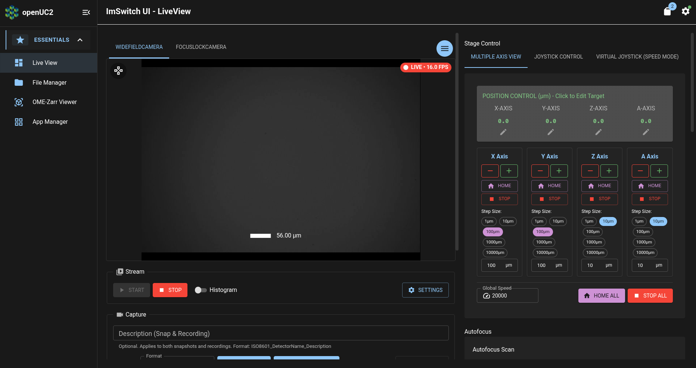
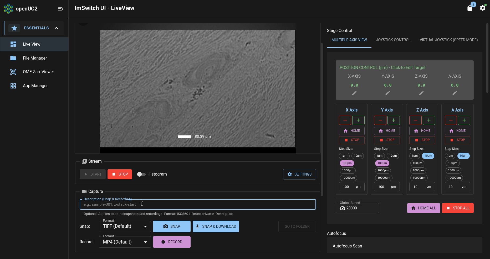
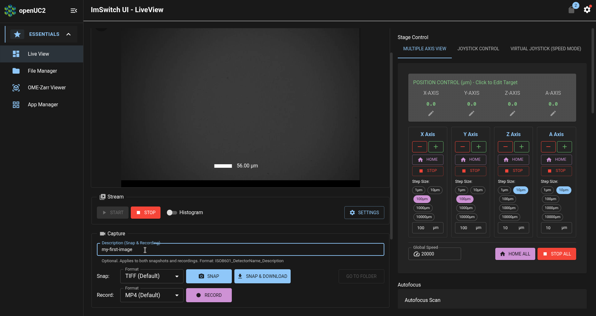
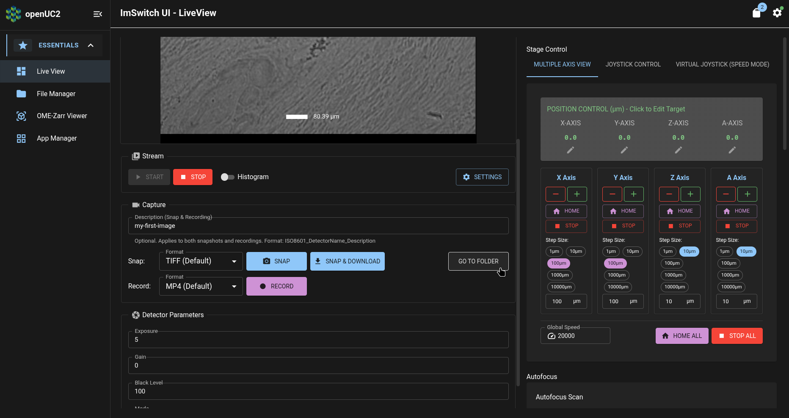
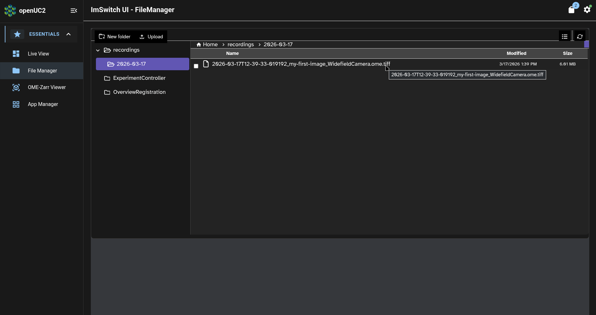
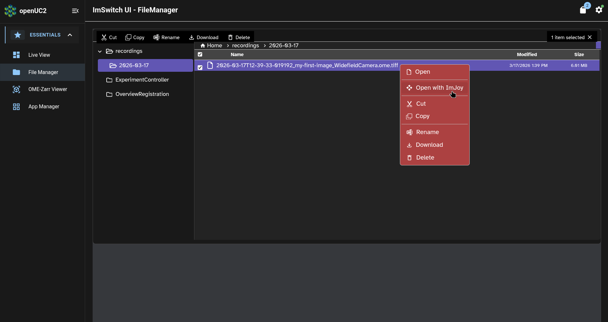
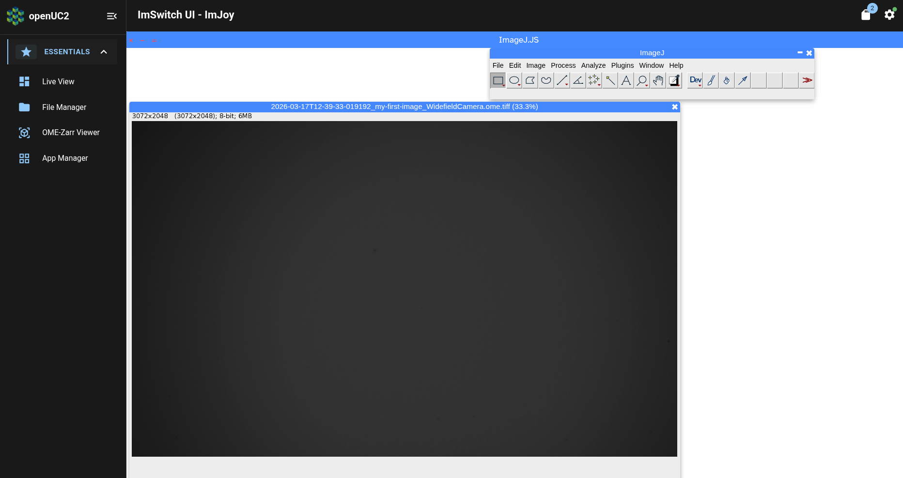
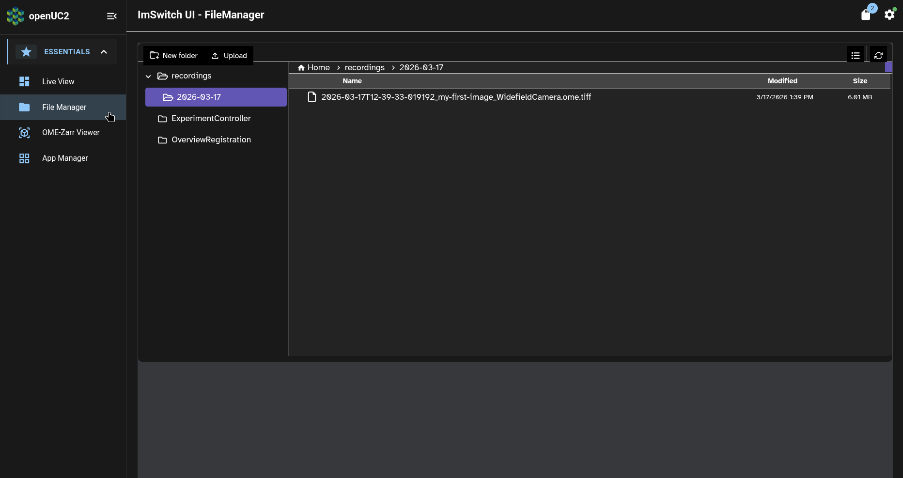
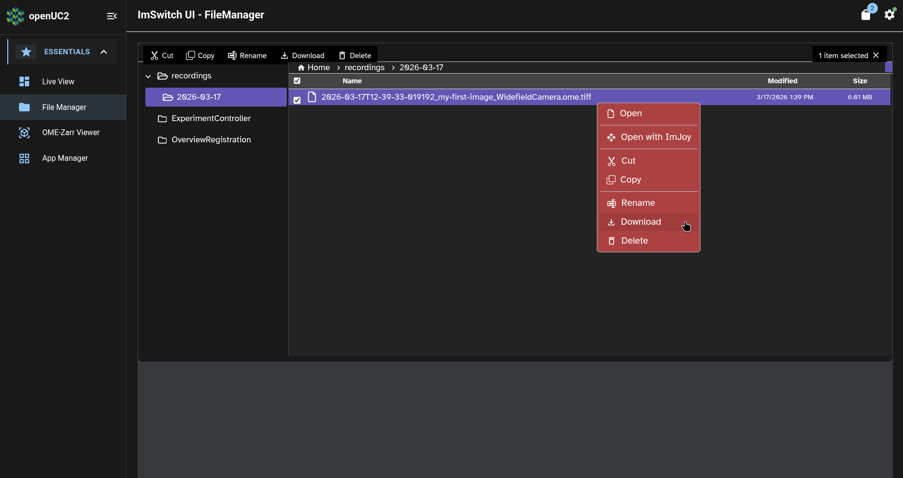
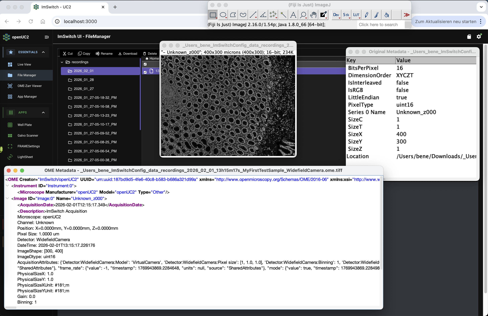

# First Sample

Now that you've [confirmed that your FRAME was not damaged during shipping](../operational-readiness/README.md), we're ready to view microscopic samples with your FRAME.

In this tutorial, we will preview, save, and view our first images of a microscopy sample.
Along the way, we will use the FRAME's ImSwitch app for microscopy, and we will see how to adjust imaging settings in ImSwitch's Live View page.

## Open the live viewer

The basic interface for exploring microscopy samples and adjusting imaging settings is ImSwitch's Live View page.
The Live View page is ImSwitch's home page, so it's what we see when we [initially open ImSwitch](../first-connection/README.md#open-imswitch).
We can also open the Live View page from other pages in ImSwitch by clicking on the "Live View" entry in ImSwitch's navigation sidebar.

Once you open the Live View page, it will look something like this:

In the center of the above screenshot, under the "WIDEFIELDCAMERA" tab, we can see a preview camera stream from your FRAME's main camera.
This preview stream has red indicator (which says "LIVE - 16.0 FPS" in the above screenshot) in its upper-right corner which indicates whether the preview is a live preview, as well as the framerate of the preview stream.

## Insert your first sample

TODO: how should the customer safely insert a slide or wellplate into the microscope, without the slide falling into the microscope?

## Explore your first sample

TODO: how should the customer reposition the sample so that the sample will be in the view of the objective lens? How should the customer turn on the appropriate light source to view the sample? How should the customer choose and set good light settings (light source intensity, exposure time, camera gain)?

## Save your first image

To save your first image of your sample, go to the "Capture" panel below the camera stream:

Enter a brief name for the image in the "Description" textbox:

Then press the "Snap" button to save the image to the FRAME's internal storage.

## View your first image

To view the image you just saved, press the "Go to Folder" button:

This will display the image file in ImSwitch's File Manager page:

We can see in the above screenshot that the image filename begins with the timestamp `2026-03-17T12-39-33-019192` (i.e. March 17, 2026 at 12:39), while the "Modified" timestamp is `3/17/2026 1:39 PM` (i.e. March 17, 2026 at 13:39).
The reason for this one-hour difference is that the timestamp in the image filename is always specified in the [UTC timezone](https://en.wikipedia.org/wiki/Coordinated_Universal_Time), while the "Modified" timestamp is always displayed in the local timezone of your web browser (which for the above screenshot is Central European Time, which is UTC+1).

Now we can right-click on the image to open a menu with entries to download the image or to preview it in ImSwitch:

This will open ImSwitch's ImJoy page.
After several moments, ImJoy will finish loading and open a window with a preview of the image we had saved:

## Download your first image

Now that we've previewed your first image, let's return to the File Manager to download the image to your computer.

Click on the "File Manager" entry in the navbar.
This will return us to the file we had previously selected:

Now right-click on the image again, and click on the context menu's entry to download the image:

This will open your web browser's dialogue choose a location on your computer for downloading the image.

Then you can view the image (and its associated metadata) in other programs on your computer, such as Napari or Fiji:

:::tip

You can configure ImSwitch to save the image directly to a removable USB storage device, instead of saving the image to the FRAME's internal SD card.
When you are acquiring large amounts of data, you should save your data to a removable storage device so that you can transfer it to other computers more easily and more quickly.

To learn how to do this, please refer to our [day-2 tutorial](../../day-2/acquire-data/README.md#to-a-removable-usb-storage-device).

:::

## What's next

Now that we've acquired, previewed, and downloaded our first image, we're ready to learn how to [set up your FRAME to be able to get remote assistance from openUC2 customer support](../remote-assistance/README.md).

In the [day-2 tutorials](../../day-2/README.md), we'll also learn how to [acquire data more efficiently](../../day-2/acquire-data/README.md), [improve your FRAME's imaging settings for your particular sample](../../day-2/imswitch-settings/README.md), and more!
