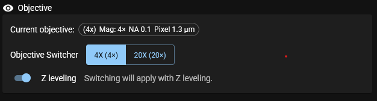
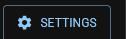
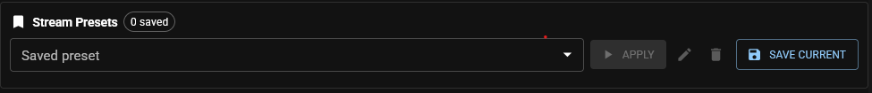
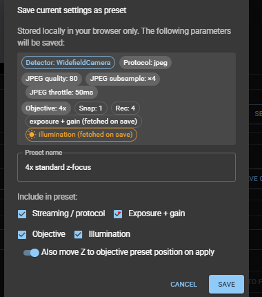
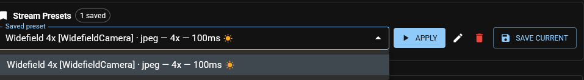
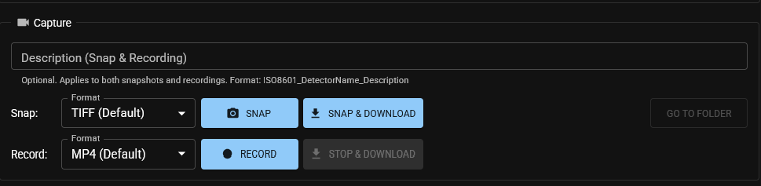
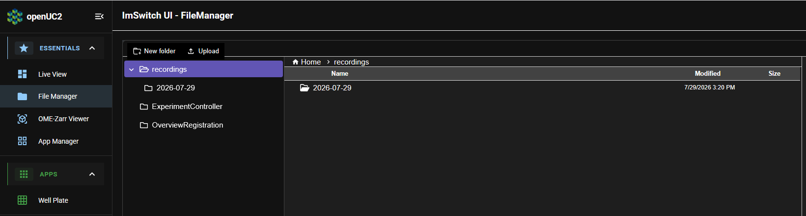

# First Sample

Now that you've [confirmed that your FRAME was not damaged during shipping](../operational-readiness/README.md), we're ready to view microscopic samples with your FRAME.

In this tutorial, we will preview, save, and view our first images of a microscopy sample.
Along the way, we will use the FRAME's ImSwitch app for microscopy, and we will see how to adjust imaging settings in ImSwitch's Live View page.

## Insert your first sample

Depending on the specific FRAME hardware configuration you purchased from openUC2, your FRAME will come with a preinstalled sample holder for holding either well plates or microscope slides:

In the above image, we can see a well plate holder on the left and a microscope slide holder on the right.

In our day-2 tutorials we'll learn how to [change the sample holders](../../day-2/reconfigure/sample-holder.md), but for now you should insert a sample matching the sample holder which has been preinstalled in your FRAME:

- if your FRAME has a slide holder, continue to the tutorial section for [inserting a microscope slide](#inserting-a-microscope-slide)
- if your FRAME has a well-plate holder, continue to the tutorial section for [inserting a well plate](#inserting-a-well-plate)

### Inserting a microscope slide

Take a microscope slide with a sample and place it on one of the slots of the slide holder like in the below sequence of images:

| Insert into flat edge | Pull back spring-loaded mechanism | Insert into spring-loaded edge |
| --------------------- | --------------------------------- | ------------------------------ |
|  |  |  |

As we can see above, first one shorter edge of the microscope slide is placed against the flat edge of the slide slot; and then a finger pulls back the spring-loaded edge at the other end of the slot; and then the other shorter edge of the microscope slide is dropped into the spring-loaded edge of the slot.
Now you can let go of the spring-loaded edge:

Now that we've inserted your first sample on a microscope slide, we can continue to the tutorial section to [Open the ImSwitch Live View App](#open-the-imswitch-live-view-app).

### Inserting a well plate

Take a well plate with a sample and place its A1 corner into the corner with the spring-loaded button, and then push the opposite corner of the well plate into the well-plate holder:

| Insert into corner with button | Insert into opposite corner |
| ------------------------------ | --------------------------- |
|  |  |

Now that we've inserted your first sample on a well plate, we can continue to the tutorial section to [Open the ImSwitch Live View App](#open-the-imswitch-live-view-app).

## Open the ImSwitch Live View App

The basic interface for exploring microscopy samples and adjusting imaging settings is ImSwitch's *Live View* App.
The *Live View* App  is ImSwitch's home page.
We can also open the *Live View* App from other pages in ImSwitch by clicking on the *Live View* entry in ImSwitch's navigation sidebar.

Once you open the Live View page, it will look something like this:

The preview stream was not yet started, so the indicator in the upper right corner is grey and says "Paused". To start the stream click on the green *Start* button below the image.
An image will appear and the  indicator changes to red saying "LIVE - 8.0 FPS" which indicates that the preview is a live preview with a frame rate of 8 FPS (Please, note, that in the picture below illumination is already turned on and the sample is in focus).

In the upper left corner you can see that the tab "WIDEFIELDCAMERA" is active, which is typically the main camera in your FRAME.

## Choose an objective

In the right column of the *Live View* App, which has the *Stage Control* and *Autofocus* sections, scroll down to the *Objective* section. Your current objective will be displayed along with its parameters. For your first image we recommend starting with the objective with the lowest magnification, e.g. 4x.

## Position and properly view your first sample

Now we'll adjust all necessary parameters to position and properly view your sample in the preview stream.

### Turn on illumination

First, we'll need to illuminate the sample.
In the right column of the *Live View* App, which has the *Stage Control* and *Autofocus* sections, scroll down to the "Illumination" section. Depending on your customer specific configuration you will see all illumination sources available to you - *LED* is always available. On default all illumination sources are switched off - to switch the *LED* on toggle the button on the right to *On*. Then set the LED Power by either sliding the scale bar or type in a value between 0 and 1023 to the right of the sliding scale.

If more illumination sources are available the section will look something like this.

Now you should see light shining onto your sample.

### Adjust exposure settings

Next, we'll need to adjust the camera's *exposure time* setting.
In the main column of the *Live View* App, which has the camera preview stream, scroll down to the *Detector Parameters* section:

As a rule of thumb:
- In most cases it is sufficient to change the *Exposure time* and leave *Gain* and *Black Level* as is.
- Finding a suitable exposure time can be done in 3 ways:
  - (Recommended) Pressing the *Auto Once* button will set the exposure time automatically and lock this exposure time in since *Mode* is *Manual* or
  - manually entering the desired exposure time or  
  - switch the mode from *Manual* to *Auto*, which will then continuously adjust exposure time whenever changes in light level occur.

Try to adjust the exposure so that the image in the camera preview stream is a moderate gray color.

### Adjust stage x-y position

Use one of the following 4-options to move the sample into the camera view.
- the *game controller*
- the *double-click function* of the preview window in the *Live View* App
- the *Axis View* tab in the *stage control* section of ImSwitch
- the *Joystick* tab in the *stage control* section of ImSwitch

To get familiar with each of these options, please, refer to [Principles of sample movement](../../../guides/day-2/Principles-of-sample-movement/README.md).

After enough adjustment of the positions of the X and Y axes, your sample should be located directly over the objective lens:

Your sample is probably still out-of-focus, so you probably still won't see anything meaningful in the *camera preview stream*.

### Adjust stage focus

Now let's bring your sample into focus, so that we can actually see something in the *camera preview stream*.

First, as a precaution, we'll move the sample as far away from the objective lens as possible, by moving the Z Axis to its zero position.
Click on the "Home" button. See [Principles of sample movement](../../../guides/day-2/Principles-of-sample-movement/README.md) for instructions on how to home the Z-Axis individually.

If the Z Axis isn't already at its zero position, it will move until it reaches its zero position.

Now we'll perform coarse focusing of our sample by using either the *game controller* or the *Axis View* tab in the *Stage control* section. See [Principles of sample movement](../../../guides/day-2/Principles-of-sample-movement/README.md) for instructions on how to do this.

Now we'll perform fine focusing of our sample using the digital *Autofocus* function available in ImSwitch. In the right column of the *Live View* App, which has the *Stage Control* section, scroll down to the and *Autofocus* section. The default parameters are shown in below picture. *Range Z = 100* will make a sweep of +/-50um with respect to the *Current Z: 4501.56*-position displayed above the *Start Autofocus* button. *Resolution Z = 10* will make the algorithm take an image in steps of 10um, which would equal 11 images with the settings displayed and find the one with the best focus.    

Click the button *Start Autofocus* and the algorithm will start running.
When it is done it will display a new *Current Z* value and *State finished*.

As a rule of thumb:
- in a first step select a wider *Range Z*, e.g. 200-300um and leave the *Resolution Z* at 10.
- in a second step select a more narrow *Range Z*, e.g. 50-100um and change the *Resolution Z* to a smaller value, e.g. 2-5um.

For a more detailed guide, please, refer to the [Autofocus](../../../guides/day-2/autofocus/README.md) guide.

By now the sample in your camera preview window should look something like this.

## Check and adjust settings of the preview window

You can access and edit the preview image settings by the *settings* button, which you will find in the main column of the *Live View* App underneath the preview window. For your first sample the default settings should work.   

For more information, please refer to the [Preview Image Settings](../../../guides/day-2/preview-image-settings/README.md) guide.

## Save Streaming Presets

Now that you have done all the work to find the best parameters for an optimum *live view image* with the active camera and objective, we recommend saving all these parameters as a *Stream Preset*. This allows you to (re)load these settings at any point in time, e.g. after switching cameras or objectives which typically needs other settings.

You can find the *Stream Presets* section in the main column of the *Live View* App underneath the preview window. If you have not yet saved any preset it will look like the picture below.    

  

Press *Save Current* and a pop-up window opens. It will show you all current parameters saved in this particular *Stream Preset*, asks you to enter a *Preset name* and gives you some Checkbox options on what or what not to include in the saved parameter set (on default all boxes are ticked).

Press *Save* and the *Stream Preset* section will now show that there is 1 saved preset available. To apply a saved *Stream preset*, select the preset in the dropdown menu and click *Apply*. You can also edit and delete it here.

`Important`These settings are stored in your browser´s cache. If you switch browsers or computers they will not be available anymore (You will then need to redo the procedure).  

## Save and view your first image

To save your first image of your sample, go to the "Capture" panel below the camera stream:

Enter a brief name for the image in the *Description* textbox, select your preferred file format (default TIFF) and press either:
- *Snap*: this stores the image on the SD card of the machines RPI. You can access it by either clicking *Go to folder* or switch to the *File Manager* App located in the ImSwitch Navigation sidebar. Either way you will see something like in the picture below. To see the recorded image go to the folder *Recordings* and the subfolder with the current date and you will find your image. Double click on the image file and you will get a preview within ImSwitch.

- (Recommended) *Snap & download*: this stores the image on the SD card of the machines RPI `AND`locally on your computer at the same time. You can access it there by using the file manager on your computer and view it using your favorite image viewer.

## What's next

Now that we've acquired, previewed, and downloaded our first image, we're ready to learn how to [set up your FRAME to be able to get remote assistance from openUC2 customer support](../remote-assistance/README.md).

In the [day-2 tutorials](../../day-2/README.md), we'll also learn how to [acquire data more efficiently](../../day-2/acquire-data/README.md), [improve your FRAME's imaging settings for your particular sample](../../day-2/imswitch-settings/README.md), and more!
