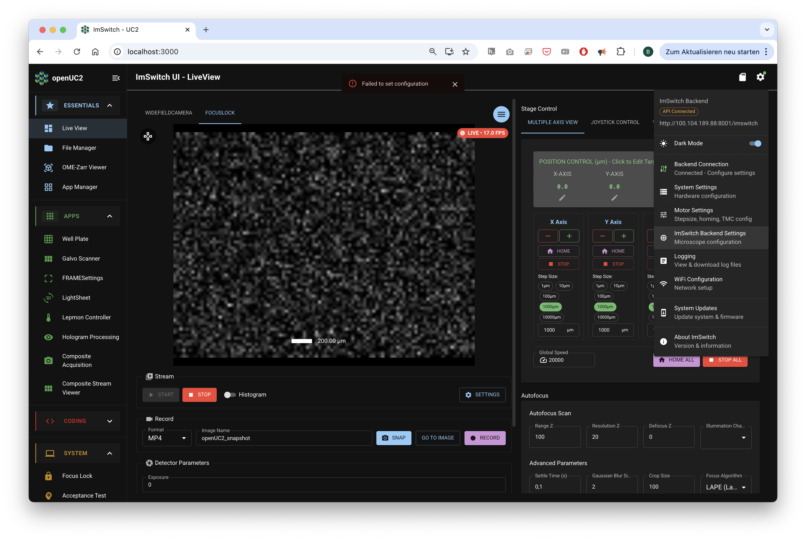
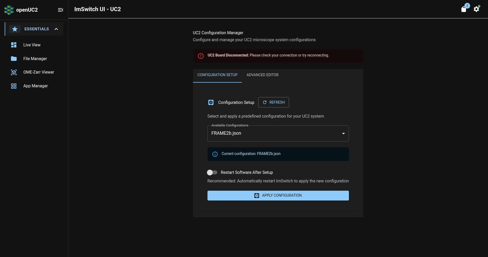
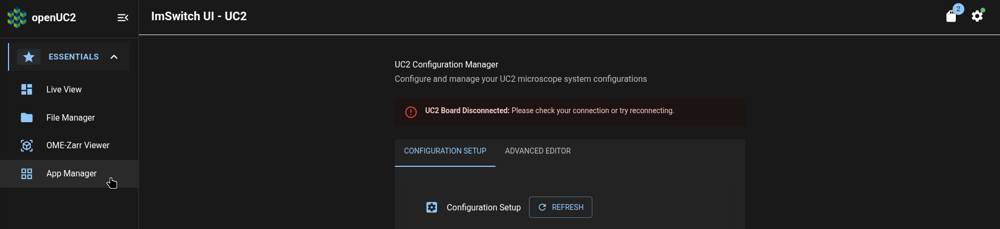
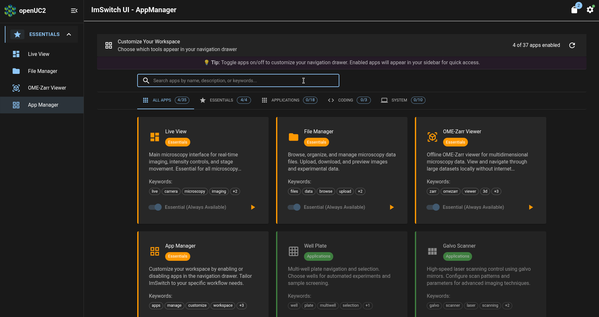
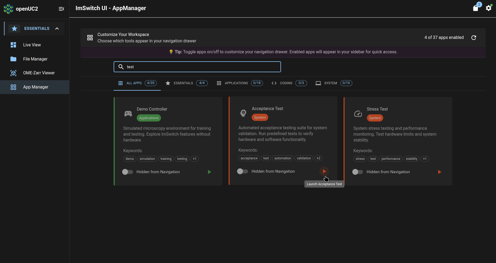
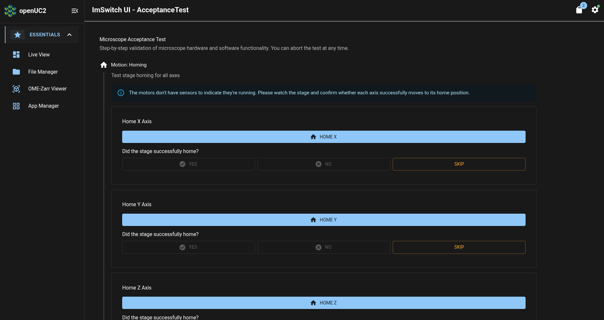
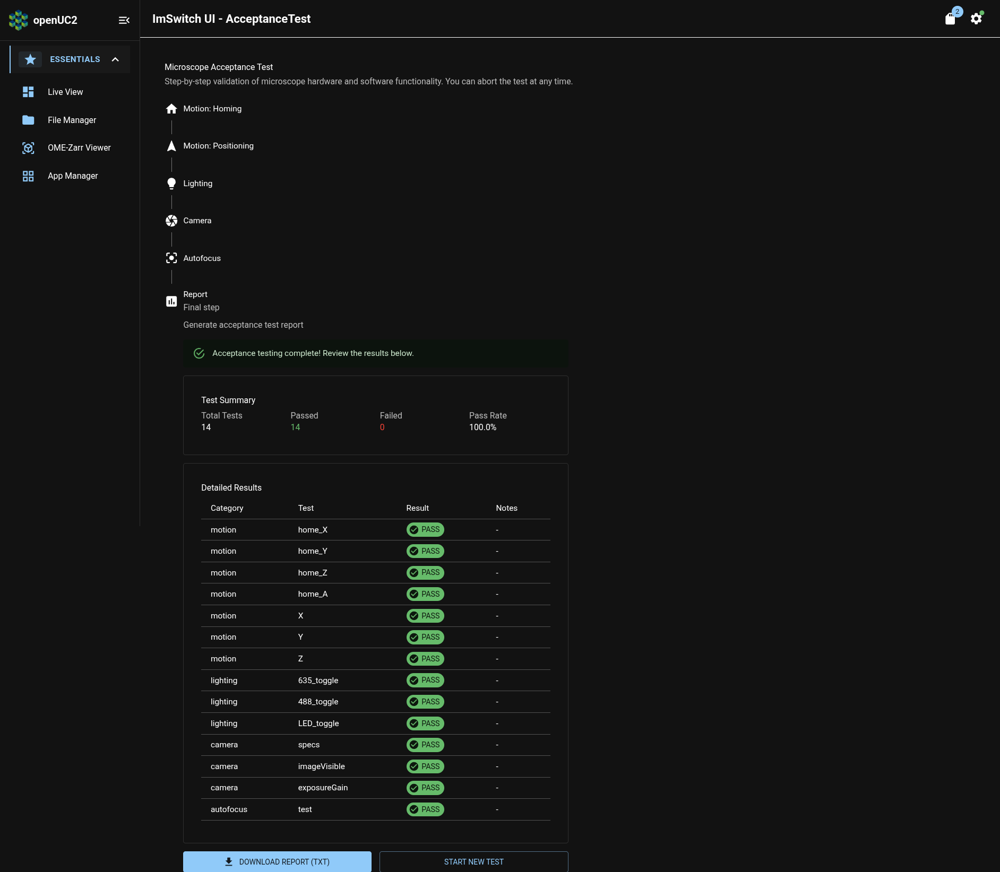

# Check Your FRAME's Operational Readiness

In this tutorial, we will perform some checks to ensure that your FRAME is ready to be operated as a microscope.
Along the way, we will use the FRAME's ImSwitch app and see some basic troubleshooting procedures we can run in ImSwitch if your FRAME behaves in way that you don't expect.

## Ensure correct ImSwitch hardware configuration

Because ImSwitch is designed to be used with a variety of hardware configurations (which may involve different detectors, light sources, stages, etc.), ImSwitch needs to be given information about the hardware configuration of your machine.
This is done by selecting one of the preinstalled hardware configuration files in ImSwitch.

If you purchased and received a machine directly from openUC2, then the correct hardware configuration file was already been set for you as part of openUC2's procedures for testing that your machine works.
Here, we will find the name of the correct hardware configuration file for your machine.

First, [open ImSwitch](../first-connection/README.md#open-imswitch).
Click on the settings icon in the upper-right corner of the page in order to open the settings menu, and click on the "ImSwitch Backend Settings" menu item:

This will open a settings page which shows the name of the currently-selected hardware configuration file:

In the screenshot above, you can see that the current configuration is called `FRAME2b.json`.

The name of the current hardware configuration file should match what openUC2 customer support communicated to you when the FRAME machine was delivered to you, so you shouldn't need to change anything here.

:::info

If you need to change the hardware configuration file, please refer to our [day-2 tutorial](../../day-2/imswitch-settings/README.md#change-hardware-configuration).

:::

## Perform acceptance test procedure

In order to ensure that the FRAME's hardware wasn't damaged in the process of being shipped to you, we can perform an acceptance test procedure in ImSwitch to check for certain kinds of hardware problems.

To open ImSwitch's Acceptance Testing page, click on the "App Manager" entry in ImSwitch's navigation sidebar:

On the App Manager page, click on the search box:

Type "test" to filter the apps, and then click the play button on the Acceptance Test app:

This will open the Acceptance Test page:

For each action (e.g. "Home X Axis") listed in the Acceptance Test page, press the button to perform that action and then answer the question about the result of that action (e.g. "Did the stage successfully home?") by pressing the corresponding button (e.g. "Yes" or "No").

At the end of the test sequence, a test report will be generated summarizing the results of the acceptance test procedure.
If any test failed on a FRAME which you purchased from openUC2, please download the test report and send it to openUC2 customer support at [support@openuc2.com](mailto:support@openuc2.com) so that we can identify and fix any damage to your machine which occurred while it was in the process of being shipped to you.

If all tests passed (like in the screenshot above), then your FRAME is ready for you to use it as a microscope.

## What's next

Now that we've determined that your FRAME is ready for imaging operations, we'll save images of your [first sample](../first-sample/README.md)!
