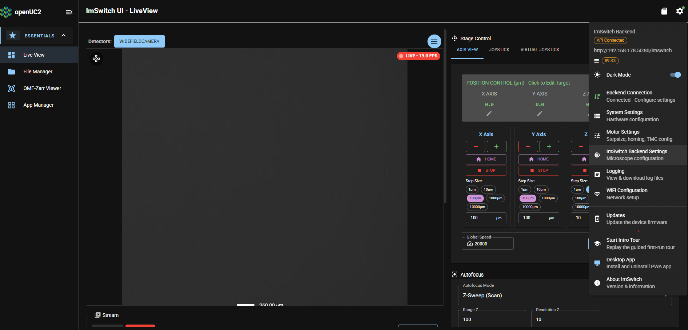
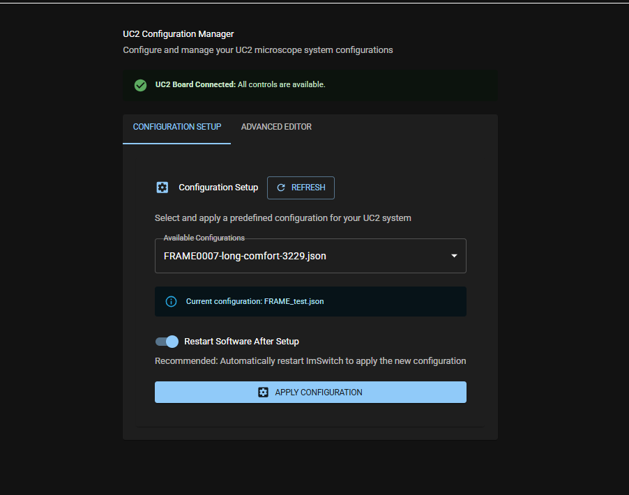
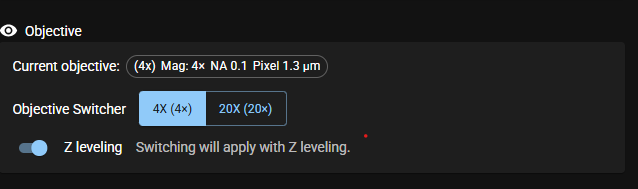
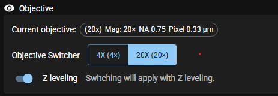
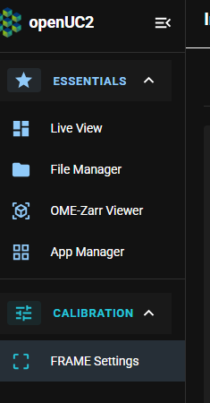
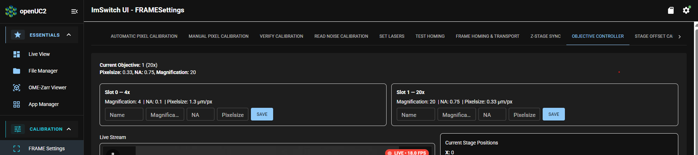

# Check Your FRAME's Operational Readiness

In this tutorial, we will perform some checks to ensure that your FRAME is ready to be operated as a microscope.
Along the way, we will use the FRAME's ImSwitch app and see some basic troubleshooting procedures we can run in ImSwitch if your FRAME behaves in way that you don't expect.

## Ensure correct ImSwitch hardware configuration

Because ImSwitch is designed to be used with a variety of hardware configurations (which may involve different detectors, light sources, stages, etc.), ImSwitch needs to be given information about the hardware configuration of your machine.
This is done by selecting one of the preinstalled hardware configuration files in ImSwitch.

If you purchased and received a machine directly from openUC2, then the correct hardware configuration file was already been set for you as part of openUC2's procedures for testing that your machine works.
Here, we will find the name of the correct hardware configuration file for your machine.

First, [open ImSwitch](../first-connection/README.md#open-imswitch).
Click on the settings icon in the upper-right corner of the page in order to open the settings menu, and click on the "ImSwitch Backend Settings" menu item:

This will open a settings page which shows the name of the currently-selected hardware configuration file:

In the screenshot above, you can see that the current configuration is called `FRAME0007-long-comfort-3229`. The syntax of the machine specific hardware configuration file consists the serial number `FRAME0007` and the the RPI machine name `long-comfort-3229`.

The name of the current hardware configuration file should match what openUC2 customer support communicated to you when the FRAME machine was delivered to you, so you shouldn't need to change anything here.

:::info

If you need to change the hardware configuration file, please refer to our [day-2 tutorial](../../day-2/imswitch-settings/README.md#change-hardware-configuration).

:::

## Homing

## View Pixel Calibration

The specific hardware configuration of your machine consists of cameras (e.g. a WideField camera in the Brightfield optical module) and 1-2 objectives. For each given optical configuration (e.g. WideField Camera + Objective in Position 1) a Pixel Size calibration was performed as part of openUC2 testing procedures.

To see the current calibration you have two options.
*Option 1:* In the live view app on the right handside scroll down to where objectives can be switched. For the active objective all parameters including pixel calibration are displayed. See an example for 2 objectives below.

*Option 2:* In the app sidebar menu on the right go to the App *FRAME Settings* (how to enable this app see ). Choose the tab *Objective Controller*. The settings for both objectives including Pixel Size are displayed at the top.

For information on how to perform pixel size calibration on your machine, please, go to [Pixel Calibration](../../../guides/day-2/calibrate-pixel-size/README.md)!

## View Objective Calibration

## View Stage Calibration

## What's next

Now that we've determined that your FRAME is ready for imaging operations, we'll save images of your [first sample](../first-sample/README.md)!
