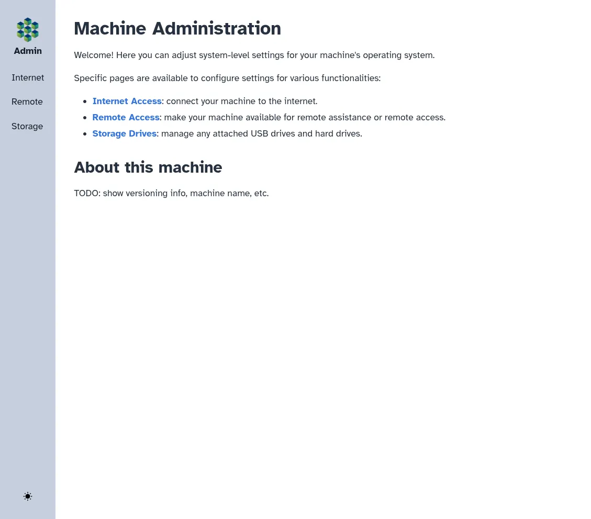
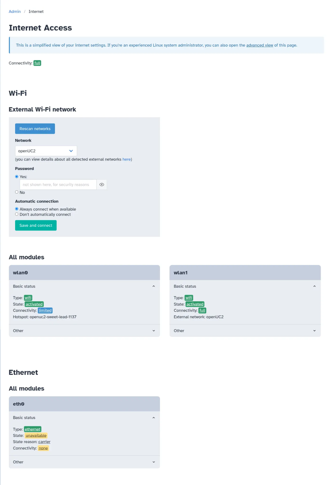
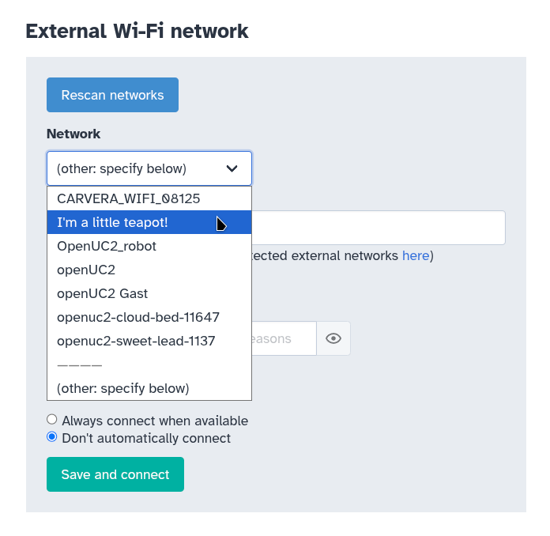
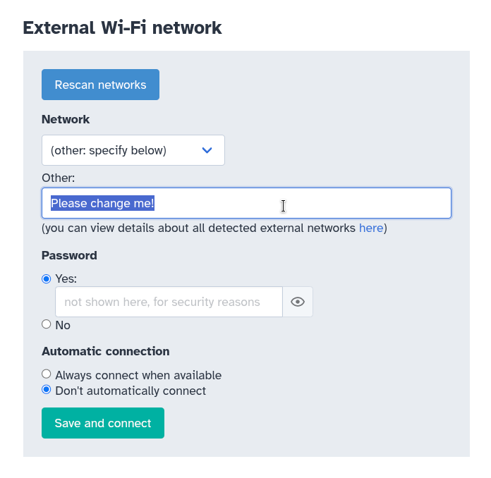
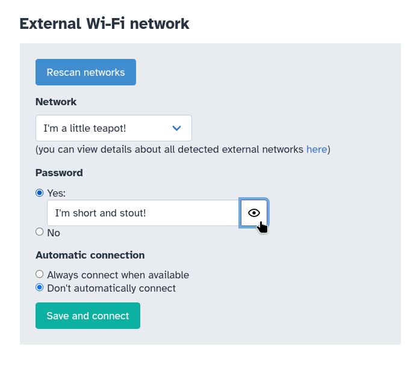
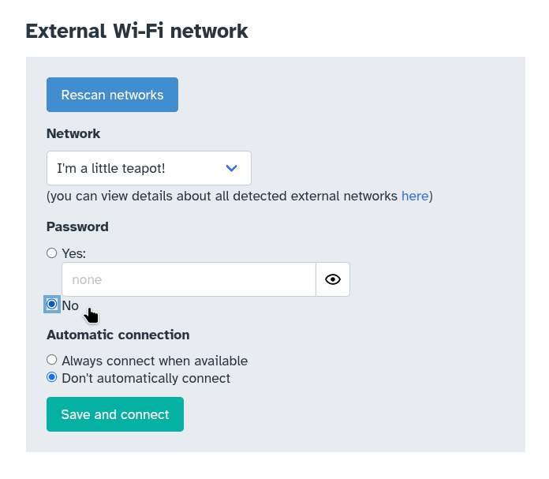
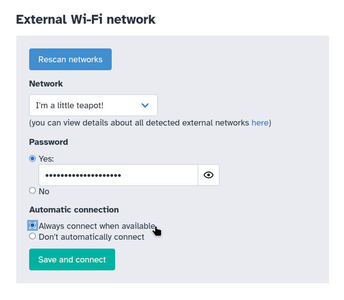
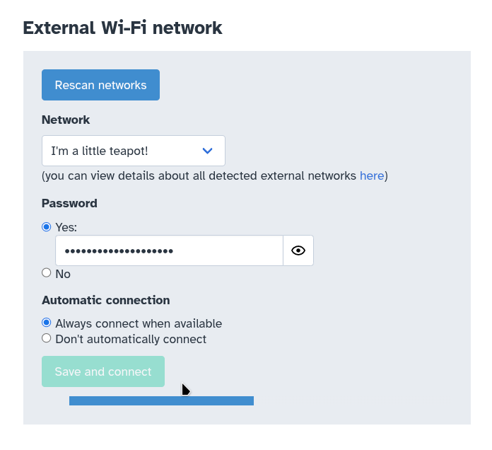
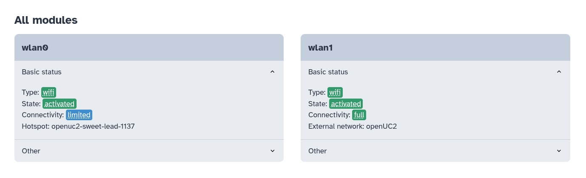

# Set Up Remote Assistance on Your FRAME

In this tutorial, we will set up remote assistance on your FRAME machine, so that you know how to enable remote assistance when you need help from openUC2 customer support.

## Connect your FRAME to the internet via Wi-Fi

First, let's open the FRAME's landing page in your web browser (we learned how to do this [in the First Connection tutorial](../first-connection/README.md#open-the-frames-web-browser-interface)).

Next, open the "Machine administration" link in the landing page's "Browser applications" section.
The Machine Administration app provides a simple way to manage various computer-related settings of the RPi in your FRAME.

In order to enable remote access to your FRAME machine, we'll need to give the RPi access to the internet.
We can configure internet-access settings on the Machine Admin app's Internet Access page.
To open this page, click the "Internet Access" link on the Machine Admin app's homepage, or on the "Internet" link in the app's navbar:

The Internet Access page shows you the status of your RPi's network devices for Wi-Fi and Ethernet:

As we can see in the "Wi-Fi" → "All modules" section, your RPi has two Wi-Fi devices, one named `wlan0` and the other named `wlan1`. `wlan0` is your RPi's internal Wi-Fi module, while `wlan1` is a USB Wi-Fi dongle which is plugged into your RPi.
`wlan0` is always used for making your RPi's Wi-Fi hotspot.
`wlan1` is reserved for connecting to any Wi-Fi network which is already created by a Wi-Fi access point (commonly called a "Wi-Fi router") near the RPi; we call such a network an *external Wi-Fi network*, in contrast to the Wi-Fi hotspot generated by the RPi which is internal to the FRAME machine.

We will use the "Wi-Fi" → "External Wi-Fi network" section to configure `wlan1` to connect to an external Wi-Fi network.
First, you should choose an external Wi-Fi network which has internet access. You can look for this network in the dropdown list of external Wi-Fi networks detected by `wlan1`:

This list will periodically update as Wi-Fi networks appear and disappear.
If you want to manually trigger a refresh, you can click on the "Rescan networks" button, which is the blue button in the screenshot above.

If your desired network isn't on the list, then the RPi won't be able to connect to it right now.
But if you want to make the RPi connect to the network in the future, you can specify the name of an undetected network, by choosing the "(other: specify below)" option visible in the option above.
Once you click on it, you'll be able to type in the exact name of your desired network:

Let's assume we're connecting to the network named "I'm a little teapot!".
If it has a Wi-Fi password, you should type in the password.
After typing in the password, you can press the "eye" icon to the right of the password to view it and check for any mistakes:

If your desired Wi-Fi network has no password, then you should instead select the "No" option instead:

:::info

This tutorial assumes that your desired Wi-Fi network uses either no Wi-Fi security (if you specify that there's no password) or WPA2 security.
If you're trying to connect to something like eduroam or a network with WPA2-Enterprise security, that's a more complicated topic which is outside the scope of this tutorial.
You may need to ask for guidance from openUC2 customer support.

:::

Next, we recommend selecting the setting to have the RPi always connect to the specified Wi-Fi network whenever it's available:

If you don't enable that option, then you'll always need to manually click the green "Save and connect" button (visible at the bottom of the screenshot above) in order to make the RPi connect to the specified network.

Finally, you should press the "Save and connect" button.
This will save the Wi-Fi network connection settings and then make the RPi attempt to connect to the network, if it's available.
A progress bar will appear for several moments while the RPi attempts to connect:

:::info

If the network you're trying to connect to requires you to register devices or has a captive portal, please refer to our how-to guide on [connecting to external Wi-Fi networks](../../../../../components/os/guides/day-1/connectivity.md#via-an-external-wi-fi-network).

:::

If/when the RPi connects, you will see updates to the status of the wlan1 module in the "Wi-Fi" → "All modules" section:

## Enable remote assistance

Here, you should see `wlan1`'s status be reported as `activated` and its connectivity be reported as `full`, which indicates that the FRAME's RPi has internet access to the internet through `wlan1`.
Finally, the name of the external network (which is `I'm a little teapot!` above) should match what you expect.

Now that we've connected your FRAME machine to the internet, we're ready to enable remote assistance!
