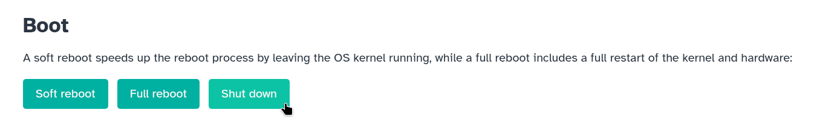
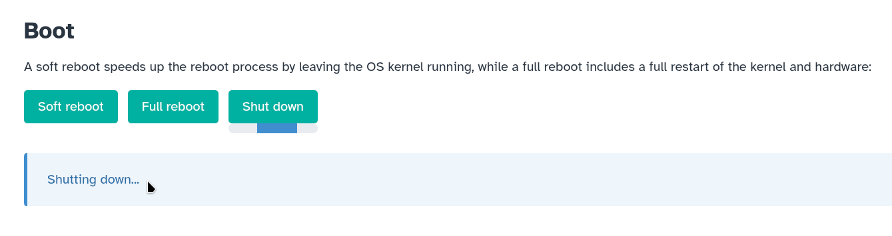
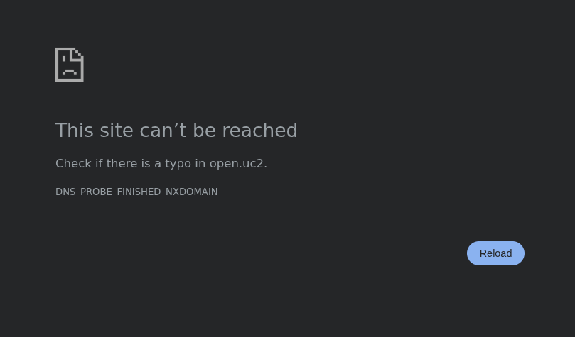

# Safe Shutdown

In this tutorial, we will shut down your FRAME machine and unplug it from power without causing data corruption on your FRAME.

## Shut down the operating system

First, let's open the FRAME's landing page in your web browser (we learned how to do this [in the First Connection tutorial](../first-connection/README.md#open-the-frames-web-browser-landing-page)).
Next, open the Machine Administration app from the landing page (we learned how to do this [in the Remote Assistance tutorial](../remote-assistance/README.md#connect-your-frame-to-the-internet-via-wi-fi)).
You should now see the homepage of the Machine Administration app:

At the bottom of the screenshot above, we can see three buttons: "Soft reboot", "Full reboot", and "Shut down".
These buttons allow you to reboot or shut down the operating system which is running on your FRAME's RPi computer; the operating system, called "[openUC2 OS](../../../../../components/os/README.md)", is responsible for:

- running all software on your FRAME (including the Machine Administration app)
- managing your FRAME's data storage devices and network interfaces

Now press the "Shut down" button in order to shut down the operating system:

Then you will see an indefinite progress bar under the "Shut down" button, as well as a message indicating that the operating system is shutting down:

Now the operating system will:

- stop all programs it was running (including the Machine Administration app)
- finish writing and saving any files it was in the middle of creating/modifying, in order to avoid data loss or data corruption
- clean up after itself

If you refresh the webpage in your web browser, then after several seconds your web browser will show you an error page indicating that it can't reach your FRAME:

You should expect to see some error similar to what's shown in the above screenshot (though your exact error message may be different), because your FRAME is now in the process of shutting down.

The shutdown process will usually be complete within 30 seconds.
Afterwards, it will be safe to unplug power from your FRAME.

:::info

The "Shutting down..." message and progress bar (visible in the above screenshot) will continue to be displayed even after your FRAME has finished shutting down.

:::

:::tip

You can also access the "Soft reboot", "Full reboot", and "Shut down" buttons from the System Settings page of ImSwitch.

:::

## Unplug power

Now we will fully cut off power by unplugging the power adapter from the FRAME's power jack, which we had previously seen in the [first connection tutorial](../first-connection/README.md#turn-on-the-frame).
Remove the power adapter's plug from the FRAME's power jack:

| Before | After |
| ------ | ----- |
|  |  |

## Turn on the FRAME again

Now we'll turn on the FRAME again, since you'll need it to be powered on for the [day-2 tutorials](../../day-2/README.md).

Plug in power to your FRAME and watch the statuses of its indicator LED, in the same way as we learned in the [first connection tutorial](../first-connection/README.md#turn-on-the-frame).

## What's next

Congratulations!
We've finished the day-1 tutorials for learning about the basics of how to set up and operate your FRAME.

Now we're ready to continue to the [day-2 tutorials](../../day-2/README.md) to learn how to perform various routine tasks with the FRAME, including more efficient ways to [acquire data](../../day-2/acquire-data/README.md) on the FRAME.
