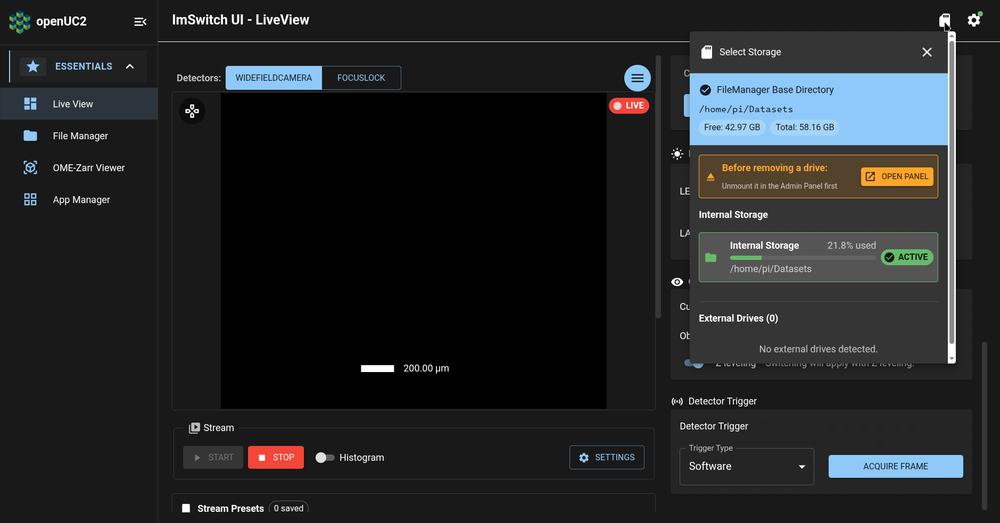
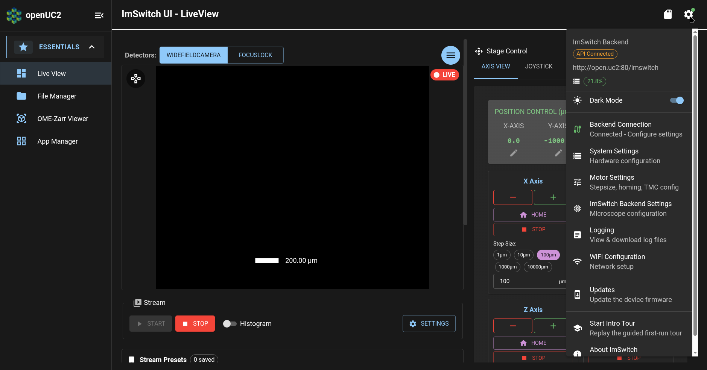
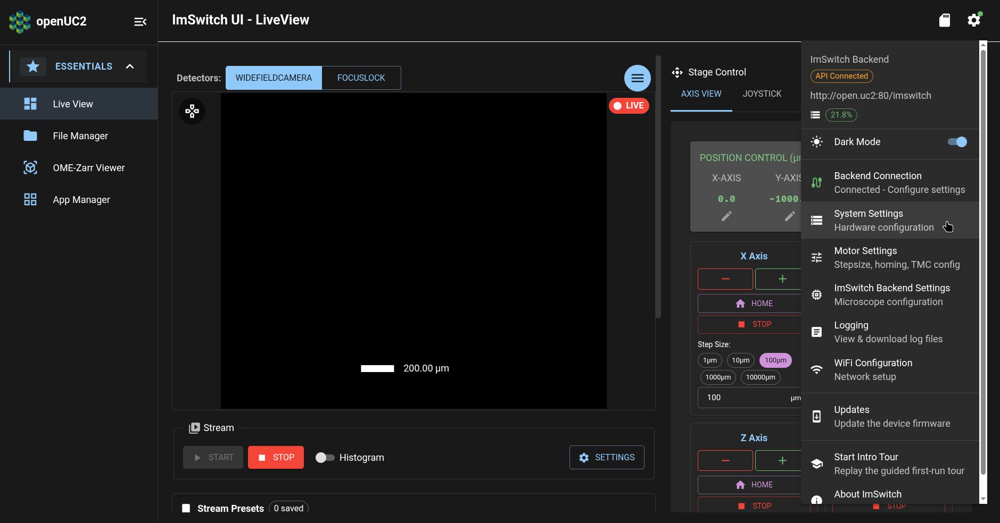
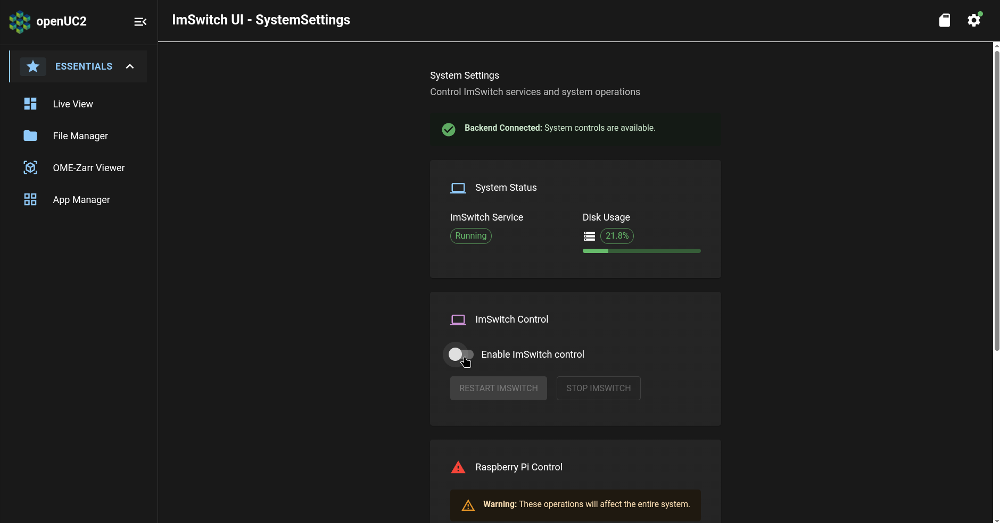
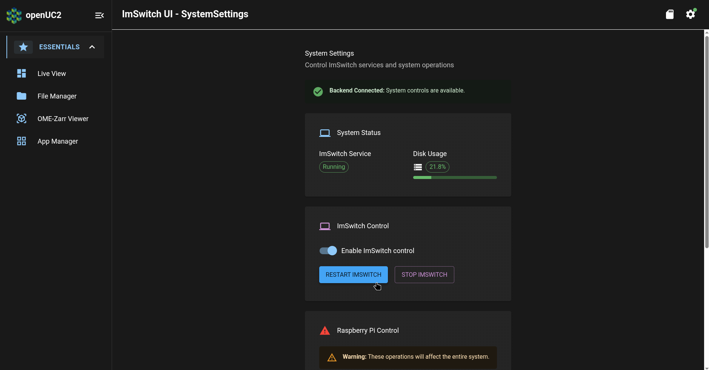
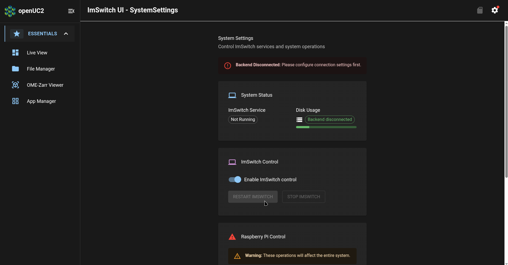
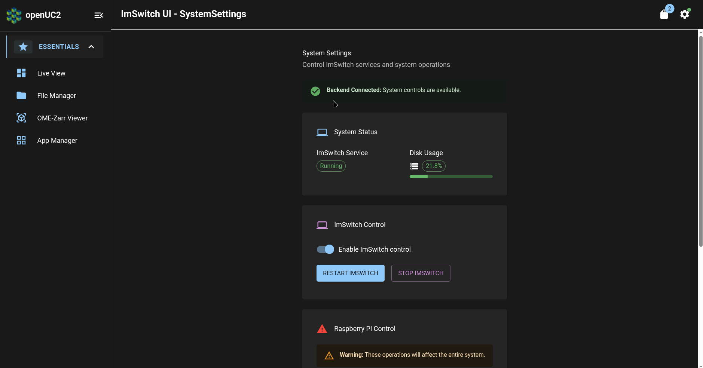

# Acquire Data

In the day-1 tutorials, we saw the overall procedure for [acquiring your very first images on the FRAME](../../day-1/first-sample/README.md).
In this day-2 tutorial, we will learn how to acquire data more efficiently.

## to a removable USB storage device

Previously, we saw how to save data to the FRAME's internal storage.
However, the FRAME's internal storage has limited capacity, and transferring data out of the internal storage can be somewhat slow or cumbersome.
For this reason, we recommend instead saving data to a USB storage drive plugged into your FRAME.
This enables you to transfer data from your FRAME efficiently and easily by simply moving your USB storage drive from your FRAME to another computer.

First, open ImSwitch (recall that we did this in the [day-1 *First Connection* tutorial](../../day-1/first-connection/README.md#open-imswitch)).
If you click on the icon shaped like an SD card in the upper-right corner of the screen, we will see the "Select Storage" menu for selecting a storage device where ImSwitch will save acquired data:

In the above screenshot, we can see that there are no external drives detected
We can also see that the SD card of the FRAME's Raspberry Pi computer has a total size of 58.16 GB with 42.97 GB of disk space available for storing data.

Next, plug a USB storage drive into an available USB port on your FRAME's RPi.
It will be automatically mounted into the RPi so that it's available to ImSwitch; however, we will need to restart ImSwitch in order to make ImSwitch detect the new USB drive.
To do so, click on the gear icon in the upper-right corner of the screen to open the Settings menu:

Then click on the "System Settings" menu item:

This will open the System Settings page.
In the "ImSwitch Control" panel of this page, click on the "Enable ImSwitch control" toggle item:

This will allow you to click on the "Restart ImSwitch" button.
Click on that button to restart ImSwitch:

After a few moments, we will see a "Backend Disconnected" message because ImSwitch has stopped:

After a few more moments, we will then see a "Backend Connected" message indicating that ImSwitch has started again:

Additionally, we can see in the above screenshot that the button for the "Select Storage" menu (with the SD card icon in the upper-right corner of the page) now has a blue badge in its upper-right corner with the number "2".
