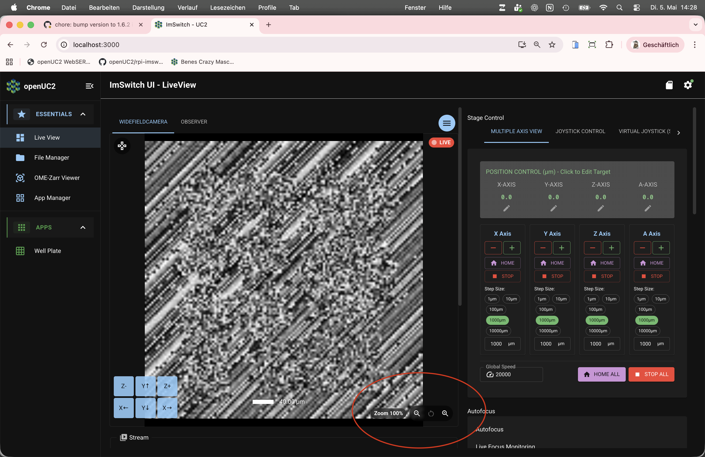

# Adjust ImSwitch settings

:::note Draft outline
Scaffold. Replace the bullet prompts with your own text and delete this banner when done.
:::

*Learning-oriented, for users.* Small settings that make daily work smoother.

## Optimize camera streaming settings

- Live-view framerate vs. resolution trade-off; digital zoom to check focus.
- Cross-link: [digital zoom how-to](../../../guides/day-2/digital-zoom/README.md).

*Digital zoom on the live stream (from TASK-FR024).*

:::note TODO
Reused from Notion `TASK-FR024`. See the [digital zoom how-to](../../../guides/day-2/digital-zoom/README.md).
:::

## Change hardware configuration

- What the hardware configuration is; when you'd change it; how to select/save one.
- Where optical settings are stored.

:::note TODO
Notion source: `TASK-FR022 Usability - software configuration json`,
`TASK-FR025 store optical settings in config`. Full field reference belongs in
[Reference / config JSON](../../../reference/config-json/README.md); this page is the
user-level "how to pick and save a config".
:::

## Related

- [ImSwitch UI reference](../../../reference/imswitch-ui-reference/README.md)
