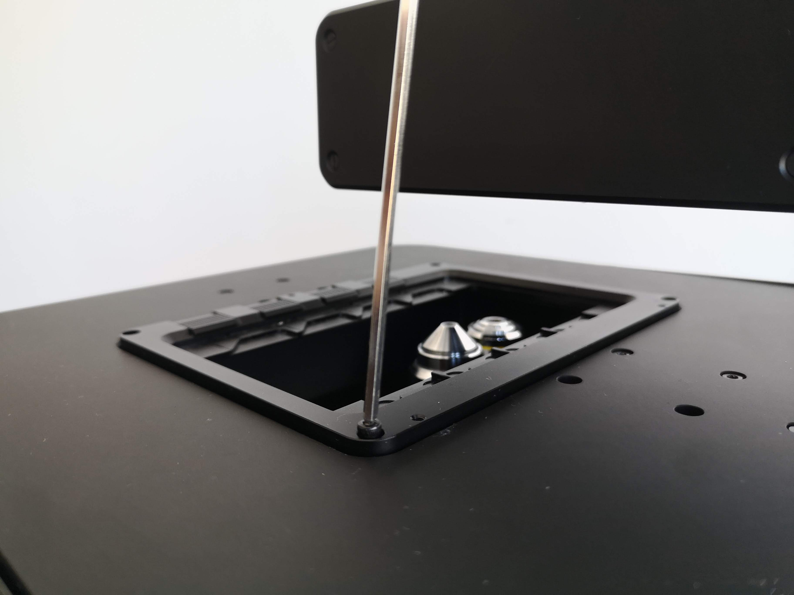
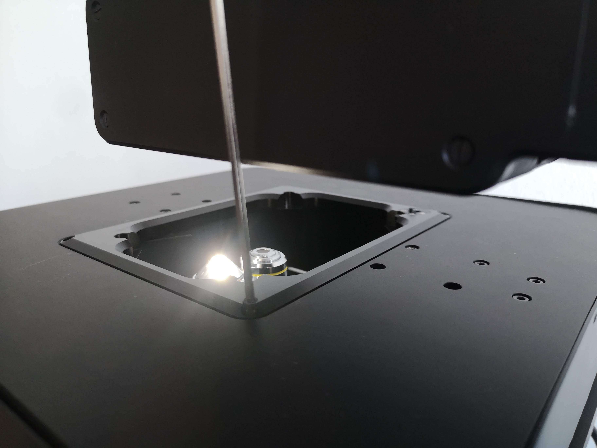

# Sample Holder

## Remove your sample holder

TODO

## Insert a slide holder

Place the slide holder on the FRAME's stage as shown in the below image, and then use your Allen wrench to secure the slide holder with one screw at each corner of the slide holder:

## Insert a well-plate holder

First, place the well-plate holder on the FRAME's stage as shown in the below image (with the orientation shown in the below image), and then use your Allen wrench to secure the well-plate holder with one screw at each corner of the well-plate holder:

As we can see in the image above, three corners of the well-plate holder have flat surfaces, while the fourth corner has a small button attached to a spring-loaded mechanism which is secured with four screws.
The well-plate holder should be oriented so that the corner with the button is closer to the rear of the FRAME, where the FRAME's illumination arm is mounted; that corner corresponds to your well plate's [corner notch (chamfer)](https://en.wikipedia.org/wiki/Microplate#Corner_notch) at the A1 position.
