# Run a large-area (stitched) scan on a slide

A single camera frame only sees a tiny part of your sample. In this tutorial you'll define a region on one slide, let the FRAME image them *tile* by *tile*, and view the *tiles* stitched into one large overview image. One *tile* equals one image captured at a specific position with predefined *image capture settings*. You can use  what we call the *Experiment Controller* of the *Wellplate App* to define, save and run your experiment with all those predefined settings.

## What stitching is

- The stage moves the sample under the fixed objective in a grid of positions.
- One image or *tile* is captured at each position with the predefined *image capture settings*. Positions are partly overlapping to ensure proper stitching.
- Overlapping *tiles* are stitched together = merged into one single image.

## Before you start

- On your Heidstar sample holder insert at least one sample in one of the 4 positions available.
- Select the camera and objective you want to run your experiment with and obtain a properly illuminated and focused image in the *preview* window of the *Live view* App (see [Insert your first sample](../../day-1/first-sample/README.md#insert-your-first-sample)).
- (Recommended) Move roughly to the center of your large-area scan.

## Step 1 — Go to the *Wellplate* App

In the navigation sidebar go to the *Wellplate* App. It will look like the pictures below.

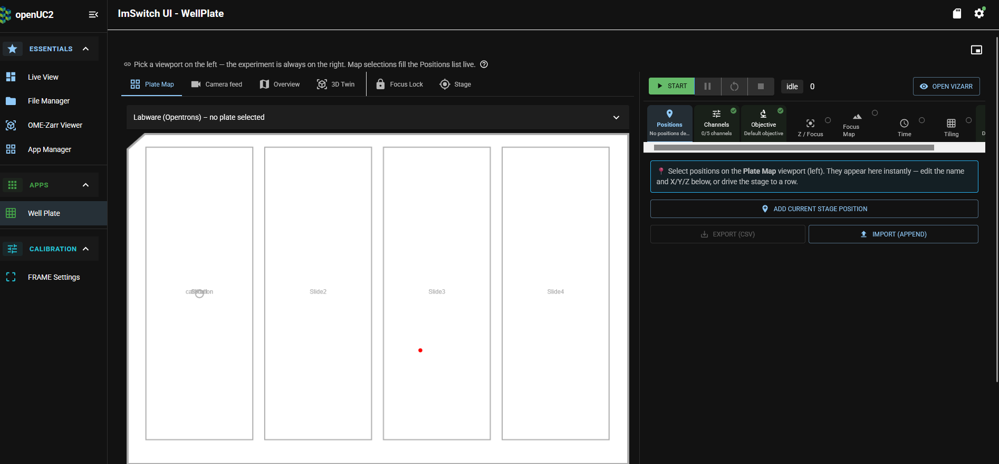

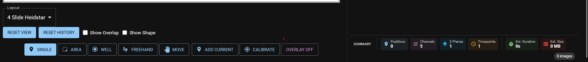

Let us do a quick tour. You will see 2 main columns.

In the left column
- the default tab is *Plate map*. For running your first large area image scan this is the only tab we need.
- Underneath an outline of your sample holder area is sketched. Choose your *Layout* - in this case *4 slide Heidstar* - from the dropdown menu just below the outline.
`Note` If no layout is selected the outline will just be blank (white).
- You see some further option at the bottom in this column such as *Reset View* or *Single* or *Well* and many more, which we will come to explain later.

In the right column - the *Experiment Controller* -
- there is a small symbol in the upper right hand corner which allows you to open a popup window with a *camera live view*. When you hover over it, this is what you will see.

  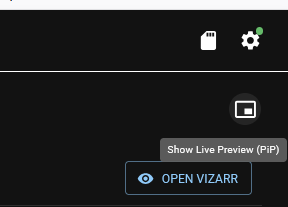

  If you open the *camera live view* it will look something like this. You can reposition and resize the *live view* window.

  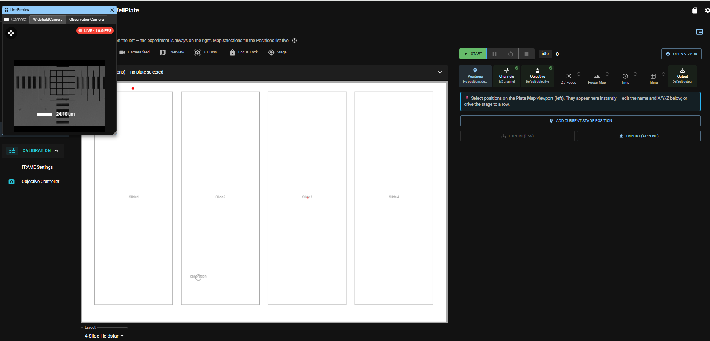

- Below is a row with a green *Start* button. We will come back to this row at the very end, when everything is ready to start the scan.
- Below that are a number of tabs in a given order, which all contain settings for your scan. We will go step by step through them in a minute.
- At the very bottom indicates a summary of your settings. Since we have not done any settings yet, it will fill up soon.
  -  *Positions*: indicates how the number of positions selected on which an image will be taken.
  - *Channels*: indicates the number of available channels.
  - *Z-Planes*: is either one or a number large than one, if you choose to do a Z-Stack.
  - *Timepoints*: is either one or a number larger than one, if you have selected to (re)capture at certain time intervals.
  - *Est. Duration* and *Est. Size*  give a first order approximation of the time your scan will need on this machine and the total storage needed for all files (currently all Zero). "0 images" shows that currently zero images will be taken, here the total number of images in your experiment will be calculated.   

Now, let us start! We recommend to go through the tabs of the *experiment controller* in the given order from left to right.

## Step 2 — Choose your area or positions

The first tab in the *experiment controller* (right column) is the *Positions* tab.
Here are some of the main options to add positions:

### Add single points

If you want to add single points make sure the button *Single* in the bottom row of the right column is selected. Move to the position of your choice on the sample by switching to the *Live View* app (see [First Sample](../../day-1/first-sample/README.md)). `Good to know` Your settings in the *wellplate* app do not get lost.

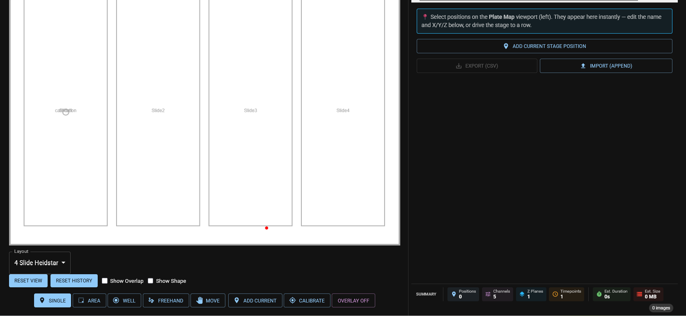

Now switch back to the *wellplate* app and press *Add current stage position*. This will add the current position (X/Y/Z) to the list of points.

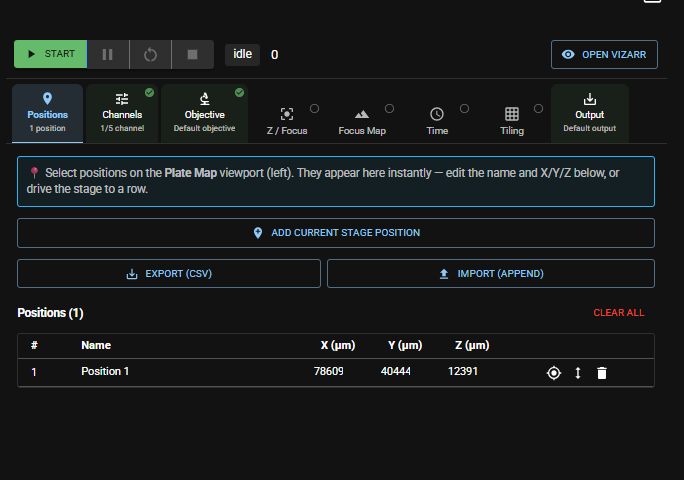

You can also use the *live view* popup window in the *wellplate* app to move to your positions of interest, it is not as handy as the *Live view* app. If you roughly know where your structures are located on your slide you can also select *Move* instead of *Single* in the bottom row and just click in the outline of your slide in the *Plate map* on a position. The stage will move your sample to this position. You can check it in the *live view* popup and add this position by switching back to *Single* and press *Add current stage position*.

You can add as many points to the list as you like.

To review your selection you can either Zoom in into the slide view and you will see the point(s) selected indicated (in this case red square). If you click on it, the stage will move to this position.

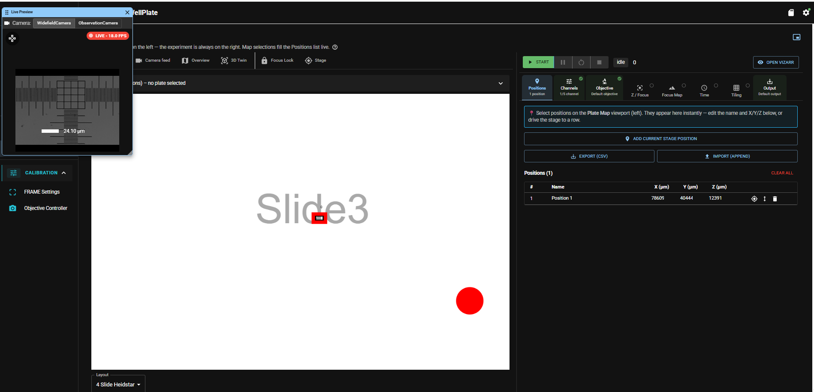

You can also use the up-and-down arrow to the right of the displayed coordinates to move to the position. YOu can delete the entry by pressing the *Recycle Bin* symbol.

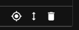

### Add an area

If you want to add an area make sure the button *Area* in the bottom row of the left column is selected. It is helpful to add a single point roughly at the center of your area first. This point will be displayed in the *Plate Map* (see [Add Single Points](#add-single-points)). You can delete it later.

Now zoom in the *Plate Map* and use the cursor to span an area of interest around the single point you have marked before. Click with the cursor in the upper left corner of your area of interest and draw a rectangle of the size of your desired area. The software will automatically display a grid of positions.

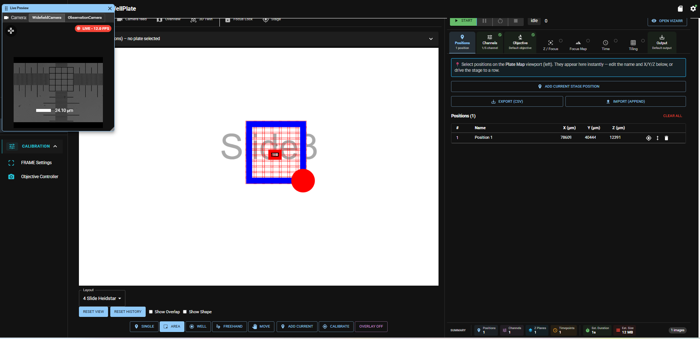

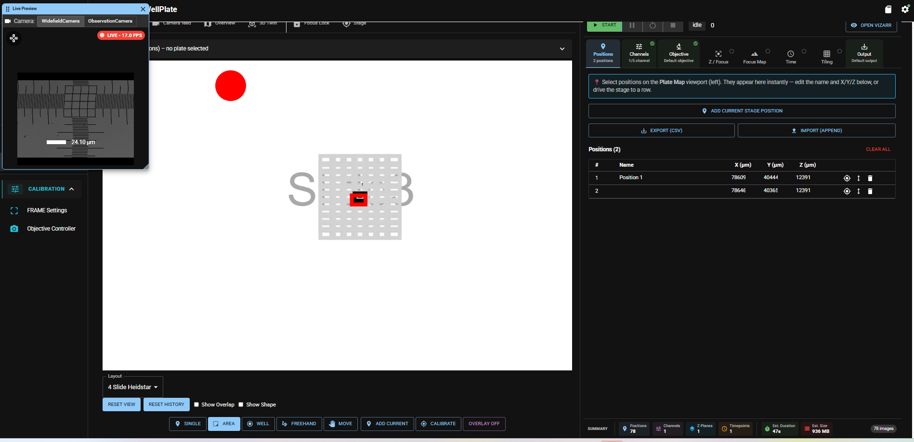

Once you are done your scan area will appear as one row in the list of points. You can review any position by clicking on it in the *Plate Map*.

The status row at the bottom of the left column is updated accordingly and shows you the total number of images and other information.

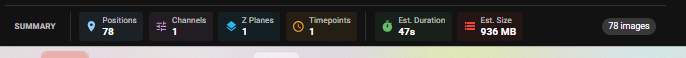

For the purpose of testing here is an example with just a 3x3 array of positions (9 images).

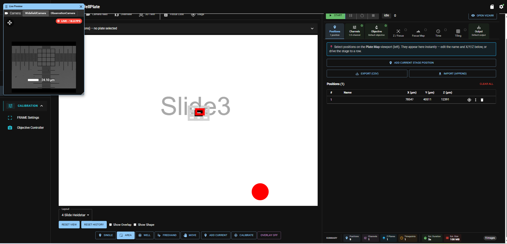

## Step 3 — Add Channels

The *experiment controller* allows you to add one ore more *channels* to your experiment. A channel equals one of your available illumination sources - LED, laser and others. What sources are available to you depends on your specific hardware configuration. *LED* for brightfield imaging is in most cases available.

Move to the second tab *channels*. In the below picture 5 *channels* = illumination sources are available for this specific machine. None of them is active, which you can see in the summary in the tab itself (0/5 channels).

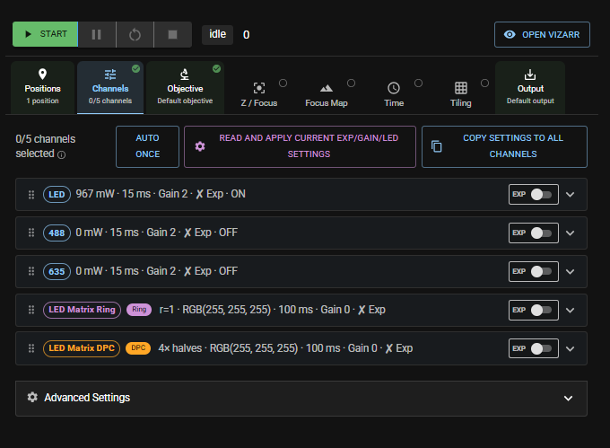

On default all *channels* are *off*. To activate a channel toggle the greyed toggle bar on the right to *on*. It will turn green. You can also see specific illumination settings for this channel in the dropdown menu.

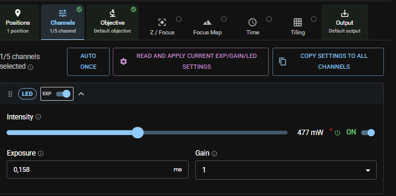

To adjust the illumination settings you have 2 options:
- (recommended): if you have not already done so adjust all relevant settings in the *Live view* app. Then press the purple button *read and apply current exp(gain/LED settings* and all current settings will be saved for this channel and used in your experiment.
- Adjust the settings manually.

If you select more than one channel the *experiment controller* will run a sequence of all activated *channels* on all positions with the settings defined.

## Step 4 — Choose or verify your objective

If you move on to the next tab *objectives* your active objective will be displayed and usually that is the one you work with.
`Important` If you switch objectives here, please, verify again, that the illumination settings under *channels* match your chosen objective.

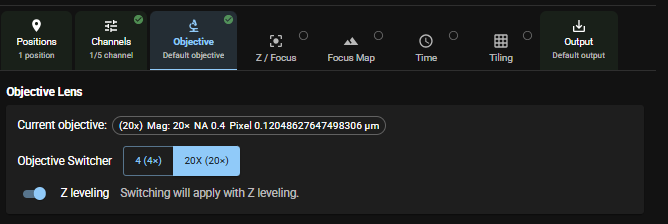

## Step 5 — Choose focus and Z-Stack parameters

The next tab *Z/Focus* allows you to choose focus options and how many different Z-planes you want to image at each position of your experiment. These are your options:

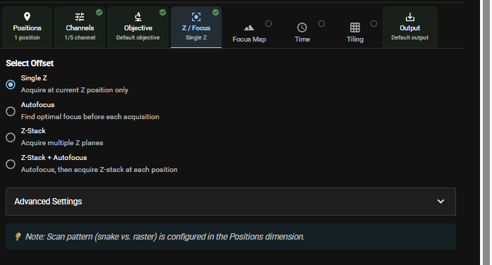

Let us go through them one by one:
- *Single Z* takes images only in one Z-plane at each position defined in the positions list and at the Z-value defined in the position list.
`Important` No autofocus will be performed. It is assumed that your sample is well focussed at the Z-value defined in the position list.

- *Autofocus* takes images only in one Z-plane at each position defined in the positions list and runs the Autofocus with the parameters defined at EACH position.
You can choose between software and hardware autofocus (if the latter is available in your hardware configuration). `Recommended` For software autofocus choose software method *Z-sweep (Scan)* and Illumination channel *LED*.
`Important` This increases experiment time significantly.

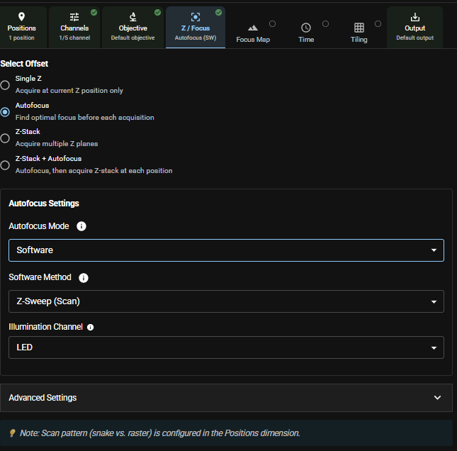

- *Z-Stack* takes images in several Z-plane at each position defined in the positions list. Use the settings menu to define the Z-planes.
`Important` No autofocus will be performed. It is assumed that your sample is well focussed at the Z-value defined in the position list.

- *Z-Stack + Autofocus* takes images in several Z-plane at each position defined in the positions list AND runs the Autofocus with the parameters defined once at the start of each Z-stack.
`Important` This increases experiment time significantly.

For more advanced settings go to the dropdown menu *Advanced Settings* at the bottom.

## Step 5 — Define a focal plane

The next tab *Focus map* allows you to define a focal plane. This is helfpul if you want to perform a larger area scan and your sample  is tilted. The algorithm will let you define the best focal plane for your scan area and apply this during the scan.

pictures and settings tbd

## Step 6 — Repeat your experiment in certain time intervals

The next tab *Time* allows you to repeat your experiment in certain time intervals.

pictures and settings tbd

## Step 6 — Parameters for stitching your scan

The next tab *Tile* allows you to define settings on how your scan shall be performed, so that stitching the individual images of your scan gives optimum results.

First you can define the overlap of the images - 20% is recommended for good stitching results.

Next you can choose your scan pattern.

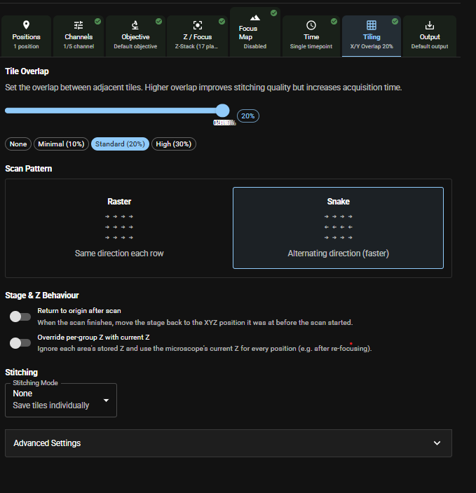

In the dropdown menu *Stitching* you can choose between
- *None*: This will only save your individual files and you can perform stitching with the software of your choice.
- *Full Stitch*: will generate a stitched TIFF.
- *Ashlar Stitch*: will generate a stitched TIFF using Ashlar. The dropdown menu shows you teh default Ashlar Stitching parameters, which you can modify.
`Important` This will significantly increase your experiment time.

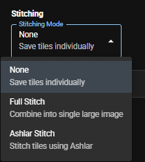

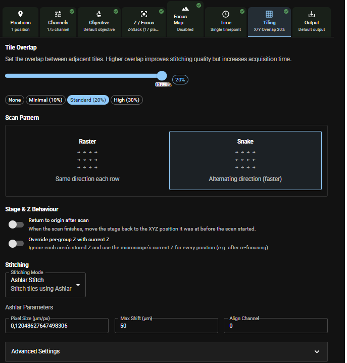

## Step 7 — Output File Parameters

The last  tab *Output* allows you to define the type(s) of output file formats generated and saved. If active (toggle slide bar to the right so that it turns from grey to blue) a file with the described format will be saved. All selected file formats will be generated.

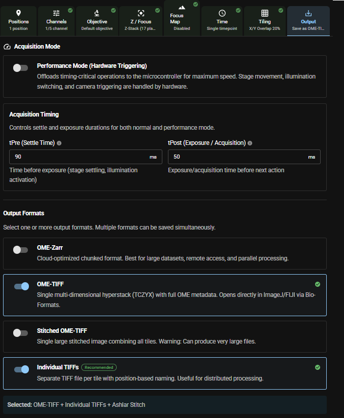

At the bottom you will find the *Ashlar Stitching* toggled on or off depending on your choice in the tab *Tile*.  

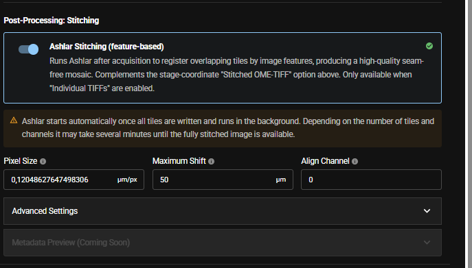

## Step 8 — Run your scan

You are all set now and you can start your scan/experiment/run by pressing the green *Start* button in top row of your experiment controller.

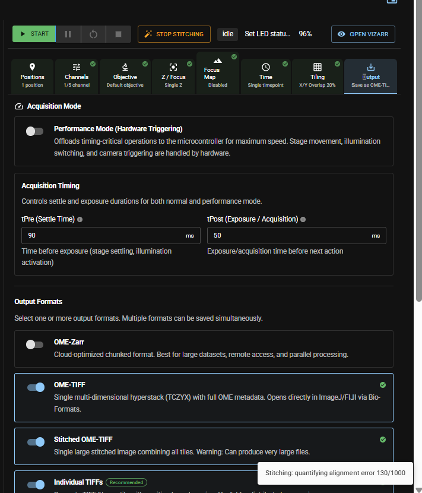

## Related

- [Acquire a Z-stack](../z-stack/README.md)
- [Keep a big scan in focus with a focus map](../focus-map/README.md)
- How-to (after you've learned it): [pixel-size calibration](../../../guides/day-2/calibrate-pixel-size/README.md)
